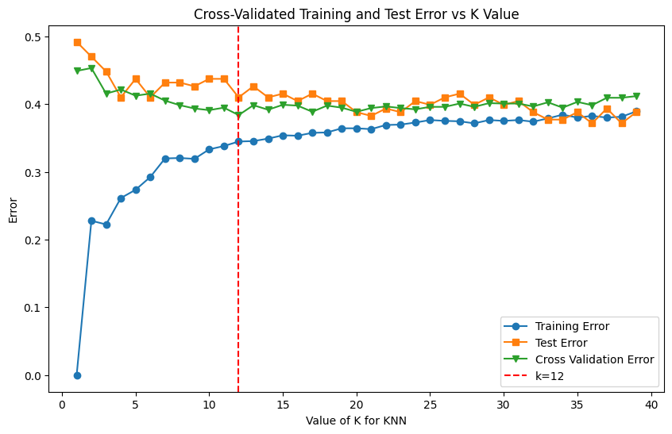
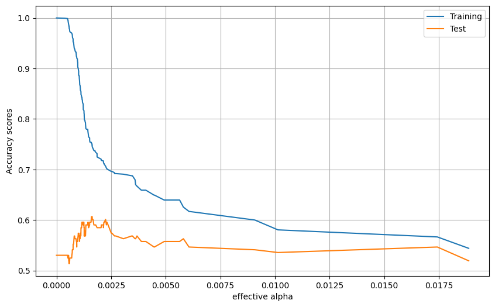
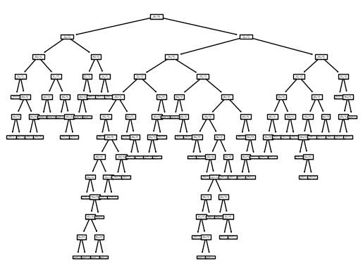
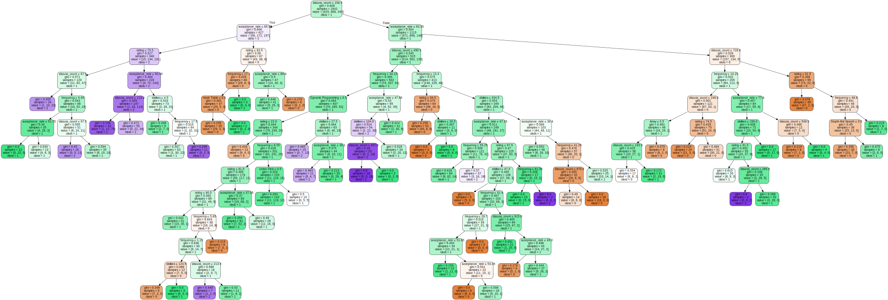

# CSE151A_WIN24_GROUP

# Milestone #1: Abstract

### Topic: LeetCode

Leetcode is one of the largest interview coding prep platforms on the internet, with a huge catalog of coding problems ranked easy, medium, and hard. However, the company has never explained what distinguishes these categories. The dataset we plan to analyze represents 1825 Leetcode problems, with 19 different features such as difficulty, acceptance rate, attempted frequency, and related topics for each individual question. The purpose of our project is to understand what factors are considered to be most important to Leetcode when scoring the difficulty of a problem. We first plan to conduct an exploratory analysis to gain insight into what features are most responsible for determining difficulty ratings. We will then build a machine learning algorithm that hopefully can accurately categorize the difficulty of a problem when given these attributes. Since the problem is a classification problem the models we are considering are k-nearest neighbors, decision trees, and a softmax neural network (if covered in class). One possible application of our project would be to automatically label the difficulty of coding problems encountered outside of Leetcode, such as HackerRank or Codesignal.

🔗 [LeetCode Dataset](https://www.kaggle.com/datasets/gzipchrist/leetcode-problem-dataset/data )

# Milestone #2: Data Exploration & Initial Preprocessing

For the complete version, please check the [current notebook](./ipynb/LeetcodeDataExploration.ipynb).

# Data Exploration

**Dataset info:** 

<class 'pandas.core.frame.DataFrame'>
    RangeIndex: 1825 entries, 0 to 1824
    Data columns (total 19 columns):
     #   Column             Non-Null Count  Dtype  
    ---  ------             --------------  -----  
     0   id                 1825 non-null   int64  
     1   title              1825 non-null   object 
     2   description        1825 non-null   object 
     3   is_premium         1825 non-null   int64  
     4   difficulty         1825 non-null   object 
     5   solution_link      987 non-null    object 
     6   acceptance_rate    1825 non-null   float64
     7   frequency          1825 non-null   float64
     8   url                1825 non-null   object 
     9   discuss_count      1825 non-null   int64  
     10  accepted           1825 non-null   object 
     11  submissions        1825 non-null   object 
     12  companies          1749 non-null   object 
     13  related_topics     1571 non-null   object 
     14  likes              1825 non-null   int64  
     15  dislikes           1825 non-null   int64  
     16  rating             1825 non-null   int64  
     17  asked_by_faang     1825 non-null   int64  
     18  similar_questions  745 non-null    object 
    dtypes: float64(2), int64(7), object(10)
    memory usage: 271.0+ KB

**Dataset null data sum:**

is_premium           0
difficulty           0
acceptance_rate      0
frequency            0
discuss_count        0
accepted             0
submissions          0
related_topics     254
likes                0
dislikes             0
rating               0
faang_count         76
non_faang_count     76
dtype: int64

**Data Example:**

  

    

<table border="1" class="dataframe">
  <thead>
    <tr style="text-align: right;">
      <th></th>
      <th>id</th>
      <th>title</th>
      <th>description</th>
      <th>is_premium</th>
      <th>difficulty</th>
      <th>solution_link</th>
      <th>acceptance_rate</th>
      <th>frequency</th>
      <th>url</th>
      <th>discuss_count</th>
      <th>accepted</th>
      <th>submissions</th>
      <th>companies</th>
      <th>related_topics</th>
      <th>likes</th>
      <th>dislikes</th>
      <th>rating</th>
      <th>asked_by_faang</th>
      <th>similar_questions</th>
    </tr>
  </thead>
  <tbody>
    <tr>
      <th>0</th>
      <td>1</td>
      <td>Two Sum</td>
      <td>Given an array of integers `nums` and an integ...</td>
      <td>0</td>
      <td>Easy</td>
      <td>/articles/two-sum</td>
      <td>46.7</td>
      <td>100.0</td>
      <td>https://leetcode.com/problems/two-sum</td>
      <td>999</td>
      <td>4.1M</td>
      <td>8.7M</td>
      <td>Amazon,Google,Apple,Adobe,Microsoft,Bloomberg,...</td>
      <td>Array,Hash Table</td>
      <td>20217</td>
      <td>712</td>
      <td>97</td>
      <td>1</td>
      <td>[3Sum, /problems/3sum/, Medium], [4Sum, /probl...</td>
    </tr>
    <tr>
      <th>1</th>
      <td>2</td>
      <td>Add Two Numbers</td>
      <td>You are given two non-empty linked lists repre...</td>
      <td>0</td>
      <td>Medium</td>
      <td>/articles/add-two-numbers</td>
      <td>35.7</td>
      <td>93.1</td>
      <td>https://leetcode.com/problems/add-two-numbers</td>
      <td>999</td>
      <td>1.9M</td>
      <td>5.2M</td>
      <td>Bloomberg,Microsoft,Amazon,Google,Facebook,App...</td>
      <td>Linked List,Math,Recursion</td>
      <td>11350</td>
      <td>2704</td>
      <td>81</td>
      <td>1</td>
      <td>[Multiply Strings, /problems/multiply-strings/...</td>
    </tr>
    <tr>
      <th>2</th>
      <td>3</td>
      <td>Longest Substring Without Repeating Characters</td>
      <td>Given a string `s`, find the length of the lon...</td>
      <td>0</td>
      <td>Medium</td>
      <td>/articles/longest-substring-without-repeating-...</td>
      <td>31.5</td>
      <td>90.9</td>
      <td>https://leetcode.com/problems/longest-substrin...</td>
      <td>999</td>
      <td>2.1M</td>
      <td>6.7M</td>
      <td>Amazon,Bloomberg,Microsoft,Facebook,Apple,Adob...</td>
      <td>Hash Table,Two Pointers,String,Sliding Window</td>
      <td>13810</td>
      <td>714</td>
      <td>95</td>
      <td>1</td>
      <td>[Longest Substring with At Most Two Distinct C...</td>
    </tr>
    <tr>
      <th>3</th>
      <td>4</td>
      <td>Median of Two Sorted Arrays</td>
      <td>Given two sorted arrays `nums1` and `nums2` of...</td>
      <td>0</td>
      <td>Hard</td>
      <td>/articles/median-of-two-sorted-arrays</td>
      <td>31.4</td>
      <td>86.2</td>
      <td>https://leetcode.com/problems/median-of-two-so...</td>
      <td>999</td>
      <td>904.7K</td>
      <td>2.9M</td>
      <td>Amazon,Goldman Sachs,Facebook,Microsoft,Apple,...</td>
      <td>Array,Binary Search,Divide and Conquer</td>
      <td>9665</td>
      <td>1486</td>
      <td>87</td>
      <td>1</td>
      <td>NaN</td>
    </tr>
    <tr>
      <th>4</th>
      <td>5</td>
      <td>Longest Palindromic Substring</td>
      <td>Given a string `s`, return the longest palindr...</td>
      <td>0</td>
      <td>Medium</td>
      <td>/articles/longest-palindromic-substring</td>
      <td>30.6</td>
      <td>84.7</td>
      <td>https://leetcode.com/problems/longest-palindro...</td>
      <td>999</td>
      <td>1.3M</td>
      <td>4.1M</td>
      <td>Amazon,Microsoft,Wayfair,Facebook,Adobe,eBay,G...</td>
      <td>String,Dynamic Programming</td>
      <td>10271</td>
      <td>670</td>
      <td>94</td>
      <td>1</td>
      <td>[Shortest Palindrome, /problems/shortest-palin...</td>
    </tr>
  </tbody>
</table>

    

  

    <button class="colab-df-convert" onclick="convertToInteractive('df-bb9ff9ee-06b9-4f4c-b98f-84fc4b73a93a')"
            title="Convert this dataframe to an interactive table."
            style="display:none;">

  <svg xmlns="http://www.w3.org/2000/svg" height="24px" viewBox="0 -960 960 960">
    <path d="M120-120v-720h720v720H120Zm60-500h600v-160H180v160Zm220 220h160v-160H400v160Zm0 220h160v-160H400v160ZM180-400h160v-160H180v160Zm440 0h160v-160H620v160ZM180-180h160v-160H180v160Zm440 0h160v-160H620v160Z"/>
  </svg>
    </button>

  
  

  <button class="colab-df-quickchart" onclick="quickchart('df-fad44315-536b-4f99-8f7a-5b39ceb726d1')"
            title="Suggest charts"
            style="display:none;">

<svg xmlns="http://www.w3.org/2000/svg" height="24px"viewBox="0 0 24 24"
     width="24px">
    <g>
        <path d="M19 3H5c-1.1 0-2 .9-2 2v14c0 1.1.9 2 2 2h14c1.1 0 2-.9 2-2V5c0-1.1-.9-2-2-2zM9 17H7v-7h2v7zm4 0h-2V7h2v10zm4 0h-2v-4h2v4z"/>
    </g>
</svg>
  </button>

    

  

## Dataset Attribute Descriptions

The dataset we have selected is derived from LeetCode, one of the largest online platforms for interview coding preparation with an extensive array of coding challenges categorized as easy, medium, and hard.
The total number of observations that have been gathered for this dataset is 1825. We have considered that this is an appropriate number of observations for a thorough analysis and modeling but is manageble anough to avoid the need for subsampling.
Each observation is detailed through 19 distinct features. However, for the scope of our analysis, we've opted to exclude 6 of these features as they do not contribute to our project's objectives.
Our target variable is the 'difficulty' level of each problem. In other words, this project aims to accurately predict the classification of these problems into easy, medium, or hard, based on their attributes.

| Column Name         | Data Type | # of Null | Description |
|---------------------|-----------|-----------|-------------|
| id                  | int64     | 0         | Unique problem id. |
| title               | String    | 0         | name of the problem. |
| description         | String    | 0         | problem description. |
| is_premium          | int64     | 0         | whether the question requires a premium account). This has been encoded as a number where the only possible values are 0 or 1, and 1 implies that the question does require a premium account. |
| difficulty          | String    | 0         | The level of difficulty of the entry (e.g., Easy, Medium, Hard). |
| solution_link       | String    | 838       | link to the solution for the problem. |
| acceptance_rate     | float64   | 0         | how often the answer submitted is correct). This is a float value indicating the percentage of acceptance, ranging from 13.9 to 95.6 in the case of our dataset but with a possible range of values between 0 and 100. |
| frequency           | float64   | 0         | how often the problem is attempted). This is also in the form of percentage. |
| url                 | String    | 0         | url to the problem. |
| discuss_count       | int64     | 0         | (how many comments are submitted by users). For this feature we have observed that there is a maximum count of 999, which means that there could be problems with that value that could go well over this limit or stay close to it. |
| accepted            | String    | 0         | how many times the answer was accepted). This has been encoded in the dataset as a string, where the value is encoded either as valueK, indicating that the value is in the thousands, or valueM, placing the value in the millions. However, for our project, we will convert this value to a number. |
| submissions         | String    | 0         | how many times the answer was submitted). This feature has the same characteristics as the previous feature, so we will perform the same modification. |
| companies           | String    | 76        | which companies were tagged as having asked this specific problem. |
| related_topics      | String    | 254       | (topics related to the current problem). This feature is given as a string of the different topics that the problem is associated with. However, as will be observed in the analysis, we have decided to use one-hot encoding in order to be able to work with this feature. It is also important to note that there is a 14% of null values, meaning that 14% of our observations don’t have any value for this feature. |
| likes               | int64     | 0         | how many likes the problem got). Integer value ranging from 2 to 20,200. |
| dislikes            | int64     | 0         | how many dislikes the problem got). Integer value ranging from 0 to 8900. |
| rating              | int64     | 0         | This feature is a combination of the previous 2 features. It is computed as likes/(likes+dislikes). Therefore, this is encoded in the form of percentage, ranging in the case of our dataset between 7 and 100. |
| asked_by_faang      | int64     | 0         | whether or not the question was asked by facebook, apple, amazon, google, or netflix. |
| similar_questions   | String    | 1080      | A list of similar entries, possibly including titles, links, and difficulty levels. |

##  Data Scales and Data Distributions

- Analyze the distribution of topics and difficulty levels, and the relationship between the two.
- Explore the correlation between problem difficulty and other factors such as acceptence rate, frequency, submissions, related topics, and the like-to-dislike ratio.

  

    

<table border="1" class="dataframe">
  <thead>
    <tr style="text-align: right;">
      <th></th>
      <th>id</th>
      <th>is_premium</th>
      <th>acceptance_rate</th>
      <th>frequency</th>
      <th>discuss_count</th>
      <th>likes</th>
      <th>dislikes</th>
      <th>rating</th>
      <th>asked_by_faang</th>
    </tr>
  </thead>
  <tbody>
    <tr>
      <th>count</th>
      <td>1825.000000</td>
      <td>1825.000000</td>
      <td>1825.000000</td>
      <td>1825.000000</td>
      <td>1825.000000</td>
      <td>1825.000000</td>
      <td>1825.000000</td>
      <td>1825.000000</td>
      <td>1825.000000</td>
    </tr>
    <tr>
      <th>mean</th>
      <td>913.000000</td>
      <td>0.218082</td>
      <td>53.139616</td>
      <td>21.113041</td>
      <td>421.435068</td>
      <td>1050.534795</td>
      <td>279.010959</td>
      <td>77.391233</td>
      <td>0.671233</td>
    </tr>
    <tr>
      <th>std</th>
      <td>526.976438</td>
      <td>0.413057</td>
      <td>14.778411</td>
      <td>22.364741</td>
      <td>330.583617</td>
      <td>1512.674013</td>
      <td>608.489206</td>
      <td>23.317515</td>
      <td>0.469894</td>
    </tr>
    <tr>
      <th>min</th>
      <td>1.000000</td>
      <td>0.000000</td>
      <td>13.900000</td>
      <td>0.000000</td>
      <td>9.000000</td>
      <td>2.000000</td>
      <td>0.000000</td>
      <td>7.000000</td>
      <td>0.000000</td>
    </tr>
    <tr>
      <th>25%</th>
      <td>457.000000</td>
      <td>0.000000</td>
      <td>42.400000</td>
      <td>3.100000</td>
      <td>150.000000</td>
      <td>217.000000</td>
      <td>32.000000</td>
      <td>67.000000</td>
      <td>0.000000</td>
    </tr>
    <tr>
      <th>50%</th>
      <td>913.000000</td>
      <td>0.000000</td>
      <td>51.600000</td>
      <td>13.500000</td>
      <td>292.000000</td>
      <td>516.000000</td>
      <td>92.000000</td>
      <td>88.000000</td>
      <td>1.000000</td>
    </tr>
    <tr>
      <th>75%</th>
      <td>1369.000000</td>
      <td>0.000000</td>
      <td>62.800000</td>
      <td>31.800000</td>
      <td>663.000000</td>
      <td>1200.000000</td>
      <td>239.000000</td>
      <td>95.000000</td>
      <td>1.000000</td>
    </tr>
    <tr>
      <th>max</th>
      <td>1825.000000</td>
      <td>1.000000</td>
      <td>95.600000</td>
      <td>100.000000</td>
      <td>999.000000</td>
      <td>20217.000000</td>
      <td>8900.000000</td>
      <td>100.000000</td>
      <td>1.000000</td>
    </tr>
  </tbody>
</table>

    

  

    <button class="colab-df-convert" onclick="convertToInteractive('df-080b3694-28bd-4117-9216-3def1f142b76')"
            title="Convert this dataframe to an interactive table."
            style="display:none;">

  <svg xmlns="http://www.w3.org/2000/svg" height="24px" viewBox="0 -960 960 960">;
    <path d="M120-120v-720h720v720H120Zm60-500h600v-160H180v160Zm220 220h160v-160H400v160Zm0 220h160v-160H400v160ZM180-400h160v-160H180v160Zm440 0h160v-160H620v160ZM180-180h160v-160H180v160Zm440 0h160v-160H620v160Z"/>
  </svg>
    </button>

  

  <button class="colab-df-quickchart" onclick="quickchart('df-66014bcc-8d87-46cc-bb7e-82a77c38bf10')"
            title="Suggest charts"
            style="display:none;">

<svg xmlns="http://www.w3.org/2000/svg" height="24px"viewBox="0 0 24 24"
     width="24px">
    <g>
        <path d="M19 3H5c-1.1 0-2 .9-2 2v14c0 1.1.9 2 2 2h14c1.1 0 2-.9 2-2V5c0-1.1-.9-2-2-2zM9 17H7v-7h2v7zm4 0h-2V7h2v10zm4 0h-2v-4h2v4z"/>
    </g>
</svg>
  </button>

    

  

    

### Count of Problems by Topic
In this section, we calculate and visualize the number of problems associated with each unique topic.

    

### Distribution of Problem Difficulty Levels
Next, we display the distribution of problems across different difficulty levels (Easy, Medium, Hard).

    

    

### Distribution of Topics by Difficulty Level

Finally, we visualize how various topics are distributed across the three difficulty levels.

    

    

## Data Evaluation and Preprocessing Overview

**1. Dropping Unnecessary Data**

We have identified certain attributes that don't contribute to predicting 'difficulty'. These columns are:

- "id": Unique identifiers for problems, irrelevant to difficulty prediction.
- "title": Does not provide predictive value for difficulty.
- "description": Unrelated to the predictive task at hand.
- "solution_link" and "url": Links that offer no predictive insight.
- "similar_questions": Does not directly contribute to predicting difficulty.
- "asked_by_faang": Rather than a binary value of whether a FAANG company asked the question, a count of how many FAANG companies asked it might be more informative.

**2. Data Standardization/Transformation**
Certain columns require transformation to numerical attributes:

- "difficulty": Our target variable will be encoded from categorical ("Easy", "Medium", "Hard") to a numerical format.
- "submissions" and "accepted": These string-formatted numerical values will be converted to integers.
- "companies": To capture the potential correlation between the problem's difficulty and the company's profile, we'll convert this into two numeric attributes: "faang_count" for the count of FAANG companies and "non_faang_count" for others.
- "related_topics": Given the potential link between certain topics and problem difficulty, this attribute will be standardized and one-hot encoded to represent the various topics.

**3. Handling Missing Data**
After the initial data cleaning:
- No attributes currently exhibit missing values, indicating a clean dataset ready for further processing.
- For optimal model performance, normalization will be applied to the remaining attributes to ensute uniformity in data scale and distribution.@

# Data Cleaning and Preprocessing 

We performed several preprocessing steps we discussed above, including:

- Encoding 'difficulty' as 0 (Easy), 1 (Medium), 2 (Hard).
- Dropping 'id', 'title', 'description', 'solution_link', 'url', 'asked_by_faang' columns.
- Encoding 'related_topics' using one-hot encoding. Although it might not be relevant, it's interesting to explore.
- Converting 'companies' into FAANG count/total count.

This part mainly consists of coding. For the detailed code, please check the [notebook](./ipynb/LeetcodeDataExploration.ipynb).

  <button class="colab-df-quickchart" onclick="quickchart('df-da895501-58c6-46c9-aa0d-2666cb586173')"
            title="Suggest charts"
            style="display:none;">

<svg xmlns="http://www.w3.org/2000/svg" height="24px"viewBox="0 0 24 24"
     width="24px">
    <g>
        <path d="M19 3H5c-1.1 0-2 .9-2 2v14c0 1.1.9 2 2 2h14c1.1 0 2-.9 2-2V5c0-1.1-.9-2-2-2zM9 17H7v-7h2v7zm4 0h-2V7h2v10zm4 0h-2v-4h2v4z"/>
    </g>
</svg>
  </button>

    

  

  

    

<table border="1" class="dataframe">
  <thead>
    <tr style="text-align: right;">
      <th></th>
      <th>is_premium</th>
      <th>difficulty</th>
      <th>acceptance_rate</th>
      <th>frequency</th>
      <th>discuss_count</th>
      <th>accepted</th>
      <th>submissions</th>
      <th>likes</th>
      <th>dislikes</th>
      <th>rating</th>
      <th>...</th>
      <th>Sliding Window</th>
      <th>Sort</th>
      <th>Stack</th>
      <th>String</th>
      <th>Suffix Array</th>
      <th>Topological Sort</th>
      <th>Tree</th>
      <th>Trie</th>
      <th>Two Pointers</th>
      <th>Union Find</th>
    </tr>
  </thead>
  <tbody>
    <tr>
      <th>0</th>
      <td>0</td>
      <td>0</td>
      <td>46.7</td>
      <td>100.0</td>
      <td>999</td>
      <td>4100000.0</td>
      <td>8700000.0</td>
      <td>20217</td>
      <td>712</td>
      <td>97</td>
      <td>...</td>
      <td>0</td>
      <td>0</td>
      <td>0</td>
      <td>0</td>
      <td>0</td>
      <td>0</td>
      <td>0</td>
      <td>0</td>
      <td>0</td>
      <td>0</td>
    </tr>
    <tr>
      <th>1</th>
      <td>0</td>
      <td>1</td>
      <td>35.7</td>
      <td>93.1</td>
      <td>999</td>
      <td>1900000.0</td>
      <td>5200000.0</td>
      <td>11350</td>
      <td>2704</td>
      <td>81</td>
      <td>...</td>
      <td>0</td>
      <td>0</td>
      <td>0</td>
      <td>0</td>
      <td>0</td>
      <td>0</td>
      <td>0</td>
      <td>0</td>
      <td>0</td>
      <td>0</td>
    </tr>
    <tr>
      <th>2</th>
      <td>0</td>
      <td>1</td>
      <td>31.5</td>
      <td>90.9</td>
      <td>999</td>
      <td>2100000.0</td>
      <td>6700000.0</td>
      <td>13810</td>
      <td>714</td>
      <td>95</td>
      <td>...</td>
      <td>1</td>
      <td>0</td>
      <td>0</td>
      <td>1</td>
      <td>0</td>
      <td>0</td>
      <td>0</td>
      <td>0</td>
      <td>1</td>
      <td>0</td>
    </tr>
    <tr>
      <th>3</th>
      <td>0</td>
      <td>2</td>
      <td>31.4</td>
      <td>86.2</td>
      <td>999</td>
      <td>904700.0</td>
      <td>2900000.0</td>
      <td>9665</td>
      <td>1486</td>
      <td>87</td>
      <td>...</td>
      <td>0</td>
      <td>0</td>
      <td>0</td>
      <td>0</td>
      <td>0</td>
      <td>0</td>
      <td>0</td>
      <td>0</td>
      <td>0</td>
      <td>0</td>
    </tr>
    <tr>
      <th>4</th>
      <td>0</td>
      <td>1</td>
      <td>30.6</td>
      <td>84.7</td>
      <td>999</td>
      <td>1300000.0</td>
      <td>4100000.0</td>
      <td>10271</td>
      <td>670</td>
      <td>94</td>
      <td>...</td>
      <td>0</td>
      <td>0</td>
      <td>0</td>
      <td>1</td>
      <td>0</td>
      <td>0</td>
      <td>0</td>
      <td>0</td>
      <td>0</td>
      <td>0</td>
    </tr>
    <tr>
      <th>...</th>
      <td>...</td>
      <td>...</td>
      <td>...</td>
      <td>...</td>
      <td>...</td>
      <td>...</td>
      <td>...</td>
      <td>...</td>
      <td>...</td>
      <td>...</td>
      <td>...</td>
      <td>...</td>
      <td>...</td>
      <td>...</td>
      <td>...</td>
      <td>...</td>
      <td>...</td>
      <td>...</td>
      <td>...</td>
      <td>...</td>
      <td>...</td>
    </tr>
    <tr>
      <th>1820</th>
      <td>1</td>
      <td>0</td>
      <td>88.9</td>
      <td>0.0</td>
      <td>15</td>
      <td>305</td>
      <td>343</td>
      <td>2</td>
      <td>2</td>
      <td>50</td>
      <td>...</td>
      <td>0</td>
      <td>0</td>
      <td>0</td>
      <td>0</td>
      <td>0</td>
      <td>0</td>
      <td>0</td>
      <td>0</td>
      <td>0</td>
      <td>0</td>
    </tr>
    <tr>
      <th>1821</th>
      <td>0</td>
      <td>0</td>
      <td>67.8</td>
      <td>0.0</td>
      <td>104</td>
      <td>7900.0</td>
      <td>11700.0</td>
      <td>37</td>
      <td>4</td>
      <td>90</td>
      <td>...</td>
      <td>0</td>
      <td>0</td>
      <td>0</td>
      <td>0</td>
      <td>0</td>
      <td>0</td>
      <td>0</td>
      <td>0</td>
      <td>0</td>
      <td>0</td>
    </tr>
    <tr>
      <th>1822</th>
      <td>0</td>
      <td>1</td>
      <td>71.8</td>
      <td>0.0</td>
      <td>135</td>
      <td>6800.0</td>
      <td>9500.0</td>
      <td>81</td>
      <td>4</td>
      <td>95</td>
      <td>...</td>
      <td>0</td>
      <td>0</td>
      <td>0</td>
      <td>0</td>
      <td>0</td>
      <td>0</td>
      <td>0</td>
      <td>0</td>
      <td>0</td>
      <td>0</td>
    </tr>
    <tr>
      <th>1823</th>
      <td>0</td>
      <td>1</td>
      <td>47.2</td>
      <td>0.0</td>
      <td>134</td>
      <td>5000.0</td>
      <td>10700.0</td>
      <td>147</td>
      <td>8</td>
      <td>95</td>
      <td>...</td>
      <td>0</td>
      <td>0</td>
      <td>0</td>
      <td>0</td>
      <td>0</td>
      <td>0</td>
      <td>0</td>
      <td>0</td>
      <td>0</td>
      <td>0</td>
    </tr>
    <tr>
      <th>1824</th>
      <td>0</td>
      <td>2</td>
      <td>28.1</td>
      <td>0.0</td>
      <td>48</td>
      <td>2100.0</td>
      <td>7400.0</td>
      <td>52</td>
      <td>43</td>
      <td>55</td>
      <td>...</td>
      <td>0</td>
      <td>0</td>
      <td>0</td>
      <td>0</td>
      <td>0</td>
      <td>0</td>
      <td>0</td>
      <td>0</td>
      <td>0</td>
      <td>0</td>
    </tr>
  </tbody>
</table>

1825 rows × 55 columns

    

  

    <button class="colab-df-convert" onclick="convertToInteractive('df-53f34cb7-d84a-46c5-a557-5b8ce8fcea36')"
            title="Convert this dataframe to an interactive table."
            style="display:none;">

  <svg xmlns="http://www.w3.org/2000/svg" height="24px" viewBox="0 -960 960 960">
    <path d="M120-120v-720h720v720H120Zm60-500h600v-160H180v160Zm220 220h160v-160H400v160Zm0 220h160v-160H400v160ZM180-400h160v-160H180v160Zm440 0h160v-160H620v160ZM180-180h160v-160H180v160Zm440 0h160v-160H620v160Z"/>
  </svg>
    </button>

  
  

  <button class="colab-df-quickchart" onclick="quickchart('df-f8066434-6038-4cb7-89a5-bd32a6e0f277')"
            title="Suggest charts"
            style="display:none;">

<svg xmlns="http://www.w3.org/2000/svg" height="24px"viewBox="0 0 24 24"
     width="24px">
    <g>
        <path d="M19 3H5c-1.1 0-2 .9-2 2v14c0 1.1.9 2 2 2h14c1.1 0 2-.9 2-2V5c0-1.1-.9-2-2-2zM9 17H7v-7h2v7zm4 0h-2V7h2v10zm4 0h-2v-4h2v4z"/>
    </g>
</svg>
  </button>

    

  

# Data Visualization and Analysis
- Analyze the distribution of topics and difficulty levels, and the relationship between the two.
- Explore the correlation between problem difficulty and other factors such as acceptence rate, frequency, submissions, related topics, and the like-to-dislike ratio.
- Visualize the data to explore patterns and uncover insights.

  

    

<table border="1" class="dataframe">
  <thead>
    <tr style="text-align: right;">
      <th></th>
      <th>is_premium</th>
      <th>difficulty</th>
      <th>acceptance_rate</th>
      <th>frequency</th>
      <th>discuss_count</th>
      <th>likes</th>
      <th>dislikes</th>
      <th>rating</th>
      <th>faang_count</th>
      <th>non_faang_count</th>
      <th>...</th>
      <th>Sliding Window</th>
      <th>Sort</th>
      <th>Stack</th>
      <th>String</th>
      <th>Suffix Array</th>
      <th>Topological Sort</th>
      <th>Tree</th>
      <th>Trie</th>
      <th>Two Pointers</th>
      <th>Union Find</th>
    </tr>
  </thead>
  <tbody>
    <tr>
      <th>count</th>
      <td>1825.000000</td>
      <td>1825.000000</td>
      <td>1825.000000</td>
      <td>1825.000000</td>
      <td>1825.000000</td>
      <td>1825.000000</td>
      <td>1825.000000</td>
      <td>1825.000000</td>
      <td>1749.000000</td>
      <td>1749.000000</td>
      <td>...</td>
      <td>1825.000000</td>
      <td>1825.000000</td>
      <td>1825.000000</td>
      <td>1825.000000</td>
      <td>1825.000000</td>
      <td>1825.000000</td>
      <td>1825.000000</td>
      <td>1825.000000</td>
      <td>1825.000000</td>
      <td>1825.000000</td>
    </tr>
    <tr>
      <th>mean</th>
      <td>0.218082</td>
      <td>0.949589</td>
      <td>53.139616</td>
      <td>21.113041</td>
      <td>421.435068</td>
      <td>1050.534795</td>
      <td>279.010959</td>
      <td>77.391233</td>
      <td>1.068039</td>
      <td>1.250429</td>
      <td>...</td>
      <td>0.014795</td>
      <td>0.041644</td>
      <td>0.035068</td>
      <td>0.121096</td>
      <td>0.002192</td>
      <td>0.003288</td>
      <td>0.085479</td>
      <td>0.011507</td>
      <td>0.040548</td>
      <td>0.020274</td>
    </tr>
    <tr>
      <th>std</th>
      <td>0.413057</td>
      <td>0.685598</td>
      <td>14.778411</td>
      <td>22.364741</td>
      <td>330.583617</td>
      <td>1512.674013</td>
      <td>608.489206</td>
      <td>23.317515</td>
      <td>1.011067</td>
      <td>2.060625</td>
      <td>...</td>
      <td>0.120763</td>
      <td>0.199829</td>
      <td>0.184003</td>
      <td>0.326328</td>
      <td>0.046778</td>
      <td>0.057260</td>
      <td>0.279670</td>
      <td>0.106680</td>
      <td>0.197295</td>
      <td>0.140975</td>
    </tr>
    <tr>
      <th>min</th>
      <td>0.000000</td>
      <td>0.000000</td>
      <td>13.900000</td>
      <td>0.000000</td>
      <td>9.000000</td>
      <td>2.000000</td>
      <td>0.000000</td>
      <td>7.000000</td>
      <td>0.000000</td>
      <td>0.000000</td>
      <td>...</td>
      <td>0.000000</td>
      <td>0.000000</td>
      <td>0.000000</td>
      <td>0.000000</td>
      <td>0.000000</td>
      <td>0.000000</td>
      <td>0.000000</td>
      <td>0.000000</td>
      <td>0.000000</td>
      <td>0.000000</td>
    </tr>
    <tr>
      <th>25%</th>
      <td>0.000000</td>
      <td>0.000000</td>
      <td>42.400000</td>
      <td>3.100000</td>
      <td>150.000000</td>
      <td>217.000000</td>
      <td>32.000000</td>
      <td>67.000000</td>
      <td>0.000000</td>
      <td>0.000000</td>
      <td>...</td>
      <td>0.000000</td>
      <td>0.000000</td>
      <td>0.000000</td>
      <td>0.000000</td>
      <td>0.000000</td>
      <td>0.000000</td>
      <td>0.000000</td>
      <td>0.000000</td>
      <td>0.000000</td>
      <td>0.000000</td>
    </tr>
    <tr>
      <th>50%</th>
      <td>0.000000</td>
      <td>1.000000</td>
      <td>51.600000</td>
      <td>13.500000</td>
      <td>292.000000</td>
      <td>516.000000</td>
      <td>92.000000</td>
      <td>88.000000</td>
      <td>1.000000</td>
      <td>1.000000</td>
      <td>...</td>
      <td>0.000000</td>
      <td>0.000000</td>
      <td>0.000000</td>
      <td>0.000000</td>
      <td>0.000000</td>
      <td>0.000000</td>
      <td>0.000000</td>
      <td>0.000000</td>
      <td>0.000000</td>
      <td>0.000000</td>
    </tr>
    <tr>
      <th>75%</th>
      <td>0.000000</td>
      <td>1.000000</td>
      <td>62.800000</td>
      <td>31.800000</td>
      <td>663.000000</td>
      <td>1200.000000</td>
      <td>239.000000</td>
      <td>95.000000</td>
      <td>1.000000</td>
      <td>1.000000</td>
      <td>...</td>
      <td>0.000000</td>
      <td>0.000000</td>
      <td>0.000000</td>
      <td>0.000000</td>
      <td>0.000000</td>
      <td>0.000000</td>
      <td>0.000000</td>
      <td>0.000000</td>
      <td>0.000000</td>
      <td>0.000000</td>
    </tr>
    <tr>
      <th>max</th>
      <td>1.000000</td>
      <td>2.000000</td>
      <td>95.600000</td>
      <td>100.000000</td>
      <td>999.000000</td>
      <td>20217.000000</td>
      <td>8900.000000</td>
      <td>100.000000</td>
      <td>4.000000</td>
      <td>16.000000</td>
      <td>...</td>
      <td>1.000000</td>
      <td>1.000000</td>
      <td>1.000000</td>
      <td>1.000000</td>
      <td>1.000000</td>
      <td>1.000000</td>
      <td>1.000000</td>
      <td>1.000000</td>
      <td>1.000000</td>
      <td>1.000000</td>
    </tr>
  </tbody>
</table>

8 rows × 53 columns

    

  

    <button class="colab-df-convert" onclick="convertToInteractive('df-9b4b5ca5-0a1c-4e9d-a2d8-15b03a84f734')"
            title="Convert this dataframe to an interactive table."
            style="display:none;">

  <svg xmlns="http://www.w3.org/2000/svg" height="24px" viewBox="0 -960 960 960">
    <path d="M120-120v-720h720v720H120Zm60-500h600v-160H180v160Zm220 220h160v-160H400v160Zm0 220h160v-160H400v160ZM180-400h160v-160H180v160Zm440 0h160v-160H620v160ZM180-180h160v-160H180v160Zm440 0h160v-160H620v160Z"/>
  </svg>
    </button>

  
  

  <button class="colab-df-quickchart" onclick="quickchart('df-ac2df204-1a6d-43f4-b3cb-797392f12822')"
            title="Suggest charts"
            style="display:none;">

<svg xmlns="http://www.w3.org/2000/svg" height="24px"viewBox="0 0 24 24"
     width="24px">
    <g>
        <path d="M19 3H5c-1.1 0-2 .9-2 2v14c0 1.1.9 2 2 2h14c1.1 0 2-.9 2-2V5c0-1.1-.9-2-2-2zM9 17H7v-7h2v7zm4 0h-2V7h2v10zm4 0h-2v-4h2v4z"/>
    </g>
</svg>
  </button>

    

  

## Pairplot
Now, we visualize the pairwise relationships between variables to identify potential patterns and correlations.

    

    
Key observations from our pair plot analysis:
- There appears to be a significant correlation between discussion, acceptance rate, and difficulty.
- Likes and dislikes are inversely correlated.
- The count of non-FAANG companies and problem frequency seem to have a positive correlation.
However, the pair plot does not provide provide substantial information relevant to our goal. Therefore, we will proceed to examine the data using a heatmap/correlation matrix to gain more insights.

## Coorrolation Matrix
Transitioning to the correlation matrix analysis, our aim is to gain deeper insights into the relationships between variables. We begin by normalizing our data, for which we have chosen min-max normalization since not all our data is normally distributed.

  

    

<table border="1" class="dataframe">
  <thead>
    <tr style="text-align: right;">
      <th></th>
      <th>is_premium</th>
      <th>difficulty</th>
      <th>acceptance_rate</th>
      <th>frequency</th>
      <th>discuss_count</th>
      <th>accepted</th>
      <th>submissions</th>
      <th>likes</th>
      <th>dislikes</th>
      <th>rating</th>
      <th>...</th>
      <th>Sliding Window</th>
      <th>Sort</th>
      <th>Stack</th>
      <th>String</th>
      <th>Suffix Array</th>
      <th>Topological Sort</th>
      <th>Tree</th>
      <th>Trie</th>
      <th>Two Pointers</th>
      <th>Union Find</th>
    </tr>
  </thead>
  <tbody>
    <tr>
      <th>0</th>
      <td>0.0</td>
      <td>0.0</td>
      <td>0.401469</td>
      <td>1.000</td>
      <td>1.000000</td>
      <td>4100000.0</td>
      <td>8700000.0</td>
      <td>1.000000</td>
      <td>0.080000</td>
      <td>0.967742</td>
      <td>...</td>
      <td>0.0</td>
      <td>0.0</td>
      <td>0.0</td>
      <td>0.0</td>
      <td>0.0</td>
      <td>0.0</td>
      <td>0.0</td>
      <td>0.0</td>
      <td>0.0</td>
      <td>0.0</td>
    </tr>
    <tr>
      <th>1</th>
      <td>0.0</td>
      <td>0.5</td>
      <td>0.266830</td>
      <td>0.931</td>
      <td>1.000000</td>
      <td>1900000.0</td>
      <td>5200000.0</td>
      <td>0.561365</td>
      <td>0.303820</td>
      <td>0.795699</td>
      <td>...</td>
      <td>0.0</td>
      <td>0.0</td>
      <td>0.0</td>
      <td>0.0</td>
      <td>0.0</td>
      <td>0.0</td>
      <td>0.0</td>
      <td>0.0</td>
      <td>0.0</td>
      <td>0.0</td>
    </tr>
    <tr>
      <th>2</th>
      <td>0.0</td>
      <td>0.5</td>
      <td>0.215422</td>
      <td>0.909</td>
      <td>1.000000</td>
      <td>2100000.0</td>
      <td>6700000.0</td>
      <td>0.683057</td>
      <td>0.080225</td>
      <td>0.946237</td>
      <td>...</td>
      <td>1.0</td>
      <td>0.0</td>
      <td>0.0</td>
      <td>1.0</td>
      <td>0.0</td>
      <td>0.0</td>
      <td>0.0</td>
      <td>0.0</td>
      <td>1.0</td>
      <td>0.0</td>
    </tr>
    <tr>
      <th>3</th>
      <td>0.0</td>
      <td>1.0</td>
      <td>0.214198</td>
      <td>0.862</td>
      <td>1.000000</td>
      <td>904700.0</td>
      <td>2900000.0</td>
      <td>0.478011</td>
      <td>0.166966</td>
      <td>0.860215</td>
      <td>...</td>
      <td>0.0</td>
      <td>0.0</td>
      <td>0.0</td>
      <td>0.0</td>
      <td>0.0</td>
      <td>0.0</td>
      <td>0.0</td>
      <td>0.0</td>
      <td>0.0</td>
      <td>0.0</td>
    </tr>
    <tr>
      <th>4</th>
      <td>0.0</td>
      <td>0.5</td>
      <td>0.204406</td>
      <td>0.847</td>
      <td>1.000000</td>
      <td>1300000.0</td>
      <td>4100000.0</td>
      <td>0.507989</td>
      <td>0.075281</td>
      <td>0.935484</td>
      <td>...</td>
      <td>0.0</td>
      <td>0.0</td>
      <td>0.0</td>
      <td>1.0</td>
      <td>0.0</td>
      <td>0.0</td>
      <td>0.0</td>
      <td>0.0</td>
      <td>0.0</td>
      <td>0.0</td>
    </tr>
    <tr>
      <th>...</th>
      <td>...</td>
      <td>...</td>
      <td>...</td>
      <td>...</td>
      <td>...</td>
      <td>...</td>
      <td>...</td>
      <td>...</td>
      <td>...</td>
      <td>...</td>
      <td>...</td>
      <td>...</td>
      <td>...</td>
      <td>...</td>
      <td>...</td>
      <td>...</td>
      <td>...</td>
      <td>...</td>
      <td>...</td>
      <td>...</td>
      <td>...</td>
    </tr>
    <tr>
      <th>1820</th>
      <td>1.0</td>
      <td>0.0</td>
      <td>0.917993</td>
      <td>0.000</td>
      <td>0.006061</td>
      <td>305</td>
      <td>343</td>
      <td>0.000000</td>
      <td>0.000225</td>
      <td>0.462366</td>
      <td>...</td>
      <td>0.0</td>
      <td>0.0</td>
      <td>0.0</td>
      <td>0.0</td>
      <td>0.0</td>
      <td>0.0</td>
      <td>0.0</td>
      <td>0.0</td>
      <td>0.0</td>
      <td>0.0</td>
    </tr>
    <tr>
      <th>1821</th>
      <td>0.0</td>
      <td>0.0</td>
      <td>0.659731</td>
      <td>0.000</td>
      <td>0.095960</td>
      <td>7900.0</td>
      <td>11700.0</td>
      <td>0.001731</td>
      <td>0.000449</td>
      <td>0.892473</td>
      <td>...</td>
      <td>0.0</td>
      <td>0.0</td>
      <td>0.0</td>
      <td>0.0</td>
      <td>0.0</td>
      <td>0.0</td>
      <td>0.0</td>
      <td>0.0</td>
      <td>0.0</td>
      <td>0.0</td>
    </tr>
    <tr>
      <th>1822</th>
      <td>0.0</td>
      <td>0.5</td>
      <td>0.708690</td>
      <td>0.000</td>
      <td>0.127273</td>
      <td>6800.0</td>
      <td>9500.0</td>
      <td>0.003908</td>
      <td>0.000449</td>
      <td>0.946237</td>
      <td>...</td>
      <td>0.0</td>
      <td>0.0</td>
      <td>0.0</td>
      <td>0.0</td>
      <td>0.0</td>
      <td>0.0</td>
      <td>0.0</td>
      <td>0.0</td>
      <td>0.0</td>
      <td>0.0</td>
    </tr>
    <tr>
      <th>1823</th>
      <td>0.0</td>
      <td>0.5</td>
      <td>0.407589</td>
      <td>0.000</td>
      <td>0.126263</td>
      <td>5000.0</td>
      <td>10700.0</td>
      <td>0.007173</td>
      <td>0.000899</td>
      <td>0.946237</td>
      <td>...</td>
      <td>0.0</td>
      <td>0.0</td>
      <td>0.0</td>
      <td>0.0</td>
      <td>0.0</td>
      <td>0.0</td>
      <td>0.0</td>
      <td>0.0</td>
      <td>0.0</td>
      <td>0.0</td>
    </tr>
    <tr>
      <th>1824</th>
      <td>0.0</td>
      <td>1.0</td>
      <td>0.173807</td>
      <td>0.000</td>
      <td>0.039394</td>
      <td>2100.0</td>
      <td>7400.0</td>
      <td>0.002473</td>
      <td>0.004831</td>
      <td>0.516129</td>
      <td>...</td>
      <td>0.0</td>
      <td>0.0</td>
      <td>0.0</td>
      <td>0.0</td>
      <td>0.0</td>
      <td>0.0</td>
      <td>0.0</td>
      <td>0.0</td>
      <td>0.0</td>
      <td>0.0</td>
    </tr>
  </tbody>
</table>

1825 rows × 55 columns

    

  

    <button class="colab-df-convert" onclick="convertToInteractive('df-a2b7bcfe-8318-4a2c-80a8-f71441b9651b')"
            title="Convert this dataframe to an interactive table."
            style="display:none;">

  <svg xmlns="http://www.w3.org/2000/svg" height="24px" viewBox="0 -960 960 960">
    <path d="M120-120v-720h720v720H120Zm60-500h600v-160H180v160Zm220 220h160v-160H400v160Zm0 220h160v-160H400v160ZM180-400h160v-160H180v160Zm440 0h160v-160H620v160ZM180-180h160v-160H180v160Zm440 0h160v-160H620v160Z"/>
  </svg>
    </button>

  

  <button class="colab-df-quickchart" onclick="quickchart('df-434c40dc-40a9-44a4-bd25-2cf9613cdf54')"
            title="Suggest charts"
            style="display:none;">

<svg xmlns="http://www.w3.org/2000/svg" height="24px"viewBox="0 0 24 24"
     width="24px">
    <g>
        <path d="M19 3H5c-1.1 0-2 .9-2 2v14c0 1.1.9 2 2 2h14c1.1 0 2-.9 2-2V5c0-1.1-.9-2-2-2zM9 17H7v-7h2v7zm4 0h-2V7h2v10zm4 0h-2v-4h2v4z"/>
    </g>
</svg>
  </button>

    

  

With the data normalization complete, we can now examine our correlation matrix.

    

    

This correlation matrix offers insights into the relationships between variables. Notable observations include:
- Several "Tree" related topics have a positive correlation with eachother.
- Discussion is negatively correlated with rating (significantly more so than submissions), implying that the harder a problem is, the less discussion there will be.
- The most negatively correlated topic with rating is "Math"

However, given the extensive information presented in this correlation matrix, we will narrow our focus on the parameter of interest: problem difficulty.

    

    

To clarify the complex data, we break down the analysis into related topics and the other remaining features.
Looking at the related topics we can conclude some interesting properties:
- "Dynamic programming" is the most corrolated topic in determining problem difficulty.
- "Array" topics are the most negatively correlated topic.
- Most topic labels are associated with increased difficulty.

    

    

Looking at the other features we can conclude some other interesting properties:
- "Acceptance rate" is the most correlated feature determining difficulty (which seems self evident)
- "Discuss count" is the second most correlated feature.
- "Dislikes" seems to be a better predictor of problem difficulty than likes (which is interesting since leetcode actually hid the dislike counter)

    

We can now clearly decide which features are relevant to problem difficulty and which are not. We will drop all features with a correlation coefficient below 0.05, leaving us with a set of 24 features (excluding 'difficulty' itself).

    

    

# Data Preprocessing (Stage Two)
Following our comprehensive data exploration, we have know identified a select group of features to keep. Although, a significant portion our data underwent preprocessing during the initial importing and cleaning phase, now we just need to make refinements based on our findings from the data exploration.

  <button class="colab-df-quickchart" onclick="quickchart('df-76fac49e-535d-4278-b823-bf57a1b57685')"
            title="Suggest charts"
            style="display:none;">

<svg xmlns="http://www.w3.org/2000/svg" height="24px"viewBox="0 0 24 24"
     width="24px">
    <g>
        <path d="M19 3H5c-1.1 0-2 .9-2 2v14c0 1.1.9 2 2 2h14c1.1 0 2-.9 2-2V5c0-1.1-.9-2-2-2zM9 17H7v-7h2v7zm4 0h-2V7h2v10zm4 0h-2v-4h2v4z"/>
    </g>
</svg>
  </button>

    

  

  

    

<table border="1" class="dataframe">
  <thead>
    <tr style="text-align: right;">
      <th></th>
      <th>acceptance_rate</th>
      <th>discuss_count</th>
      <th>Array</th>
      <th>dislikes</th>
      <th>Hash Table</th>
      <th>String</th>
      <th>Sliding Window</th>
      <th>Trie</th>
      <th>Depth-first Search</th>
      <th>Binary Search</th>
      <th>...</th>
      <th>Breadth-first Search</th>
      <th>Ordered Map</th>
      <th>Heap</th>
      <th>Union Find</th>
      <th>Backtracking</th>
      <th>frequency</th>
      <th>Segment Tree</th>
      <th>rating</th>
      <th>Dynamic Programming</th>
      <th>difficulty</th>
    </tr>
  </thead>
  <tbody>
    <tr>
      <th>0</th>
      <td>46.7</td>
      <td>999</td>
      <td>1</td>
      <td>712</td>
      <td>1</td>
      <td>0</td>
      <td>0</td>
      <td>0</td>
      <td>0</td>
      <td>0</td>
      <td>...</td>
      <td>0</td>
      <td>0</td>
      <td>0</td>
      <td>0</td>
      <td>0</td>
      <td>100.0</td>
      <td>0</td>
      <td>97</td>
      <td>0</td>
      <td>0</td>
    </tr>
    <tr>
      <th>1</th>
      <td>35.7</td>
      <td>999</td>
      <td>0</td>
      <td>2704</td>
      <td>0</td>
      <td>0</td>
      <td>0</td>
      <td>0</td>
      <td>0</td>
      <td>0</td>
      <td>...</td>
      <td>0</td>
      <td>0</td>
      <td>0</td>
      <td>0</td>
      <td>0</td>
      <td>93.1</td>
      <td>0</td>
      <td>81</td>
      <td>0</td>
      <td>1</td>
    </tr>
    <tr>
      <th>2</th>
      <td>31.5</td>
      <td>999</td>
      <td>0</td>
      <td>714</td>
      <td>1</td>
      <td>1</td>
      <td>1</td>
      <td>0</td>
      <td>0</td>
      <td>0</td>
      <td>...</td>
      <td>0</td>
      <td>0</td>
      <td>0</td>
      <td>0</td>
      <td>0</td>
      <td>90.9</td>
      <td>0</td>
      <td>95</td>
      <td>0</td>
      <td>1</td>
    </tr>
    <tr>
      <th>3</th>
      <td>31.4</td>
      <td>999</td>
      <td>1</td>
      <td>1486</td>
      <td>0</td>
      <td>0</td>
      <td>0</td>
      <td>0</td>
      <td>0</td>
      <td>1</td>
      <td>...</td>
      <td>0</td>
      <td>0</td>
      <td>0</td>
      <td>0</td>
      <td>0</td>
      <td>86.2</td>
      <td>0</td>
      <td>87</td>
      <td>0</td>
      <td>2</td>
    </tr>
    <tr>
      <th>4</th>
      <td>30.6</td>
      <td>999</td>
      <td>0</td>
      <td>670</td>
      <td>0</td>
      <td>1</td>
      <td>0</td>
      <td>0</td>
      <td>0</td>
      <td>0</td>
      <td>...</td>
      <td>0</td>
      <td>0</td>
      <td>0</td>
      <td>0</td>
      <td>0</td>
      <td>84.7</td>
      <td>0</td>
      <td>94</td>
      <td>1</td>
      <td>1</td>
    </tr>
    <tr>
      <th>...</th>
      <td>...</td>
      <td>...</td>
      <td>...</td>
      <td>...</td>
      <td>...</td>
      <td>...</td>
      <td>...</td>
      <td>...</td>
      <td>...</td>
      <td>...</td>
      <td>...</td>
      <td>...</td>
      <td>...</td>
      <td>...</td>
      <td>...</td>
      <td>...</td>
      <td>...</td>
      <td>...</td>
      <td>...</td>
      <td>...</td>
      <td>...</td>
    </tr>
    <tr>
      <th>1820</th>
      <td>88.9</td>
      <td>15</td>
      <td>0</td>
      <td>2</td>
      <td>0</td>
      <td>0</td>
      <td>0</td>
      <td>0</td>
      <td>0</td>
      <td>0</td>
      <td>...</td>
      <td>0</td>
      <td>0</td>
      <td>0</td>
      <td>0</td>
      <td>0</td>
      <td>0.0</td>
      <td>0</td>
      <td>50</td>
      <td>0</td>
      <td>0</td>
    </tr>
    <tr>
      <th>1821</th>
      <td>67.8</td>
      <td>104</td>
      <td>0</td>
      <td>4</td>
      <td>0</td>
      <td>0</td>
      <td>0</td>
      <td>0</td>
      <td>0</td>
      <td>0</td>
      <td>...</td>
      <td>0</td>
      <td>0</td>
      <td>0</td>
      <td>0</td>
      <td>0</td>
      <td>0.0</td>
      <td>0</td>
      <td>90</td>
      <td>0</td>
      <td>0</td>
    </tr>
    <tr>
      <th>1822</th>
      <td>71.8</td>
      <td>135</td>
      <td>1</td>
      <td>4</td>
      <td>0</td>
      <td>0</td>
      <td>0</td>
      <td>0</td>
      <td>0</td>
      <td>0</td>
      <td>...</td>
      <td>0</td>
      <td>0</td>
      <td>0</td>
      <td>0</td>
      <td>0</td>
      <td>0.0</td>
      <td>0</td>
      <td>95</td>
      <td>0</td>
      <td>1</td>
    </tr>
    <tr>
      <th>1823</th>
      <td>47.2</td>
      <td>134</td>
      <td>0</td>
      <td>8</td>
      <td>0</td>
      <td>0</td>
      <td>0</td>
      <td>0</td>
      <td>0</td>
      <td>0</td>
      <td>...</td>
      <td>1</td>
      <td>0</td>
      <td>0</td>
      <td>0</td>
      <td>0</td>
      <td>0.0</td>
      <td>0</td>
      <td>95</td>
      <td>1</td>
      <td>1</td>
    </tr>
    <tr>
      <th>1824</th>
      <td>28.1</td>
      <td>48</td>
      <td>0</td>
      <td>43</td>
      <td>0</td>
      <td>0</td>
      <td>0</td>
      <td>0</td>
      <td>0</td>
      <td>0</td>
      <td>...</td>
      <td>0</td>
      <td>0</td>
      <td>1</td>
      <td>0</td>
      <td>0</td>
      <td>0.0</td>
      <td>0</td>
      <td>55</td>
      <td>0</td>
      <td>2</td>
    </tr>
  </tbody>
</table>

1825 rows × 23 columns

    

  

    <button class="colab-df-convert" onclick="convertToInteractive('df-9b565fdc-fb99-414d-af92-79629f89c11e')"
            title="Convert this dataframe to an interactive table."
            style="display:none;">

  <svg xmlns="http://www.w3.org/2000/svg" height="24px" viewBox="0 -960 960 960">
    <path d="M120-120v-720h720v720H120Zm60-500h600v-160H180v160Zm220 220h160v-160H400v160Zm0 220h160v-160H400v160ZM180-400h160v-160H180v160Zm440 0h160v-160H620v160ZM180-180h160v-160H180v160Zm440 0h160v-160H620v160Z"/>
  </svg>
    </button>

  
  

  <button class="colab-df-quickchart" onclick="quickchart('df-7239ee62-0a9b-4381-b977-590787bf6576')"
            title="Suggest charts"
            style="display:none;">
  </button>

# Milestone #3: Model One - K-Nearest Neighbors

For the complete version, please check the [current notebook](./ipynb/LeetcodeDataExploration.ipynb).

We chose the K-Nearest Neighbors (KNN) algorithm for its simplicity and effectiveness, particularly in multi-label classification tasks. KNN operates on the principle that similar data points are often in close proximity and classifies a new data point based on the majority vote of its 'k' nearest neighbors. Its ability to handle multi-label classification makes it well-suited for predicting the difficulty levels of LeetCode problems (Easy, Medium, Hard).

The model's key aspects include:

- Utilizing a range of 'k' values to determine the optimal number of neighbors for classification.
- Evaluating the model using accuracy, precision, and recall metrics.
- Employing cross-validation to assess the model's performance and avoid overfitting.

## Training the K-Nearest Neighbors Model

The model's key aspects include:

- Utilizing a range of 'k' values to determine the optimal number of neighbors for classification. Our findings showed the best 'k' value is 12.
- Evaluating the model using accuracy, precision, and recall metrics.
- Employing cross-validation to assess the model's performance and avoid overfitting.

## Evaluation In Test Set (KNN)

After tuning our model to the best 'k' value, we continue by assessing its performance on the unseen test data to see how well it generalizes.

    Confusion Matrix:
    [[[118  17]
      [ 32  16]]
    
     [[ 39  49]
      [ 21  74]]
    
     [[134   9]
      [ 22  18]]]
    
    Classification Report:
                  precision    recall  f1-score   support
    
               0       0.48      0.33      0.40        48
               1       0.60      0.78      0.68        95
               2       0.67      0.45      0.54        40
    
        accuracy                           0.59       183
       macro avg       0.58      0.52      0.54       183
    weighted avg       0.59      0.59      0.57       183
    
    

## Evulation in Training Set (KNN)

To understand our model's learning, we also evaluate its performance on the training set to see how well it has captured the underlying patterns of the data.

    Confusion Matrix:
    [[[1087  126]
      [ 210  219]]
    
     [[ 393  381]
      [ 163  705]]
    
     [[1238   59]
      [ 193  152]]]
    
    Classification Report:
                  precision    recall  f1-score   support
    
               0       0.63      0.51      0.57       429
               1       0.65      0.81      0.72       868
               2       0.72      0.44      0.55       345
    
        accuracy                           0.66      1642
       macro avg       0.67      0.59      0.61      1642
    weighted avg       0.66      0.66      0.64      1642
    
    

## Comparing Training and Testing Error

By compare the error/accuracy and precision, recall in training and test data, we can see that:
- The model performs not too good in both trainingand test data, we only got accuracy = 0.66/0.59.
- Overall, the model performs better in training data.
- The model performs better in class '2', which is medium in "difficulty". This make sense because the observation of medium problems is the most.
- The model performs stable in precision (around 0.60 in three classes), but performs unstable in recall (high in medium problems, low in other problems.) We believe the reason caused this difference is also the overvation number of different problems.

Next we would show the fitting graph of training and test error under different K values.

## Fitting Graph and Cross Validation Result
The fitting graph below shows the relationship between the choice of 'k' in KNN and the corresponding **training**, **testing**, and **cross-validation errors**.

    
### **Observations from the Graph**

- **Overfitting at Low k-values:** When 'k' is small (especially at k=1), the model achieves perfect accuracy on the training data, indicative of overfitting. As 'k' increases, the training error rises, and the test error generally decreases which shows a reduction in overfitting.

- **Underfitting at High k-values:** Larger 'k' values tend to generalize better to unseen data, reducing test errors but excessively large 'k' can lead to underfitting.

- **Cross-Validation:** The cross-validation error doesn't always grow according to 'k'. This behavior shows the importance of cross-validation in identifying a 'k' that ensures a model that is balanced between known data and unseen data. This pattern shows the delicate balance between avoiding overfitting with lower 'k' values and the risk of underfitting with higher 'k' values, despite the smaller errors.

- **Odd vs. Even k-values:** Odd values of 'k' generally outperform even values, likely due to the nature of KNNs where an even 'k' can lead to equal votes among competing classes.

**Reference used (KNN Introduction):** https://www.codecademy.com/learn/introduction-to-supervised-learning-skill-path/modules/k-nearest-neighbors-skill-path/cheatsheet

### **Optimal 'k' Selection**

We have chosen a 'k' of 12 since it shows the most balanced performance between overfitting and underfitting, as evidenced by its superior cross-validation score.

## Conclusion of Model #1: K-Nearest Neighbours

Despite our efforts in fine-tuning 'k', the model's performance through iterative cross-validation on the dataset — marked by accuracies of 0.59 and 0.66 — hasn't met our expectations.
This might be due to the fact that there is a relatively weak corellation between out features and the target variable "difficulty". The exploratory analysis, particularly the heatmap, showed that even the most correlated feature, "acceptance_rate", only has a correlation coefficient of -0.39. This is likely a significant contributor to the model's underwhelming performance.
Strategies for Improvement

Given the model's current limitations, we propose some approaches to improve its accuracy:
Extended 'k' Range: Broadening the range of 'k' values beyond the initial 1 to 40, we may find a more effective 'k' that could improve the model's performance. However, we need to keep in mind that it's crucial to balance the risk of overfitting with smaller 'k' values against underfitting with larger 'k' values.
Data Preprocessing Refinement: Revisiting our aproach to preprocessing, which is currently centered around MinMax Scaling, could be beneficial. Exploring alternative scaling and standardization techniques could reveal new patterns and correlations that might help the model's performance.
As we progress to subsequent models, we hope that we can achieve a better performance.

# Model #2: Decision Trees

We chose the Decision Tree algorithm for its easy interpretation, and its ability to visualize which attributes are most important, which isn't always clear with other algorithms. This is beneficial because we can see the hierarchical relationship between the features, thus being able to determine which features are most strongly predictive, and which are not. Also, its ability to handle various data types such as discrete or continuous values through the use of thresholds makes it suitable for a multi-label classification, or in our case, predicting the difficulty levels of LeetCode problems (Easy, Medium, Hard).

## Training the Decision Tree Model

- We fine-tuned the model on ccp_alpha parameter that represents degree of pruning
- Best validation accuracy was achieved for alpha=0.0016001376425733224

    

    
Visualization of the best model

## TODO:
4. Where does your model fit in the fitting graph, how does it compare to your first model?

## Evaluation on Training and Test

    Train accuracy: 0.7521315468940317
    Test accuracy: 0.6065573770491803
                  precision    recall  f1-score   support
    
               0       0.53      0.33      0.41        48
               1       0.62      0.72      0.66        95
               2       0.63      0.68      0.65        40
    
        accuracy                           0.61       183
       macro avg       0.59      0.57      0.57       183
    weighted avg       0.60      0.61      0.59       183
    

## Compare Training and Testing Error

Now we conduct a comparative analysis of the model's performance across the training and the testing sets to understand how well the model can generalize beyond the data it was trained on.

- **Performance Overview:** The accuracy scores indicate that the model's performance is moderate, with a training accuracy of 0.75 and testing accuracy of 0.61. This again, has room for improvement in the model's ability to predict unseen data accurately. However, it had slightly better results than the previous model. The model performs better on the training set, as expected.

- **Class-wise Performance:** The model shows better performance for the 'medium' and 'hard' difficulty level than the 'easy' difficulty level. This could be because of having low prevalence of 'easy' difficulty class compared to 'medium' and 'hard' in the dataset.

- **Precision and Recall:** The model’s precision across the 3 classes is relatively stable at around .60. The recall however is not as stable with recall being lower for the easier questions and higher for the medium and harder questions. The features don’t capture the difference between easy and medium questions very well so the model will frequently classify it as a medium question.

## Decision Tree visualization

    

    

### **Decision Tree Observation**

We observe that the most useful features for classification are the ones being compared in the top layers of the tree. In the top 3 layers, the only features used are discuss_count, acceptance_rate, and rating. In the lower layers, frequency, acceptance_rate, and many question topics (Hash Map, Union Find, etc) are used.

Looking at the tree as a whole, we find a lot of nodes of class 1, perhaps due to the nature of our encoding putting class 1 between the other classes causing many predictions of class 1. This aligns with about half of the samples being class 1 as well as class 1 having relatively fewer false negatives (precision < recall).

The first decision separates more than half of the class 2 observations from the set along with around a fourth of the class 1 observations and very few class 0 observations. This suggests that the classes do somewhat fall on a spectrum with respect to the selected features (it is easier to separate class 0 and 2 rather than 0 and 1 or 1 and 2). This is supported by the fact that there is only one instance of two sibling nodes being class 0 and 2; every other pair is 0/1 or 1/2.

## **Conclusion of Model #2: Decision Tree**

TODO

# Upcoming Models

###**Decision Tree**

https://scikit-learn.org/stable/modules/tree.html

###**Neural Network**

Reason: We are familiar with neural networks from class, and we know that they can be used to solve classification problems. For example, we used a neural network in HW2 to build a classifier for types of beans based on their attributes. We know how to start solving a multi-class classification problem using a neural net: for example, we're familiar with the different activation functions and loss functions we could use, and we understand structual details, like having as many units in the output layer as we have unique values in our target (in our case, 3 distinct difficulties). We are hopeful that a neural net will be a more successful model because of the hyperparameter tuning we will be able to do. There is a lot of experimentation to be done to optimize the model, so we are eager to attempt to achieve better results using this model.