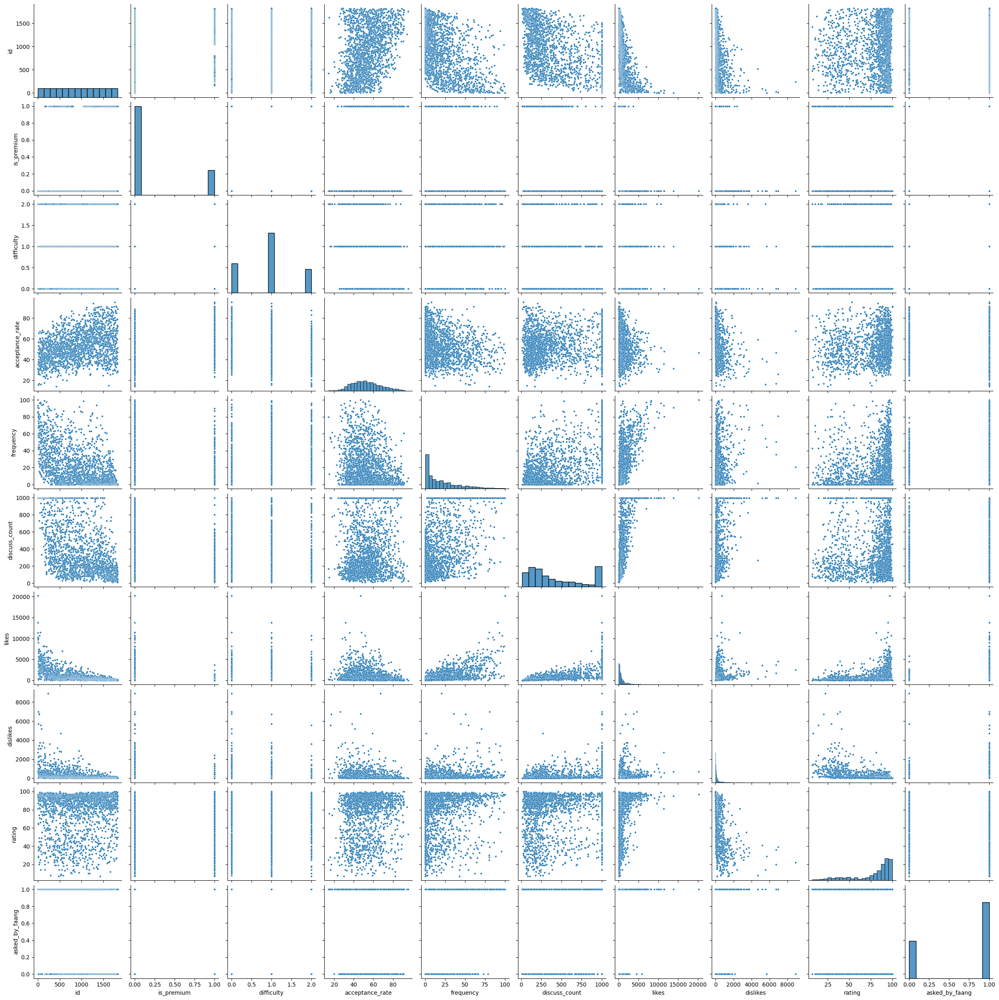
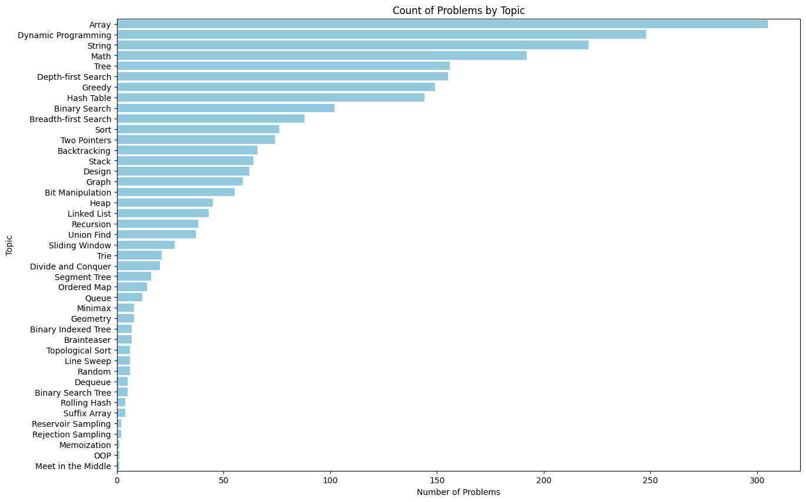
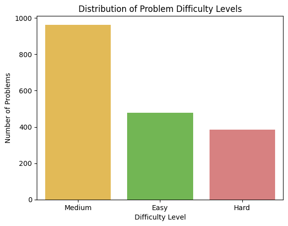
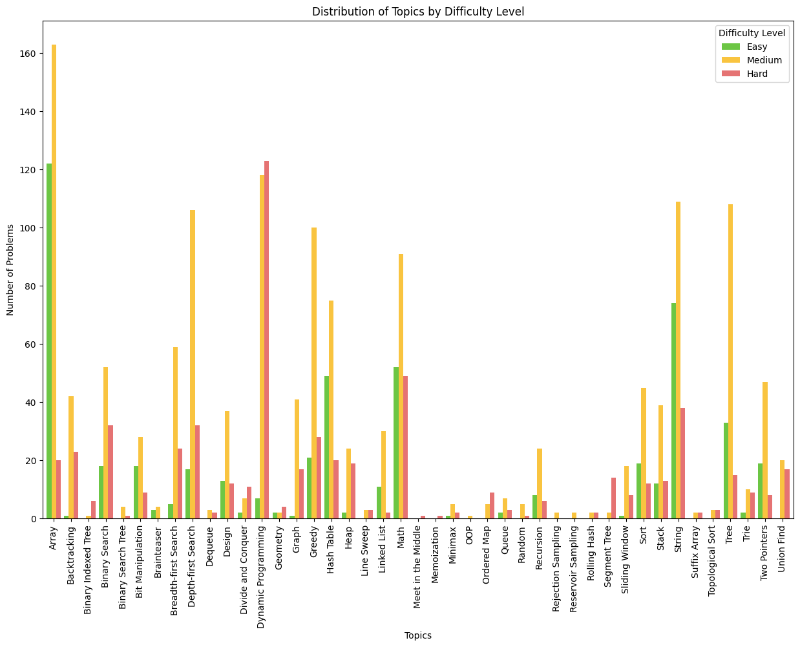
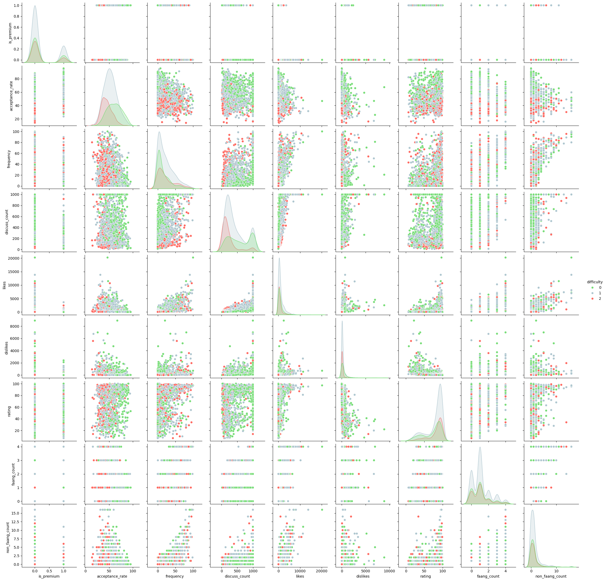
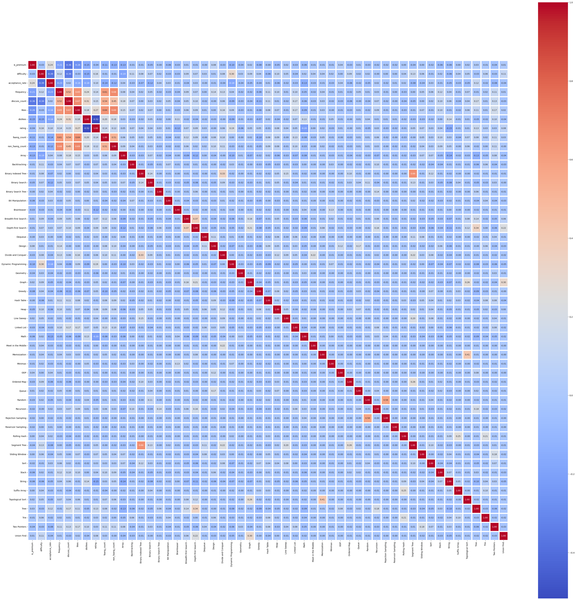
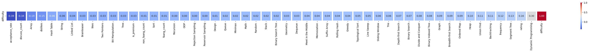
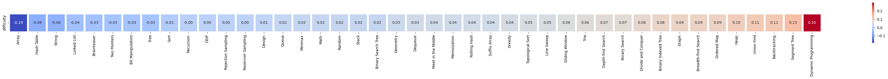
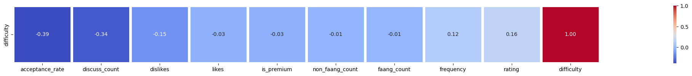
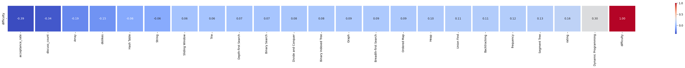

# CSE151A_WIN24_GROUP


# Milestone1 - Abstract

### Topic: LeetCode

**Dataset**:
https://www.kaggle.com/datasets/gzipchrist/leetcode-problem-dataset/data 

**Abstract**: 
Leetcode is one of the largest interview coding prep platforms on the internet, with a huge catalog of coding problems ranked easy, medium, and hard. However, the company has never explained what distinguishes these categories. The dataset we plan to analyze represents 1825 Leetcode problems, with 19 different features such as difficulty, acceptance rate, attempted frequency, and related topics for each individual question. The purpose of our project is to understand what factors are considered to be most important to Leetcode when scoring the difficulty of a problem. We first plan to conduct an exploratory analysis to gain insight into what features are most responsible for determining difficulty ratings. We will then build a machine learning algorithm that hopefully can accurately categorize the difficulty of a problem when given these attributes. Since the problem is a classification problem the models we are considering are k-nearest neighbors, decision trees, and a softmax neural network (if covered in class). One possible application of our project would be to automatically label the difficulty of coding problems encountered outside of Leetcode, such as HackerRank or Codesignal.


# Milestone2

---

[Link to milestone2 notebook](./ipynb/LeetcodeDataExploration.ipynb)

```python
import pandas as pd
import numpy as np
import seaborn as sns
import matplotlib.pyplot as plt

!git clone https://github.com/ruili4UCSD/CSE151A_WIN24_GROUP.git
from google.colab import files
# Make directory named kaggle, copy kaggle.json file there, and change the permissions of the file.
! mkdir ~/.kaggle
! cp ./CSE151A_WIN24_GROUP/data/kaggle.json ~/.kaggle/
! chmod 600 ~/.kaggle/kaggle.json

# Download and unzip sign-language-mnist dataset into '/usr/local'
! kaggle datasets download -d gzipchrist/leetcode-problem-dataset --path 'CSE151A_WIN24_GROUP/data/dataset/'
! unzip 'CSE151A_WIN24_GROUP/data/dataset/leetcode-problem-dataset.zip' -d "CSE151A_WIN24_GROUP/data/dataset/"
```

# Data Set Exploration


## Import Dataset


```python
raw_data = pd.read_csv("CSE151A_WIN24_GROUP/data/dataset/leetcode_dataset - lc.csv")
```


```python
# print("Dataset head: \n", raw_data.head())
print("\nDataset info: \n", raw_data.info())
print("\nDataset null data sum: \n", raw_data.isnull().sum())
print("\nData example: ")
raw_data.head()

```

    <class 'pandas.core.frame.DataFrame'>
    RangeIndex: 1825 entries, 0 to 1824
    Data columns (total 19 columns):
     #   Column             Non-Null Count  Dtype  
    ---  ------             --------------  -----  
     0   id                 1825 non-null   int64  
     1   title              1825 non-null   object 
     2   description        1825 non-null   object 
     3   is_premium         1825 non-null   int64  
     4   difficulty         1825 non-null   object 
     5   solution_link      987 non-null    object 
     6   acceptance_rate    1825 non-null   float64
     7   frequency          1825 non-null   float64
     8   url                1825 non-null   object 
     9   discuss_count      1825 non-null   int64  
     10  accepted           1825 non-null   object 
     11  submissions        1825 non-null   object 
     12  companies          1749 non-null   object 
     13  related_topics     1571 non-null   object 
     14  likes              1825 non-null   int64  
     15  dislikes           1825 non-null   int64  
     16  rating             1825 non-null   int64  
     17  asked_by_faang     1825 non-null   int64  
     18  similar_questions  745 non-null    object 
    dtypes: float64(2), int64(7), object(10)
    memory usage: 271.0+ KB
    
    Dataset info: 
     None
    
    Dataset null data sum: 
     id                      0
    title                   0
    description             0
    is_premium              0
    difficulty              0
    solution_link         838
    acceptance_rate         0
    frequency               0
    url                     0
    discuss_count           0
    accepted                0
    submissions             0
    companies              76
    related_topics        254
    likes                   0
    dislikes                0
    rating                  0
    asked_by_faang          0
    similar_questions    1080
    dtype: int64
    
    Data example: 
    


  <div id="df-bb9ff9ee-06b9-4f4c-b98f-84fc4b73a93a" class="colab-df-container">
    <div>

<table border="1" class="dataframe">
  <thead>
    <tr style="text-align: right;">
      <th></th>
      <th>id</th>
      <th>title</th>
      <th>description</th>
      <th>is_premium</th>
      <th>difficulty</th>
      <th>solution_link</th>
      <th>acceptance_rate</th>
      <th>frequency</th>
      <th>url</th>
      <th>discuss_count</th>
      <th>accepted</th>
      <th>submissions</th>
      <th>companies</th>
      <th>related_topics</th>
      <th>likes</th>
      <th>dislikes</th>
      <th>rating</th>
      <th>asked_by_faang</th>
      <th>similar_questions</th>
    </tr>
  </thead>
  <tbody>
    <tr>
      <th>0</th>
      <td>1</td>
      <td>Two Sum</td>
      <td>Given an array of integers `nums` and an integ...</td>
      <td>0</td>
      <td>Easy</td>
      <td>/articles/two-sum</td>
      <td>46.7</td>
      <td>100.0</td>
      <td>https://leetcode.com/problems/two-sum</td>
      <td>999</td>
      <td>4.1M</td>
      <td>8.7M</td>
      <td>Amazon,Google,Apple,Adobe,Microsoft,Bloomberg,...</td>
      <td>Array,Hash Table</td>
      <td>20217</td>
      <td>712</td>
      <td>97</td>
      <td>1</td>
      <td>[3Sum, /problems/3sum/, Medium], [4Sum, /probl...</td>
    </tr>
    <tr>
      <th>1</th>
      <td>2</td>
      <td>Add Two Numbers</td>
      <td>You are given two non-empty linked lists repre...</td>
      <td>0</td>
      <td>Medium</td>
      <td>/articles/add-two-numbers</td>
      <td>35.7</td>
      <td>93.1</td>
      <td>https://leetcode.com/problems/add-two-numbers</td>
      <td>999</td>
      <td>1.9M</td>
      <td>5.2M</td>
      <td>Bloomberg,Microsoft,Amazon,Google,Facebook,App...</td>
      <td>Linked List,Math,Recursion</td>
      <td>11350</td>
      <td>2704</td>
      <td>81</td>
      <td>1</td>
      <td>[Multiply Strings, /problems/multiply-strings/...</td>
    </tr>
    <tr>
      <th>2</th>
      <td>3</td>
      <td>Longest Substring Without Repeating Characters</td>
      <td>Given a string `s`, find the length of the lon...</td>
      <td>0</td>
      <td>Medium</td>
      <td>/articles/longest-substring-without-repeating-...</td>
      <td>31.5</td>
      <td>90.9</td>
      <td>https://leetcode.com/problems/longest-substrin...</td>
      <td>999</td>
      <td>2.1M</td>
      <td>6.7M</td>
      <td>Amazon,Bloomberg,Microsoft,Facebook,Apple,Adob...</td>
      <td>Hash Table,Two Pointers,String,Sliding Window</td>
      <td>13810</td>
      <td>714</td>
      <td>95</td>
      <td>1</td>
      <td>[Longest Substring with At Most Two Distinct C...</td>
    </tr>
    <tr>
      <th>3</th>
      <td>4</td>
      <td>Median of Two Sorted Arrays</td>
      <td>Given two sorted arrays `nums1` and `nums2` of...</td>
      <td>0</td>
      <td>Hard</td>
      <td>/articles/median-of-two-sorted-arrays</td>
      <td>31.4</td>
      <td>86.2</td>
      <td>https://leetcode.com/problems/median-of-two-so...</td>
      <td>999</td>
      <td>904.7K</td>
      <td>2.9M</td>
      <td>Amazon,Goldman Sachs,Facebook,Microsoft,Apple,...</td>
      <td>Array,Binary Search,Divide and Conquer</td>
      <td>9665</td>
      <td>1486</td>
      <td>87</td>
      <td>1</td>
      <td>NaN</td>
    </tr>
    <tr>
      <th>4</th>
      <td>5</td>
      <td>Longest Palindromic Substring</td>
      <td>Given a string `s`, return the longest palindr...</td>
      <td>0</td>
      <td>Medium</td>
      <td>/articles/longest-palindromic-substring</td>
      <td>30.6</td>
      <td>84.7</td>
      <td>https://leetcode.com/problems/longest-palindro...</td>
      <td>999</td>
      <td>1.3M</td>
      <td>4.1M</td>
      <td>Amazon,Microsoft,Wayfair,Facebook,Adobe,eBay,G...</td>
      <td>String,Dynamic Programming</td>
      <td>10271</td>
      <td>670</td>
      <td>94</td>
      <td>1</td>
      <td>[Shortest Palindrome, /problems/shortest-palin...</td>
    </tr>
  </tbody>
</table>
</div>
    <div class="colab-df-buttons">

  <div class="colab-df-container">
    <button class="colab-df-convert" onclick="convertToInteractive('df-bb9ff9ee-06b9-4f4c-b98f-84fc4b73a93a')"
            title="Convert this dataframe to an interactive table."
            style="display:none;">

  <svg xmlns="http://www.w3.org/2000/svg" height="24px" viewBox="0 -960 960 960">
    <path d="M120-120v-720h720v720H120Zm60-500h600v-160H180v160Zm220 220h160v-160H400v160Zm0 220h160v-160H400v160ZM180-400h160v-160H180v160Zm440 0h160v-160H620v160ZM180-180h160v-160H180v160Zm440 0h160v-160H620v160Z"/>
  </svg>
    </button>

  
  </div>


<div id="df-fad44315-536b-4f99-8f7a-5b39ceb726d1">
  <button class="colab-df-quickchart" onclick="quickchart('df-fad44315-536b-4f99-8f7a-5b39ceb726d1')"
            title="Suggest charts"
            style="display:none;">

<svg xmlns="http://www.w3.org/2000/svg" height="24px"viewBox="0 0 24 24"
     width="24px">
    <g>
        <path d="M19 3H5c-1.1 0-2 .9-2 2v14c0 1.1.9 2 2 2h14c1.1 0 2-.9 2-2V5c0-1.1-.9-2-2-2zM9 17H7v-7h2v7zm4 0h-2V7h2v10zm4 0h-2v-4h2v4z"/>
    </g>
</svg>
  </button>

</div>
    </div>
  </div>


## Dataset Attribute Descriptions

The dataset we have chosen to work with is related to Leetcode, which is one of the largest interview coding prep platforms on the internet, with a huge catalog of coding problems ranked easy, medium, and hard.

The total number of observations that have been gathered for this dataset is 1825. We have considered that this is an appropriate number of observations, with enough data to perform a correct analysis and modeling but not so many as to need to subsample the dataset.

For each of these observations we have 19 distinct features. However, we have decided to drop 6 of the columns for the purpose of our analysis, since they are not relevant to our project.

Our target is difficulty. That is, with this project our aim is to predict whether the problem is considered easy, medium or hard.


| Column Name         | Data Type | # of Null | Description |
|---------------------|-----------|-----------|-------------|
| id                  | int64     | 0         | Unique problem id. |
| title               | String    | 0         | name of the problem. |
| description         | String    | 0         | problem description. |
| is_premium          | int64     | 0         | whether the question requires a premium account). This has been encoded as a number where the only possible values are 0 or 1, and 1 implies that the question does require a premium account. |
| difficulty          | String    | 0         | The level of difficulty of the entry (e.g., Easy, Medium, Hard). |
| solution_link       | String    | 838       | link to the solution for the problem. |
| acceptance_rate     | float64   | 0         | how often the answer submitted is correct). This is a float value indicating the percentage of acceptance, ranging from 13.9 to 95.6 in the case of our dataset but with a possible range of values between 0 and 100. |
| frequency           | float64   | 0         | how often the problem is attempted). This is also in the form of percentage. |
| url                 | String    | 0         | url to the problem. |
| discuss_count       | int64     | 0         | (how many comments are submitted by users). For this feature we have observed that there is a maximum count of 999, which means that there could be problems with that value that could go well over this limit or stay close to it. |
| accepted            | String    | 0         | how many times the answer was accepted). This has been encoded in the dataset as a string, where the value is encoded either as valueK, indicating that the value is in the thousands, or valueM, placing the value in the millions. However, for our project, we will convert this value to a number. |
| submissions         | String    | 0         | how many times the answer was submitted). This feature has the same characteristics as the previous feature, so we will perform the same modification. |
| companies           | String    | 76        | which companies were tagged as having asked this specific problem. |
| related_topics      | String    | 254       | (topics related to the current problem). This feature is given as a string of the different topics that the problem is associated with. However, as will be observed in the analysis, we have decided to use one-hot encoding in order to be able to work with this feature. It is also important to note that there is a 14% of null values, meaning that 14% of our observations don’t have any value for this feature. |
| likes               | int64     | 0         | how many likes the problem got). Integer value ranging from 2 to 20,200. |
| dislikes            | int64     | 0         | how many dislikes the problem got). Integer value ranging from 0 to 8900. |
| rating              | int64     | 0         | This feature is a combination of the previous 2 features. It is computed as likes/(likes+dislikes). Therefore, this is encoded in the form of percentage, ranging in the case of our dataset between 7 and 100. |
| asked_by_faang      | int64     | 0         | whether or not the question was asked by facebook, apple, amazon, google, or netflix. |
| similar_questions   | String    | 1080      | A list of similar entries, possibly including titles, links, and difficulty levels. |

##  Data Scales and Data Distributions

- Analyze the distribution of topics and difficulty levels, and the relationship between the two.
- Explore the correlation between problem difficulty and other factors such as acceptence rate, frequency, submissions, related topics, and the like-to-dislike ratio.


```python
raw_data.describe()
```


  <div id="df-080b3694-28bd-4117-9216-3def1f142b76" class="colab-df-container">
    <div>

<table border="1" class="dataframe">
  <thead>
    <tr style="text-align: right;">
      <th></th>
      <th>id</th>
      <th>is_premium</th>
      <th>acceptance_rate</th>
      <th>frequency</th>
      <th>discuss_count</th>
      <th>likes</th>
      <th>dislikes</th>
      <th>rating</th>
      <th>asked_by_faang</th>
    </tr>
  </thead>
  <tbody>
    <tr>
      <th>count</th>
      <td>1825.000000</td>
      <td>1825.000000</td>
      <td>1825.000000</td>
      <td>1825.000000</td>
      <td>1825.000000</td>
      <td>1825.000000</td>
      <td>1825.000000</td>
      <td>1825.000000</td>
      <td>1825.000000</td>
    </tr>
    <tr>
      <th>mean</th>
      <td>913.000000</td>
      <td>0.218082</td>
      <td>53.139616</td>
      <td>21.113041</td>
      <td>421.435068</td>
      <td>1050.534795</td>
      <td>279.010959</td>
      <td>77.391233</td>
      <td>0.671233</td>
    </tr>
    <tr>
      <th>std</th>
      <td>526.976438</td>
      <td>0.413057</td>
      <td>14.778411</td>
      <td>22.364741</td>
      <td>330.583617</td>
      <td>1512.674013</td>
      <td>608.489206</td>
      <td>23.317515</td>
      <td>0.469894</td>
    </tr>
    <tr>
      <th>min</th>
      <td>1.000000</td>
      <td>0.000000</td>
      <td>13.900000</td>
      <td>0.000000</td>
      <td>9.000000</td>
      <td>2.000000</td>
      <td>0.000000</td>
      <td>7.000000</td>
      <td>0.000000</td>
    </tr>
    <tr>
      <th>25%</th>
      <td>457.000000</td>
      <td>0.000000</td>
      <td>42.400000</td>
      <td>3.100000</td>
      <td>150.000000</td>
      <td>217.000000</td>
      <td>32.000000</td>
      <td>67.000000</td>
      <td>0.000000</td>
    </tr>
    <tr>
      <th>50%</th>
      <td>913.000000</td>
      <td>0.000000</td>
      <td>51.600000</td>
      <td>13.500000</td>
      <td>292.000000</td>
      <td>516.000000</td>
      <td>92.000000</td>
      <td>88.000000</td>
      <td>1.000000</td>
    </tr>
    <tr>
      <th>75%</th>
      <td>1369.000000</td>
      <td>0.000000</td>
      <td>62.800000</td>
      <td>31.800000</td>
      <td>663.000000</td>
      <td>1200.000000</td>
      <td>239.000000</td>
      <td>95.000000</td>
      <td>1.000000</td>
    </tr>
    <tr>
      <th>max</th>
      <td>1825.000000</td>
      <td>1.000000</td>
      <td>95.600000</td>
      <td>100.000000</td>
      <td>999.000000</td>
      <td>20217.000000</td>
      <td>8900.000000</td>
      <td>100.000000</td>
      <td>1.000000</td>
    </tr>
  </tbody>
</table>
</div>
    <div class="colab-df-buttons">

  <div class="colab-df-container">
    <button class="colab-df-convert" onclick="convertToInteractive('df-080b3694-28bd-4117-9216-3def1f142b76')"
            title="Convert this dataframe to an interactive table."
            style="display:none;">

  <svg xmlns="http://www.w3.org/2000/svg" height="24px" viewBox="0 -960 960 960">
    <path d="M120-120v-720h720v720H120Zm60-500h600v-160H180v160Zm220 220h160v-160H400v160Zm0 220h160v-160H400v160ZM180-400h160v-160H180v160Zm440 0h160v-160H620v160ZM180-180h160v-160H180v160Zm440 0h160v-160H620v160Z"/>
  </svg>
    </button>

  </div>


<div id="df-66014bcc-8d87-46cc-bb7e-82a77c38bf10">
  <button class="colab-df-quickchart" onclick="quickchart('df-66014bcc-8d87-46cc-bb7e-82a77c38bf10')"
            title="Suggest charts"
            style="display:none;">

<svg xmlns="http://www.w3.org/2000/svg" height="24px"viewBox="0 0 24 24"
     width="24px">
    <g>
        <path d="M19 3H5c-1.1 0-2 .9-2 2v14c0 1.1.9 2 2 2h14c1.1 0 2-.9 2-2V5c0-1.1-.9-2-2-2zM9 17H7v-7h2v7zm4 0h-2V7h2v10zm4 0h-2v-4h2v4z"/>
    </g>
</svg>
  </button>

</div>
    </div>
  </div>


```python
data_example = raw_data
difficulty_mapping = {'Easy': 0, 'Medium': 1, 'Hard': 2}
data_example['difficulty'] = data_example['difficulty'].replace(difficulty_mapping)
sns.pairplot(data_example, height=2.5, plot_kws={'s': 10})
```


    


### Count of Problems by Topic
In this section, we calculate and visualize the number of problems associated with each unique topic.


```python
related_topics = data_example['related_topics'].str.get_dummies(sep=",").columns.to_list()
data_example = pd.concat([data_example.drop(columns=['related_topics']), data_example['related_topics'].str.get_dummies(sep=",")], axis=1)
unique_topics = [
    'Array', 'Backtracking', 'Binary Indexed Tree', 'Binary Search', 'Binary Search Tree',
    'Bit Manipulation', 'Brainteaser', 'Breadth-first Search', 'Depth-first Search', 'Dequeue',
    'Design', 'Divide and Conquer', 'Dynamic Programming', 'Geometry', 'Graph', 'Greedy', 'Hash Table',
    'Heap', 'Line Sweep', 'Linked List', 'Math', 'Meet in the Middle', 'Memoization', 'Minimax', 'OOP',
    'Ordered Map', 'Queue', 'Random', 'Recursion', 'Rejection Sampling', 'Reservoir Sampling', 'Rolling Hash',
    'Segment Tree', 'Sliding Window', 'Sort', 'Stack', 'String', 'Suffix Array', 'Topological Sort',
    'Tree', 'Trie', 'Two Pointers', 'Union Find'
]

topic_counts = data_example[unique_topics].sum().reset_index()
topic_counts.columns = ['Topic', 'Count']

topic_counts_sorted = topic_counts.sort_values(by='Count', ascending=False)

plt.figure(figsize=(15, 10))
sns.barplot(x='Count', y='Topic', data=topic_counts_sorted, color='skyblue')

plt.title('Count of Problems by Topic')
plt.xlabel('Number of Problems')
plt.ylabel('Topic')
plt.show()
```


    

    


### Distribution of Problem Difficulty Levels
Next, we display the distribution of problems across different difficulty levels (Easy, Medium, Hard).


```python
difficulty_distribution = data_example['difficulty'].value_counts()
difficulty_df = difficulty_distribution.reset_index()
difficulty_df.columns = ['Difficulty Level', 'Number of Problems']

difficulty_renames = {0: 'Easy', 1: 'Medium', 2: 'Hard'}
difficulty_df['Difficulty Level'] = difficulty_df['Difficulty Level'].replace(difficulty_renames)

custom_palette = {'Easy': '#6cc644', 'Medium': '#f9c440', 'Hard': '#e57373'}

sns.barplot(x='Difficulty Level', y='Number of Problems', data=difficulty_df, palette=custom_palette, hue='Difficulty Level', legend=False)
plt.title('Distribution of Problem Difficulty Levels')
plt.show()
```


    

    


### Distribution of Topics by Difficulty Level

Finally, we visualize how various topics are distributed across the three difficulty levels.


```python
topic_by_difficulty = data_example.groupby('difficulty')[unique_topics].sum()
topic_by_difficulty = topic_by_difficulty.rename(index=difficulty_renames)

topic_by_difficulty.T.plot(kind='bar', figsize=(15, 10), width=0.8, color=['#6cc644', '#f9c440', '#e57373'])
plt.title('Distribution of Topics by Difficulty Level')
plt.ylabel('Number of Problems')
plt.xlabel('Topics')
plt.xticks(rotation=90)
plt.legend(title='Difficulty Level')
plt.show()
```


    

    


## Data Evulation and How We Preprocessing Data

### Data we need to drop

Given our goal is to predict the "difficulty" by a series of inputs, through the above data exploration and data visualization above, we can eliminate the following columns from the database:

- "id": A unique identifier for each problem, which does not aid in predicting difficulty.
- "title": Same as above.
- "description": Same as above.
- "solution_link": Same as above.
- "url": Same as above.
- "similar_questions": Same as above.
- "asked_by_faang":  This attributes just indicates whether the question was asked by faang or not. We thought it would be more useful to have “how many faang companies asked this question” instead of that for the prediction.
- (standlization) "companies": Some big companies might choose harder problems, we would transfer this column to numeric attributes "fanng_count" and "non_fanng_count" that can be used by model.
- (standlization) "related_topics": There might be a correlation between this attribute and difficulty (topics associated with obscure concepts might be harder), since this is a String attributes, we need to standlization it.

### Data we need to standlization

We need to perform Data Transformation on the following attributes:

- "difficulty": This is our target attribute (class), given that it is initialized as "Easy", "Medium", "Hard", we need to perform Categorical Feature Encoding on it.
- "submissions": This attribute is number in string format,  we need to convert it into a number.
- "accepted": This attribute is number in string format,  we need to convert it into a number.
- "companies" standlized to "faang_count", As talked above, some big companies might choose harder problems, we would add a new column "faang" count how many famous companies ("Facebook", "Amazon", "Apple", "Netflix", "Google".) choosed this question.
- "companies" standlized to "non_faang_count", same as above, but this is how many compainess does not choose this question.
- "related topics": We will separate the terms in this attribute by comma, then one-hot encode them to fit the machine learning.

### Missing data and problems

Among the remaining attributes, we mainly have missing data in the following attributes:

- Currently, after dropping attributes, no attributes are left with missing data.

For the remaining attributes, we need to perform Normalization to make them more suitable for machine learning.


# Data Cleaning and Preprocessing (Stage One For Data Visualization)


```python
data = raw_data

#Encode difficulty
data.loc[raw_data['difficulty'] == 'Easy', 'difficulty'] = 0
data.loc[raw_data['difficulty'] == 'Medium', 'difficulty'] = 1
data.loc[raw_data['difficulty'] == 'Hard', 'difficulty'] = 2
data['difficulty'] = pd.to_numeric(data.loc[:, 'difficulty'])

# Drop attribute not need
data.drop(columns=["id", "title", "description", "solution_link", "url", "asked_by_faang", "similar_questions"], inplace=True)
```


```python
data.head()
```


  <div id="df-dea5f81c-16d4-4d67-b2fd-51d67d7fd463" class="colab-df-container">
    <div>

<table border="1" class="dataframe">
  <thead>
    <tr style="text-align: right;">
      <th></th>
      <th>is_premium</th>
      <th>difficulty</th>
      <th>acceptance_rate</th>
      <th>frequency</th>
      <th>discuss_count</th>
      <th>accepted</th>
      <th>submissions</th>
      <th>companies</th>
      <th>related_topics</th>
      <th>likes</th>
      <th>dislikes</th>
      <th>rating</th>
    </tr>
  </thead>
  <tbody>
    <tr>
      <th>0</th>
      <td>0</td>
      <td>0</td>
      <td>46.7</td>
      <td>100.0</td>
      <td>999</td>
      <td>4.1M</td>
      <td>8.7M</td>
      <td>Amazon,Google,Apple,Adobe,Microsoft,Bloomberg,...</td>
      <td>Array,Hash Table</td>
      <td>20217</td>
      <td>712</td>
      <td>97</td>
    </tr>
    <tr>
      <th>1</th>
      <td>0</td>
      <td>1</td>
      <td>35.7</td>
      <td>93.1</td>
      <td>999</td>
      <td>1.9M</td>
      <td>5.2M</td>
      <td>Bloomberg,Microsoft,Amazon,Google,Facebook,App...</td>
      <td>Linked List,Math,Recursion</td>
      <td>11350</td>
      <td>2704</td>
      <td>81</td>
    </tr>
    <tr>
      <th>2</th>
      <td>0</td>
      <td>1</td>
      <td>31.5</td>
      <td>90.9</td>
      <td>999</td>
      <td>2.1M</td>
      <td>6.7M</td>
      <td>Amazon,Bloomberg,Microsoft,Facebook,Apple,Adob...</td>
      <td>Hash Table,Two Pointers,String,Sliding Window</td>
      <td>13810</td>
      <td>714</td>
      <td>95</td>
    </tr>
    <tr>
      <th>3</th>
      <td>0</td>
      <td>2</td>
      <td>31.4</td>
      <td>86.2</td>
      <td>999</td>
      <td>904.7K</td>
      <td>2.9M</td>
      <td>Amazon,Goldman Sachs,Facebook,Microsoft,Apple,...</td>
      <td>Array,Binary Search,Divide and Conquer</td>
      <td>9665</td>
      <td>1486</td>
      <td>87</td>
    </tr>
    <tr>
      <th>4</th>
      <td>0</td>
      <td>1</td>
      <td>30.6</td>
      <td>84.7</td>
      <td>999</td>
      <td>1.3M</td>
      <td>4.1M</td>
      <td>Amazon,Microsoft,Wayfair,Facebook,Adobe,eBay,G...</td>
      <td>String,Dynamic Programming</td>
      <td>10271</td>
      <td>670</td>
      <td>94</td>
    </tr>
  </tbody>
</table>
</div>
    <div class="colab-df-buttons">

  <div class="colab-df-container">
    <button class="colab-df-convert" onclick="convertToInteractive('df-dea5f81c-16d4-4d67-b2fd-51d67d7fd463')"
            title="Convert this dataframe to an interactive table."
            style="display:none;">

  <svg xmlns="http://www.w3.org/2000/svg" height="24px" viewBox="0 -960 960 960">
    <path d="M120-120v-720h720v720H120Zm60-500h600v-160H180v160Zm220 220h160v-160H400v160Zm0 220h160v-160H400v160ZM180-400h160v-160H180v160Zm440 0h160v-160H620v160ZM180-180h160v-160H180v160Zm440 0h160v-160H620v160Z"/>
  </svg>
    </button>


  </div>


<div id="df-663cc8ba-83b5-44df-8f36-23abee1071b7">
  <button class="colab-df-quickchart" onclick="quickchart('df-663cc8ba-83b5-44df-8f36-23abee1071b7')"
            title="Suggest charts"
            style="display:none;">

<svg xmlns="http://www.w3.org/2000/svg" height="24px"viewBox="0 0 24 24"
     width="24px">
    <g>
        <path d="M19 3H5c-1.1 0-2 .9-2 2v14c0 1.1.9 2 2 2h14c1.1 0 2-.9 2-2V5c0-1.1-.9-2-2-2zM9 17H7v-7h2v7zm4 0h-2V7h2v10zm4 0h-2v-4h2v4z"/>
    </g>
</svg>
  </button>

</div>
    </div>
  </div>


```python
# sources: https://www.geeksforgeeks.org/python-pandas-series-str-count/
# https://saturncloud.io/blog/how-to-check-if-pandas-column-has-value-from-list-of-strings/#:~:text=One%20simple%20and%20efficient%20way,contained%20in%20the%20given%20list
# https://www.freecodecamp.org/news/dataframe-drop-column-in-pandas-how-to-remove-columns-from-dataframes/#:~:text=drop()%20Method%20in%20Pandas,the%20inplace%20parameter%20to%20True%20
import re
company_series = data["companies"]
fb_count = company_series.str.count("Facebook", re.I)
am_count = company_series.str.count("Amazon", re.I)
ap_count = company_series.str.count("Apple", re.I)
nf_count = company_series.str.count("Netflix", re.I)
gl_count = company_series.str.count("Google", re.I)

faang_count = fb_count + am_count + ap_count + nf_count + gl_count

total_company_count = company_series.str.count(",")
total_company_count = total_company_count + 1

non_faang_count = total_company_count - faang_count

data["faang_count"] = faang_count
data["non_faang_count"] = non_faang_count
data.drop(columns=["companies"], inplace=True)

```


```python
data.head()
```


  <div id="df-df22f6e9-2b8f-4eff-8688-fe2f196c3dda" class="colab-df-container">
    <div>

<table border="1" class="dataframe">
  <thead>
    <tr style="text-align: right;">
      <th></th>
      <th>is_premium</th>
      <th>difficulty</th>
      <th>acceptance_rate</th>
      <th>frequency</th>
      <th>discuss_count</th>
      <th>accepted</th>
      <th>submissions</th>
      <th>related_topics</th>
      <th>likes</th>
      <th>dislikes</th>
      <th>rating</th>
      <th>faang_count</th>
      <th>non_faang_count</th>
    </tr>
  </thead>
  <tbody>
    <tr>
      <th>0</th>
      <td>0</td>
      <td>0</td>
      <td>46.7</td>
      <td>100.0</td>
      <td>999</td>
      <td>4.1M</td>
      <td>8.7M</td>
      <td>Array,Hash Table</td>
      <td>20217</td>
      <td>712</td>
      <td>97</td>
      <td>4.0</td>
      <td>16.0</td>
    </tr>
    <tr>
      <th>1</th>
      <td>0</td>
      <td>1</td>
      <td>35.7</td>
      <td>93.1</td>
      <td>999</td>
      <td>1.9M</td>
      <td>5.2M</td>
      <td>Linked List,Math,Recursion</td>
      <td>11350</td>
      <td>2704</td>
      <td>81</td>
      <td>4.0</td>
      <td>9.0</td>
    </tr>
    <tr>
      <th>2</th>
      <td>0</td>
      <td>1</td>
      <td>31.5</td>
      <td>90.9</td>
      <td>999</td>
      <td>2.1M</td>
      <td>6.7M</td>
      <td>Hash Table,Two Pointers,String,Sliding Window</td>
      <td>13810</td>
      <td>714</td>
      <td>95</td>
      <td>4.0</td>
      <td>16.0</td>
    </tr>
    <tr>
      <th>3</th>
      <td>0</td>
      <td>2</td>
      <td>31.4</td>
      <td>86.2</td>
      <td>999</td>
      <td>904.7K</td>
      <td>2.9M</td>
      <td>Array,Binary Search,Divide and Conquer</td>
      <td>9665</td>
      <td>1486</td>
      <td>87</td>
      <td>4.0</td>
      <td>8.0</td>
    </tr>
    <tr>
      <th>4</th>
      <td>0</td>
      <td>1</td>
      <td>30.6</td>
      <td>84.7</td>
      <td>999</td>
      <td>1.3M</td>
      <td>4.1M</td>
      <td>String,Dynamic Programming</td>
      <td>10271</td>
      <td>670</td>
      <td>94</td>
      <td>3.0</td>
      <td>8.0</td>
    </tr>
  </tbody>
</table>
</div>
    <div class="colab-df-buttons">

  <div class="colab-df-container">
    <button class="colab-df-convert" onclick="convertToInteractive('df-df22f6e9-2b8f-4eff-8688-fe2f196c3dda')"
            title="Convert this dataframe to an interactive table."
            style="display:none;">

  <svg xmlns="http://www.w3.org/2000/svg" height="24px" viewBox="0 -960 960 960">
    <path d="M120-120v-720h720v720H120Zm60-500h600v-160H180v160Zm220 220h160v-160H400v160Zm0 220h160v-160H400v160ZM180-400h160v-160H180v160Zm440 0h160v-160H620v160ZM180-180h160v-160H180v160Zm440 0h160v-160H620v160Z"/>
  </svg>
    </button>

  

  </div>


<div id="df-da895501-58c6-46c9-aa0d-2666cb586173">
  <button class="colab-df-quickchart" onclick="quickchart('df-da895501-58c6-46c9-aa0d-2666cb586173')"
            title="Suggest charts"
            style="display:none;">

<svg xmlns="http://www.w3.org/2000/svg" height="24px"viewBox="0 0 24 24"
     width="24px">
    <g>
        <path d="M19 3H5c-1.1 0-2 .9-2 2v14c0 1.1.9 2 2 2h14c1.1 0 2-.9 2-2V5c0-1.1-.9-2-2-2zM9 17H7v-7h2v7zm4 0h-2V7h2v10zm4 0h-2v-4h2v4z"/>
    </g>
</svg>
  </button>

</div>
    </div>
  </div>


```python
#convert accepted and submissions to ints
def convert_to_int(s):
  if isinstance(s, (int, float)):
    return s
  elif pd.isna(s):
    return 0

  if 'K' in s:
    return float(s.replace('K', '')) * 1000
  elif 'M' in s:
    return float(s.replace('M', '')) * 1000000
  else:
    return s
data['accepted'] = data['accepted'].apply(convert_to_int)
data['submissions'] = data['submissions'].apply(convert_to_int)

related_topics = data['related_topics'].str.get_dummies(sep=",").columns.to_list()

#one hot encode related_topics
data = pd.concat([data.drop(columns=['related_topics']), data['related_topics'].str.get_dummies(sep=",")], axis=1)
```


```python
data
```


  <div id="df-53f34cb7-d84a-46c5-a557-5b8ce8fcea36" class="colab-df-container">
    <div>

<table border="1" class="dataframe">
  <thead>
    <tr style="text-align: right;">
      <th></th>
      <th>is_premium</th>
      <th>difficulty</th>
      <th>acceptance_rate</th>
      <th>frequency</th>
      <th>discuss_count</th>
      <th>accepted</th>
      <th>submissions</th>
      <th>likes</th>
      <th>dislikes</th>
      <th>rating</th>
      <th>...</th>
      <th>Sliding Window</th>
      <th>Sort</th>
      <th>Stack</th>
      <th>String</th>
      <th>Suffix Array</th>
      <th>Topological Sort</th>
      <th>Tree</th>
      <th>Trie</th>
      <th>Two Pointers</th>
      <th>Union Find</th>
    </tr>
  </thead>
  <tbody>
    <tr>
      <th>0</th>
      <td>0</td>
      <td>0</td>
      <td>46.7</td>
      <td>100.0</td>
      <td>999</td>
      <td>4100000.0</td>
      <td>8700000.0</td>
      <td>20217</td>
      <td>712</td>
      <td>97</td>
      <td>...</td>
      <td>0</td>
      <td>0</td>
      <td>0</td>
      <td>0</td>
      <td>0</td>
      <td>0</td>
      <td>0</td>
      <td>0</td>
      <td>0</td>
      <td>0</td>
    </tr>
    <tr>
      <th>1</th>
      <td>0</td>
      <td>1</td>
      <td>35.7</td>
      <td>93.1</td>
      <td>999</td>
      <td>1900000.0</td>
      <td>5200000.0</td>
      <td>11350</td>
      <td>2704</td>
      <td>81</td>
      <td>...</td>
      <td>0</td>
      <td>0</td>
      <td>0</td>
      <td>0</td>
      <td>0</td>
      <td>0</td>
      <td>0</td>
      <td>0</td>
      <td>0</td>
      <td>0</td>
    </tr>
    <tr>
      <th>2</th>
      <td>0</td>
      <td>1</td>
      <td>31.5</td>
      <td>90.9</td>
      <td>999</td>
      <td>2100000.0</td>
      <td>6700000.0</td>
      <td>13810</td>
      <td>714</td>
      <td>95</td>
      <td>...</td>
      <td>1</td>
      <td>0</td>
      <td>0</td>
      <td>1</td>
      <td>0</td>
      <td>0</td>
      <td>0</td>
      <td>0</td>
      <td>1</td>
      <td>0</td>
    </tr>
    <tr>
      <th>3</th>
      <td>0</td>
      <td>2</td>
      <td>31.4</td>
      <td>86.2</td>
      <td>999</td>
      <td>904700.0</td>
      <td>2900000.0</td>
      <td>9665</td>
      <td>1486</td>
      <td>87</td>
      <td>...</td>
      <td>0</td>
      <td>0</td>
      <td>0</td>
      <td>0</td>
      <td>0</td>
      <td>0</td>
      <td>0</td>
      <td>0</td>
      <td>0</td>
      <td>0</td>
    </tr>
    <tr>
      <th>4</th>
      <td>0</td>
      <td>1</td>
      <td>30.6</td>
      <td>84.7</td>
      <td>999</td>
      <td>1300000.0</td>
      <td>4100000.0</td>
      <td>10271</td>
      <td>670</td>
      <td>94</td>
      <td>...</td>
      <td>0</td>
      <td>0</td>
      <td>0</td>
      <td>1</td>
      <td>0</td>
      <td>0</td>
      <td>0</td>
      <td>0</td>
      <td>0</td>
      <td>0</td>
    </tr>
    <tr>
      <th>...</th>
      <td>...</td>
      <td>...</td>
      <td>...</td>
      <td>...</td>
      <td>...</td>
      <td>...</td>
      <td>...</td>
      <td>...</td>
      <td>...</td>
      <td>...</td>
      <td>...</td>
      <td>...</td>
      <td>...</td>
      <td>...</td>
      <td>...</td>
      <td>...</td>
      <td>...</td>
      <td>...</td>
      <td>...</td>
      <td>...</td>
      <td>...</td>
    </tr>
    <tr>
      <th>1820</th>
      <td>1</td>
      <td>0</td>
      <td>88.9</td>
      <td>0.0</td>
      <td>15</td>
      <td>305</td>
      <td>343</td>
      <td>2</td>
      <td>2</td>
      <td>50</td>
      <td>...</td>
      <td>0</td>
      <td>0</td>
      <td>0</td>
      <td>0</td>
      <td>0</td>
      <td>0</td>
      <td>0</td>
      <td>0</td>
      <td>0</td>
      <td>0</td>
    </tr>
    <tr>
      <th>1821</th>
      <td>0</td>
      <td>0</td>
      <td>67.8</td>
      <td>0.0</td>
      <td>104</td>
      <td>7900.0</td>
      <td>11700.0</td>
      <td>37</td>
      <td>4</td>
      <td>90</td>
      <td>...</td>
      <td>0</td>
      <td>0</td>
      <td>0</td>
      <td>0</td>
      <td>0</td>
      <td>0</td>
      <td>0</td>
      <td>0</td>
      <td>0</td>
      <td>0</td>
    </tr>
    <tr>
      <th>1822</th>
      <td>0</td>
      <td>1</td>
      <td>71.8</td>
      <td>0.0</td>
      <td>135</td>
      <td>6800.0</td>
      <td>9500.0</td>
      <td>81</td>
      <td>4</td>
      <td>95</td>
      <td>...</td>
      <td>0</td>
      <td>0</td>
      <td>0</td>
      <td>0</td>
      <td>0</td>
      <td>0</td>
      <td>0</td>
      <td>0</td>
      <td>0</td>
      <td>0</td>
    </tr>
    <tr>
      <th>1823</th>
      <td>0</td>
      <td>1</td>
      <td>47.2</td>
      <td>0.0</td>
      <td>134</td>
      <td>5000.0</td>
      <td>10700.0</td>
      <td>147</td>
      <td>8</td>
      <td>95</td>
      <td>...</td>
      <td>0</td>
      <td>0</td>
      <td>0</td>
      <td>0</td>
      <td>0</td>
      <td>0</td>
      <td>0</td>
      <td>0</td>
      <td>0</td>
      <td>0</td>
    </tr>
    <tr>
      <th>1824</th>
      <td>0</td>
      <td>2</td>
      <td>28.1</td>
      <td>0.0</td>
      <td>48</td>
      <td>2100.0</td>
      <td>7400.0</td>
      <td>52</td>
      <td>43</td>
      <td>55</td>
      <td>...</td>
      <td>0</td>
      <td>0</td>
      <td>0</td>
      <td>0</td>
      <td>0</td>
      <td>0</td>
      <td>0</td>
      <td>0</td>
      <td>0</td>
      <td>0</td>
    </tr>
  </tbody>
</table>
<p>1825 rows × 55 columns</p>
</div>
    <div class="colab-df-buttons">

  <div class="colab-df-container">
    <button class="colab-df-convert" onclick="convertToInteractive('df-53f34cb7-d84a-46c5-a557-5b8ce8fcea36')"
            title="Convert this dataframe to an interactive table."
            style="display:none;">

  <svg xmlns="http://www.w3.org/2000/svg" height="24px" viewBox="0 -960 960 960">
    <path d="M120-120v-720h720v720H120Zm60-500h600v-160H180v160Zm220 220h160v-160H400v160Zm0 220h160v-160H400v160ZM180-400h160v-160H180v160Zm440 0h160v-160H620v160ZM180-180h160v-160H180v160Zm440 0h160v-160H620v160Z"/>
  </svg>
    </button>

  
  </div>


<div id="df-f8066434-6038-4cb7-89a5-bd32a6e0f277">
  <button class="colab-df-quickchart" onclick="quickchart('df-f8066434-6038-4cb7-89a5-bd32a6e0f277')"
            title="Suggest charts"
            style="display:none;">

<svg xmlns="http://www.w3.org/2000/svg" height="24px"viewBox="0 0 24 24"
     width="24px">
    <g>
        <path d="M19 3H5c-1.1 0-2 .9-2 2v14c0 1.1.9 2 2 2h14c1.1 0 2-.9 2-2V5c0-1.1-.9-2-2-2zM9 17H7v-7h2v7zm4 0h-2V7h2v10zm4 0h-2v-4h2v4z"/>
    </g>
</svg>
  </button>

</div>
    </div>
  </div>


# Data Visualization and Analysis
- See the coorolation between difficulty and (acceptence rate, frequency?, submissions, topics, like to dislike)
- All data visualizations

```python
data.describe()
```


  <div id="df-9b4b5ca5-0a1c-4e9d-a2d8-15b03a84f734" class="colab-df-container">
    <div>

<table border="1" class="dataframe">
  <thead>
    <tr style="text-align: right;">
      <th></th>
      <th>is_premium</th>
      <th>difficulty</th>
      <th>acceptance_rate</th>
      <th>frequency</th>
      <th>discuss_count</th>
      <th>likes</th>
      <th>dislikes</th>
      <th>rating</th>
      <th>faang_count</th>
      <th>non_faang_count</th>
      <th>...</th>
      <th>Sliding Window</th>
      <th>Sort</th>
      <th>Stack</th>
      <th>String</th>
      <th>Suffix Array</th>
      <th>Topological Sort</th>
      <th>Tree</th>
      <th>Trie</th>
      <th>Two Pointers</th>
      <th>Union Find</th>
    </tr>
  </thead>
  <tbody>
    <tr>
      <th>count</th>
      <td>1825.000000</td>
      <td>1825.000000</td>
      <td>1825.000000</td>
      <td>1825.000000</td>
      <td>1825.000000</td>
      <td>1825.000000</td>
      <td>1825.000000</td>
      <td>1825.000000</td>
      <td>1749.000000</td>
      <td>1749.000000</td>
      <td>...</td>
      <td>1825.000000</td>
      <td>1825.000000</td>
      <td>1825.000000</td>
      <td>1825.000000</td>
      <td>1825.000000</td>
      <td>1825.000000</td>
      <td>1825.000000</td>
      <td>1825.000000</td>
      <td>1825.000000</td>
      <td>1825.000000</td>
    </tr>
    <tr>
      <th>mean</th>
      <td>0.218082</td>
      <td>0.949589</td>
      <td>53.139616</td>
      <td>21.113041</td>
      <td>421.435068</td>
      <td>1050.534795</td>
      <td>279.010959</td>
      <td>77.391233</td>
      <td>1.068039</td>
      <td>1.250429</td>
      <td>...</td>
      <td>0.014795</td>
      <td>0.041644</td>
      <td>0.035068</td>
      <td>0.121096</td>
      <td>0.002192</td>
      <td>0.003288</td>
      <td>0.085479</td>
      <td>0.011507</td>
      <td>0.040548</td>
      <td>0.020274</td>
    </tr>
    <tr>
      <th>std</th>
      <td>0.413057</td>
      <td>0.685598</td>
      <td>14.778411</td>
      <td>22.364741</td>
      <td>330.583617</td>
      <td>1512.674013</td>
      <td>608.489206</td>
      <td>23.317515</td>
      <td>1.011067</td>
      <td>2.060625</td>
      <td>...</td>
      <td>0.120763</td>
      <td>0.199829</td>
      <td>0.184003</td>
      <td>0.326328</td>
      <td>0.046778</td>
      <td>0.057260</td>
      <td>0.279670</td>
      <td>0.106680</td>
      <td>0.197295</td>
      <td>0.140975</td>
    </tr>
    <tr>
      <th>min</th>
      <td>0.000000</td>
      <td>0.000000</td>
      <td>13.900000</td>
      <td>0.000000</td>
      <td>9.000000</td>
      <td>2.000000</td>
      <td>0.000000</td>
      <td>7.000000</td>
      <td>0.000000</td>
      <td>0.000000</td>
      <td>...</td>
      <td>0.000000</td>
      <td>0.000000</td>
      <td>0.000000</td>
      <td>0.000000</td>
      <td>0.000000</td>
      <td>0.000000</td>
      <td>0.000000</td>
      <td>0.000000</td>
      <td>0.000000</td>
      <td>0.000000</td>
    </tr>
    <tr>
      <th>25%</th>
      <td>0.000000</td>
      <td>0.000000</td>
      <td>42.400000</td>
      <td>3.100000</td>
      <td>150.000000</td>
      <td>217.000000</td>
      <td>32.000000</td>
      <td>67.000000</td>
      <td>0.000000</td>
      <td>0.000000</td>
      <td>...</td>
      <td>0.000000</td>
      <td>0.000000</td>
      <td>0.000000</td>
      <td>0.000000</td>
      <td>0.000000</td>
      <td>0.000000</td>
      <td>0.000000</td>
      <td>0.000000</td>
      <td>0.000000</td>
      <td>0.000000</td>
    </tr>
    <tr>
      <th>50%</th>
      <td>0.000000</td>
      <td>1.000000</td>
      <td>51.600000</td>
      <td>13.500000</td>
      <td>292.000000</td>
      <td>516.000000</td>
      <td>92.000000</td>
      <td>88.000000</td>
      <td>1.000000</td>
      <td>1.000000</td>
      <td>...</td>
      <td>0.000000</td>
      <td>0.000000</td>
      <td>0.000000</td>
      <td>0.000000</td>
      <td>0.000000</td>
      <td>0.000000</td>
      <td>0.000000</td>
      <td>0.000000</td>
      <td>0.000000</td>
      <td>0.000000</td>
    </tr>
    <tr>
      <th>75%</th>
      <td>0.000000</td>
      <td>1.000000</td>
      <td>62.800000</td>
      <td>31.800000</td>
      <td>663.000000</td>
      <td>1200.000000</td>
      <td>239.000000</td>
      <td>95.000000</td>
      <td>1.000000</td>
      <td>1.000000</td>
      <td>...</td>
      <td>0.000000</td>
      <td>0.000000</td>
      <td>0.000000</td>
      <td>0.000000</td>
      <td>0.000000</td>
      <td>0.000000</td>
      <td>0.000000</td>
      <td>0.000000</td>
      <td>0.000000</td>
      <td>0.000000</td>
    </tr>
    <tr>
      <th>max</th>
      <td>1.000000</td>
      <td>2.000000</td>
      <td>95.600000</td>
      <td>100.000000</td>
      <td>999.000000</td>
      <td>20217.000000</td>
      <td>8900.000000</td>
      <td>100.000000</td>
      <td>4.000000</td>
      <td>16.000000</td>
      <td>...</td>
      <td>1.000000</td>
      <td>1.000000</td>
      <td>1.000000</td>
      <td>1.000000</td>
      <td>1.000000</td>
      <td>1.000000</td>
      <td>1.000000</td>
      <td>1.000000</td>
      <td>1.000000</td>
      <td>1.000000</td>
    </tr>
  </tbody>
</table>
<p>8 rows × 53 columns</p>
</div>
    <div class="colab-df-buttons">

  <div class="colab-df-container">
    <button class="colab-df-convert" onclick="convertToInteractive('df-9b4b5ca5-0a1c-4e9d-a2d8-15b03a84f734')"
            title="Convert this dataframe to an interactive table."
            style="display:none;">

  <svg xmlns="http://www.w3.org/2000/svg" height="24px" viewBox="0 -960 960 960">
    <path d="M120-120v-720h720v720H120Zm60-500h600v-160H180v160Zm220 220h160v-160H400v160Zm0 220h160v-160H400v160ZM180-400h160v-160H180v160Zm440 0h160v-160H620v160ZM180-180h160v-160H180v160Zm440 0h160v-160H620v160Z"/>
  </svg>
    </button>


  
  </div>


<div id="df-ac2df204-1a6d-43f4-b3cb-797392f12822">
  <button class="colab-df-quickchart" onclick="quickchart('df-ac2df204-1a6d-43f4-b3cb-797392f12822')"
            title="Suggest charts"
            style="display:none;">

<svg xmlns="http://www.w3.org/2000/svg" height="24px"viewBox="0 0 24 24"
     width="24px">
    <g>
        <path d="M19 3H5c-1.1 0-2 .9-2 2v14c0 1.1.9 2 2 2h14c1.1 0 2-.9 2-2V5c0-1.1-.9-2-2-2zM9 17H7v-7h2v7zm4 0h-2V7h2v10zm4 0h-2v-4h2v4z"/>
    </g>
</svg>
  </button>

</div>
    </div>
  </div>


## Pairplot
We have opted to remove the one hot encoded data in our pairplot as it takes much to long to load if we do.


```python
#with our pair plot we exclude the one hot encoding as it takes the pairplot forever to plot
palette = ['#77dd77', '#aec6cf', '#ff6961']
sns.pairplot(data.drop(related_topics, axis=1), hue='difficulty', palette=palette)
```


    <seaborn.axisgrid.PairGrid at 0x789f4b573640>


    

    


```python

```

Some interesting things to note from our pair plot include:
- That discussion and acceptence rate seem most corrolated with difficulty.
- Likes and dislikes are inversely coorolated.
- non-faang count and frequency look to be positively corrolated.

But our pairplot isn't giving us a ton of stuff relevant information for our goal. So thats why we move on to our heat map/corrolation matrix.

## Coorrolation Matrix
We now move onto our corrolation matrix, which we hope will give us a little more insight into our data. We need to start by normalizing our data. We use minmax normalization since only some of our data looks to be normally distributed.


```python
#note we need to fix 'accepted' and 'submissions' as they are strings rn
normalized_data = data
def minMaxNormalizeSeries(series):
  if series.dtype != object:
    min = series.min()
    max = series.max()
    series = (series-min)/(max-min)
  return series
normalized_data.apply(minMaxNormalizeSeries, axis = 0)
```


  <div id="df-a2b7bcfe-8318-4a2c-80a8-f71441b9651b" class="colab-df-container">
    <div>

<table border="1" class="dataframe">
  <thead>
    <tr style="text-align: right;">
      <th></th>
      <th>is_premium</th>
      <th>difficulty</th>
      <th>acceptance_rate</th>
      <th>frequency</th>
      <th>discuss_count</th>
      <th>accepted</th>
      <th>submissions</th>
      <th>likes</th>
      <th>dislikes</th>
      <th>rating</th>
      <th>...</th>
      <th>Sliding Window</th>
      <th>Sort</th>
      <th>Stack</th>
      <th>String</th>
      <th>Suffix Array</th>
      <th>Topological Sort</th>
      <th>Tree</th>
      <th>Trie</th>
      <th>Two Pointers</th>
      <th>Union Find</th>
    </tr>
  </thead>
  <tbody>
    <tr>
      <th>0</th>
      <td>0.0</td>
      <td>0.0</td>
      <td>0.401469</td>
      <td>1.000</td>
      <td>1.000000</td>
      <td>4100000.0</td>
      <td>8700000.0</td>
      <td>1.000000</td>
      <td>0.080000</td>
      <td>0.967742</td>
      <td>...</td>
      <td>0.0</td>
      <td>0.0</td>
      <td>0.0</td>
      <td>0.0</td>
      <td>0.0</td>
      <td>0.0</td>
      <td>0.0</td>
      <td>0.0</td>
      <td>0.0</td>
      <td>0.0</td>
    </tr>
    <tr>
      <th>1</th>
      <td>0.0</td>
      <td>0.5</td>
      <td>0.266830</td>
      <td>0.931</td>
      <td>1.000000</td>
      <td>1900000.0</td>
      <td>5200000.0</td>
      <td>0.561365</td>
      <td>0.303820</td>
      <td>0.795699</td>
      <td>...</td>
      <td>0.0</td>
      <td>0.0</td>
      <td>0.0</td>
      <td>0.0</td>
      <td>0.0</td>
      <td>0.0</td>
      <td>0.0</td>
      <td>0.0</td>
      <td>0.0</td>
      <td>0.0</td>
    </tr>
    <tr>
      <th>2</th>
      <td>0.0</td>
      <td>0.5</td>
      <td>0.215422</td>
      <td>0.909</td>
      <td>1.000000</td>
      <td>2100000.0</td>
      <td>6700000.0</td>
      <td>0.683057</td>
      <td>0.080225</td>
      <td>0.946237</td>
      <td>...</td>
      <td>1.0</td>
      <td>0.0</td>
      <td>0.0</td>
      <td>1.0</td>
      <td>0.0</td>
      <td>0.0</td>
      <td>0.0</td>
      <td>0.0</td>
      <td>1.0</td>
      <td>0.0</td>
    </tr>
    <tr>
      <th>3</th>
      <td>0.0</td>
      <td>1.0</td>
      <td>0.214198</td>
      <td>0.862</td>
      <td>1.000000</td>
      <td>904700.0</td>
      <td>2900000.0</td>
      <td>0.478011</td>
      <td>0.166966</td>
      <td>0.860215</td>
      <td>...</td>
      <td>0.0</td>
      <td>0.0</td>
      <td>0.0</td>
      <td>0.0</td>
      <td>0.0</td>
      <td>0.0</td>
      <td>0.0</td>
      <td>0.0</td>
      <td>0.0</td>
      <td>0.0</td>
    </tr>
    <tr>
      <th>4</th>
      <td>0.0</td>
      <td>0.5</td>
      <td>0.204406</td>
      <td>0.847</td>
      <td>1.000000</td>
      <td>1300000.0</td>
      <td>4100000.0</td>
      <td>0.507989</td>
      <td>0.075281</td>
      <td>0.935484</td>
      <td>...</td>
      <td>0.0</td>
      <td>0.0</td>
      <td>0.0</td>
      <td>1.0</td>
      <td>0.0</td>
      <td>0.0</td>
      <td>0.0</td>
      <td>0.0</td>
      <td>0.0</td>
      <td>0.0</td>
    </tr>
    <tr>
      <th>...</th>
      <td>...</td>
      <td>...</td>
      <td>...</td>
      <td>...</td>
      <td>...</td>
      <td>...</td>
      <td>...</td>
      <td>...</td>
      <td>...</td>
      <td>...</td>
      <td>...</td>
      <td>...</td>
      <td>...</td>
      <td>...</td>
      <td>...</td>
      <td>...</td>
      <td>...</td>
      <td>...</td>
      <td>...</td>
      <td>...</td>
      <td>...</td>
    </tr>
    <tr>
      <th>1820</th>
      <td>1.0</td>
      <td>0.0</td>
      <td>0.917993</td>
      <td>0.000</td>
      <td>0.006061</td>
      <td>305</td>
      <td>343</td>
      <td>0.000000</td>
      <td>0.000225</td>
      <td>0.462366</td>
      <td>...</td>
      <td>0.0</td>
      <td>0.0</td>
      <td>0.0</td>
      <td>0.0</td>
      <td>0.0</td>
      <td>0.0</td>
      <td>0.0</td>
      <td>0.0</td>
      <td>0.0</td>
      <td>0.0</td>
    </tr>
    <tr>
      <th>1821</th>
      <td>0.0</td>
      <td>0.0</td>
      <td>0.659731</td>
      <td>0.000</td>
      <td>0.095960</td>
      <td>7900.0</td>
      <td>11700.0</td>
      <td>0.001731</td>
      <td>0.000449</td>
      <td>0.892473</td>
      <td>...</td>
      <td>0.0</td>
      <td>0.0</td>
      <td>0.0</td>
      <td>0.0</td>
      <td>0.0</td>
      <td>0.0</td>
      <td>0.0</td>
      <td>0.0</td>
      <td>0.0</td>
      <td>0.0</td>
    </tr>
    <tr>
      <th>1822</th>
      <td>0.0</td>
      <td>0.5</td>
      <td>0.708690</td>
      <td>0.000</td>
      <td>0.127273</td>
      <td>6800.0</td>
      <td>9500.0</td>
      <td>0.003908</td>
      <td>0.000449</td>
      <td>0.946237</td>
      <td>...</td>
      <td>0.0</td>
      <td>0.0</td>
      <td>0.0</td>
      <td>0.0</td>
      <td>0.0</td>
      <td>0.0</td>
      <td>0.0</td>
      <td>0.0</td>
      <td>0.0</td>
      <td>0.0</td>
    </tr>
    <tr>
      <th>1823</th>
      <td>0.0</td>
      <td>0.5</td>
      <td>0.407589</td>
      <td>0.000</td>
      <td>0.126263</td>
      <td>5000.0</td>
      <td>10700.0</td>
      <td>0.007173</td>
      <td>0.000899</td>
      <td>0.946237</td>
      <td>...</td>
      <td>0.0</td>
      <td>0.0</td>
      <td>0.0</td>
      <td>0.0</td>
      <td>0.0</td>
      <td>0.0</td>
      <td>0.0</td>
      <td>0.0</td>
      <td>0.0</td>
      <td>0.0</td>
    </tr>
    <tr>
      <th>1824</th>
      <td>0.0</td>
      <td>1.0</td>
      <td>0.173807</td>
      <td>0.000</td>
      <td>0.039394</td>
      <td>2100.0</td>
      <td>7400.0</td>
      <td>0.002473</td>
      <td>0.004831</td>
      <td>0.516129</td>
      <td>...</td>
      <td>0.0</td>
      <td>0.0</td>
      <td>0.0</td>
      <td>0.0</td>
      <td>0.0</td>
      <td>0.0</td>
      <td>0.0</td>
      <td>0.0</td>
      <td>0.0</td>
      <td>0.0</td>
    </tr>
  </tbody>
</table>
<p>1825 rows × 55 columns</p>
</div>
    <div class="colab-df-buttons">

  <div class="colab-df-container">
    <button class="colab-df-convert" onclick="convertToInteractive('df-a2b7bcfe-8318-4a2c-80a8-f71441b9651b')"
            title="Convert this dataframe to an interactive table."
            style="display:none;">

  <svg xmlns="http://www.w3.org/2000/svg" height="24px" viewBox="0 -960 960 960">
    <path d="M120-120v-720h720v720H120Zm60-500h600v-160H180v160Zm220 220h160v-160H400v160Zm0 220h160v-160H400v160ZM180-400h160v-160H180v160Zm440 0h160v-160H620v160ZM180-180h160v-160H180v160Zm440 0h160v-160H620v160Z"/>
  </svg>
    </button>


  </div>


<div id="df-434c40dc-40a9-44a4-bd25-2cf9613cdf54">
  <button class="colab-df-quickchart" onclick="quickchart('df-434c40dc-40a9-44a4-bd25-2cf9613cdf54')"
            title="Suggest charts"
            style="display:none;">

<svg xmlns="http://www.w3.org/2000/svg" height="24px"viewBox="0 0 24 24"
     width="24px">
    <g>
        <path d="M19 3H5c-1.1 0-2 .9-2 2v14c0 1.1.9 2 2 2h14c1.1 0 2-.9 2-2V5c0-1.1-.9-2-2-2zM9 17H7v-7h2v7zm4 0h-2V7h2v10zm4 0h-2v-4h2v4z"/>
    </g>
</svg>
  </button>

</div>
    </div>
  </div>


We now can now look at our corrolation matrix.


```python
# remove the drop once accepted and submissions are fixed
dataplot = normalized_data

plt.figure(figsize=(50, 50))
sns.heatmap(dataplot.corr(), annot=True, fmt='.2f', cmap='coolwarm', square=True, linewidths=5)
plt.show()
```


    

    


So with this corrolation matrix we can get a better understanding of what variables are correlated with others. For example:
- We can see how many of the Tree topics have positive correlation with eachother
- Discussion is negatively correlated with rating (significantly more so than submissions), implying that the harder a problem is the less discussion there will be.
- The most negatively correlated topic with rating is math XD (leetcoders hate math)

However, this corrolation matrix is a bit overwhelming. So lets focus on our parameter of interest, difficulty.


```python
#Look at all the corrolation between subjects and difficulty and rank them
difficulty_vs_all = pd.DataFrame(normalized_data.corr().loc[['difficulty'], :]).sort_values(by=['difficulty'], axis = 1)
plt.figure(figsize=(50, 2))
sns.heatmap(difficulty_vs_all, annot=True, fmt='.2f', cmap='coolwarm', square=True, linewidths=5)
```


    

    


With all the topics mixed with all the other data its still a bit hard to see whats going on. So we can break it down even further into related topics and the rest of the features:


```python
difficulty_vs_related_topics = difficulty_vs_all.loc[:, related_topics].sort_values(by=['difficulty'], axis = 1)
difficulty_vs_other = difficulty_vs_all.drop(related_topics, axis=1).sort_values(by=['difficulty'], axis = 1)
```

Looking at the related topics we can conclude some interesting properties.
- "Dynamic programming" is the most corrolated topic in determining problem difficulty.
- Array is the most negatively corrolated topic
- Most topic labels are associated with increased difficulty


```python
plt.figure(figsize=(50, 2))
sns.heatmap(difficulty_vs_related_topics, annot=True, fmt='.2f', cmap='coolwarm', square=True, linewidths=5)
```

    

    


Looking at the other features we can conclude some other interesting properties.
- "Acceptance rate" is the most corrolated feature determining difficulty (which seems self evident)
- "Discuss count" is the second most corrolated feature
- Dislikes seems to be a better predictor of problem difficulty than likes (which is interesting since leetcode actually hid the dislike counter)


```python
plt.figure(figsize=(50, 2))
sns.heatmap(difficulty_vs_other, annot=True, fmt='.2f', cmap='coolwarm', square=True, linewidths=5)
```



    


We can now clearly decide which features are relevant and which are not. We will drop all features who's corrolation is below .05 leaving us with 24 features (excluding difficulty).


```python
#Drop values with a magnitude below .05
relevant_feature_corr = difficulty_vs_all.loc[:, (abs(difficulty_vs_all) >= .05).T.difficulty]
plt.figure(figsize=(50, 2))
sns.heatmap(relevant_feature_corr, annot=True, fmt='.2f', cmap='coolwarm', square=True, linewidths=5)
len(relevant_feature_corr.columns)
```

    

    


# Data Preprocessing (Stage Two)
With all of our data exploration done we have know have landed on a handful of features we know we want to keep.
In reality a lot of our data has already been pre-processed in the Importing and Cleanning data phase, now we just need to refine based on our finding from the data exploration.


```python
relevant_feature_corr.columns
```


    Index(['acceptance_rate', 'discuss_count', 'Array', 'dislikes', 'Hash Table',
           'String', 'Sliding Window', 'Trie', 'Depth-first Search',
           'Binary Search', 'Divide and Conquer', 'Binary Indexed Tree', 'Graph',
           'Breadth-first Search', 'Ordered Map', 'Heap', 'Union Find',
           'Backtracking', 'frequency', 'Segment Tree', 'rating',
           'Dynamic Programming', 'difficulty'],
          dtype='object')


```python
data
```


  <div id="df-b9f963a0-3934-47ff-869d-47a21d2b1c2f" class="colab-df-container">
    <div>

<table border="1" class="dataframe">
  <thead>
    <tr style="text-align: right;">
      <th></th>
      <th>is_premium</th>
      <th>difficulty</th>
      <th>acceptance_rate</th>
      <th>frequency</th>
      <th>discuss_count</th>
      <th>accepted</th>
      <th>submissions</th>
      <th>likes</th>
      <th>dislikes</th>
      <th>rating</th>
      <th>...</th>
      <th>Sliding Window</th>
      <th>Sort</th>
      <th>Stack</th>
      <th>String</th>
      <th>Suffix Array</th>
      <th>Topological Sort</th>
      <th>Tree</th>
      <th>Trie</th>
      <th>Two Pointers</th>
      <th>Union Find</th>
    </tr>
  </thead>
  <tbody>
    <tr>
      <th>0</th>
      <td>0</td>
      <td>0</td>
      <td>46.7</td>
      <td>100.0</td>
      <td>999</td>
      <td>4100000.0</td>
      <td>8700000.0</td>
      <td>20217</td>
      <td>712</td>
      <td>97</td>
      <td>...</td>
      <td>0</td>
      <td>0</td>
      <td>0</td>
      <td>0</td>
      <td>0</td>
      <td>0</td>
      <td>0</td>
      <td>0</td>
      <td>0</td>
      <td>0</td>
    </tr>
    <tr>
      <th>1</th>
      <td>0</td>
      <td>1</td>
      <td>35.7</td>
      <td>93.1</td>
      <td>999</td>
      <td>1900000.0</td>
      <td>5200000.0</td>
      <td>11350</td>
      <td>2704</td>
      <td>81</td>
      <td>...</td>
      <td>0</td>
      <td>0</td>
      <td>0</td>
      <td>0</td>
      <td>0</td>
      <td>0</td>
      <td>0</td>
      <td>0</td>
      <td>0</td>
      <td>0</td>
    </tr>
    <tr>
      <th>2</th>
      <td>0</td>
      <td>1</td>
      <td>31.5</td>
      <td>90.9</td>
      <td>999</td>
      <td>2100000.0</td>
      <td>6700000.0</td>
      <td>13810</td>
      <td>714</td>
      <td>95</td>
      <td>...</td>
      <td>1</td>
      <td>0</td>
      <td>0</td>
      <td>1</td>
      <td>0</td>
      <td>0</td>
      <td>0</td>
      <td>0</td>
      <td>1</td>
      <td>0</td>
    </tr>
    <tr>
      <th>3</th>
      <td>0</td>
      <td>2</td>
      <td>31.4</td>
      <td>86.2</td>
      <td>999</td>
      <td>904700.0</td>
      <td>2900000.0</td>
      <td>9665</td>
      <td>1486</td>
      <td>87</td>
      <td>...</td>
      <td>0</td>
      <td>0</td>
      <td>0</td>
      <td>0</td>
      <td>0</td>
      <td>0</td>
      <td>0</td>
      <td>0</td>
      <td>0</td>
      <td>0</td>
    </tr>
    <tr>
      <th>4</th>
      <td>0</td>
      <td>1</td>
      <td>30.6</td>
      <td>84.7</td>
      <td>999</td>
      <td>1300000.0</td>
      <td>4100000.0</td>
      <td>10271</td>
      <td>670</td>
      <td>94</td>
      <td>...</td>
      <td>0</td>
      <td>0</td>
      <td>0</td>
      <td>1</td>
      <td>0</td>
      <td>0</td>
      <td>0</td>
      <td>0</td>
      <td>0</td>
      <td>0</td>
    </tr>
    <tr>
      <th>...</th>
      <td>...</td>
      <td>...</td>
      <td>...</td>
      <td>...</td>
      <td>...</td>
      <td>...</td>
      <td>...</td>
      <td>...</td>
      <td>...</td>
      <td>...</td>
      <td>...</td>
      <td>...</td>
      <td>...</td>
      <td>...</td>
      <td>...</td>
      <td>...</td>
      <td>...</td>
      <td>...</td>
      <td>...</td>
      <td>...</td>
      <td>...</td>
    </tr>
    <tr>
      <th>1820</th>
      <td>1</td>
      <td>0</td>
      <td>88.9</td>
      <td>0.0</td>
      <td>15</td>
      <td>305</td>
      <td>343</td>
      <td>2</td>
      <td>2</td>
      <td>50</td>
      <td>...</td>
      <td>0</td>
      <td>0</td>
      <td>0</td>
      <td>0</td>
      <td>0</td>
      <td>0</td>
      <td>0</td>
      <td>0</td>
      <td>0</td>
      <td>0</td>
    </tr>
    <tr>
      <th>1821</th>
      <td>0</td>
      <td>0</td>
      <td>67.8</td>
      <td>0.0</td>
      <td>104</td>
      <td>7900.0</td>
      <td>11700.0</td>
      <td>37</td>
      <td>4</td>
      <td>90</td>
      <td>...</td>
      <td>0</td>
      <td>0</td>
      <td>0</td>
      <td>0</td>
      <td>0</td>
      <td>0</td>
      <td>0</td>
      <td>0</td>
      <td>0</td>
      <td>0</td>
    </tr>
    <tr>
      <th>1822</th>
      <td>0</td>
      <td>1</td>
      <td>71.8</td>
      <td>0.0</td>
      <td>135</td>
      <td>6800.0</td>
      <td>9500.0</td>
      <td>81</td>
      <td>4</td>
      <td>95</td>
      <td>...</td>
      <td>0</td>
      <td>0</td>
      <td>0</td>
      <td>0</td>
      <td>0</td>
      <td>0</td>
      <td>0</td>
      <td>0</td>
      <td>0</td>
      <td>0</td>
    </tr>
    <tr>
      <th>1823</th>
      <td>0</td>
      <td>1</td>
      <td>47.2</td>
      <td>0.0</td>
      <td>134</td>
      <td>5000.0</td>
      <td>10700.0</td>
      <td>147</td>
      <td>8</td>
      <td>95</td>
      <td>...</td>
      <td>0</td>
      <td>0</td>
      <td>0</td>
      <td>0</td>
      <td>0</td>
      <td>0</td>
      <td>0</td>
      <td>0</td>
      <td>0</td>
      <td>0</td>
    </tr>
    <tr>
      <th>1824</th>
      <td>0</td>
      <td>2</td>
      <td>28.1</td>
      <td>0.0</td>
      <td>48</td>
      <td>2100.0</td>
      <td>7400.0</td>
      <td>52</td>
      <td>43</td>
      <td>55</td>
      <td>...</td>
      <td>0</td>
      <td>0</td>
      <td>0</td>
      <td>0</td>
      <td>0</td>
      <td>0</td>
      <td>0</td>
      <td>0</td>
      <td>0</td>
      <td>0</td>
    </tr>
  </tbody>
</table>
<p>1825 rows × 55 columns</p>
</div>
    <div class="colab-df-buttons">

  <div class="colab-df-container">
    <button class="colab-df-convert" onclick="convertToInteractive('df-b9f963a0-3934-47ff-869d-47a21d2b1c2f')"
            title="Convert this dataframe to an interactive table."
            style="display:none;">

  <svg xmlns="http://www.w3.org/2000/svg" height="24px" viewBox="0 -960 960 960">
    <path d="M120-120v-720h720v720H120Zm60-500h600v-160H180v160Zm220 220h160v-160H400v160Zm0 220h160v-160H400v160ZM180-400h160v-160H180v160Zm440 0h160v-160H620v160ZM180-180h160v-160H180v160Zm440 0h160v-160H620v160Z"/>
  </svg>
    </button>


  </div>


<div id="df-76fac49e-535d-4278-b823-bf57a1b57685">
  <button class="colab-df-quickchart" onclick="quickchart('df-76fac49e-535d-4278-b823-bf57a1b57685')"
            title="Suggest charts"
            style="display:none;">

<svg xmlns="http://www.w3.org/2000/svg" height="24px"viewBox="0 0 24 24"
     width="24px">
    <g>
        <path d="M19 3H5c-1.1 0-2 .9-2 2v14c0 1.1.9 2 2 2h14c1.1 0 2-.9 2-2V5c0-1.1-.9-2-2-2zM9 17H7v-7h2v7zm4 0h-2V7h2v10zm4 0h-2v-4h2v4z"/>
    </g>
</svg>
  </button>

</div>
    </div>
  </div>


```python
final_data = data.loc[:, relevant_feature_corr.columns]
final_data
```


  <div id="df-9b565fdc-fb99-414d-af92-79629f89c11e" class="colab-df-container">
    <div>

<table border="1" class="dataframe">
  <thead>
    <tr style="text-align: right;">
      <th></th>
      <th>acceptance_rate</th>
      <th>discuss_count</th>
      <th>Array</th>
      <th>dislikes</th>
      <th>Hash Table</th>
      <th>String</th>
      <th>Sliding Window</th>
      <th>Trie</th>
      <th>Depth-first Search</th>
      <th>Binary Search</th>
      <th>...</th>
      <th>Breadth-first Search</th>
      <th>Ordered Map</th>
      <th>Heap</th>
      <th>Union Find</th>
      <th>Backtracking</th>
      <th>frequency</th>
      <th>Segment Tree</th>
      <th>rating</th>
      <th>Dynamic Programming</th>
      <th>difficulty</th>
    </tr>
  </thead>
  <tbody>
    <tr>
      <th>0</th>
      <td>46.7</td>
      <td>999</td>
      <td>1</td>
      <td>712</td>
      <td>1</td>
      <td>0</td>
      <td>0</td>
      <td>0</td>
      <td>0</td>
      <td>0</td>
      <td>...</td>
      <td>0</td>
      <td>0</td>
      <td>0</td>
      <td>0</td>
      <td>0</td>
      <td>100.0</td>
      <td>0</td>
      <td>97</td>
      <td>0</td>
      <td>0</td>
    </tr>
    <tr>
      <th>1</th>
      <td>35.7</td>
      <td>999</td>
      <td>0</td>
      <td>2704</td>
      <td>0</td>
      <td>0</td>
      <td>0</td>
      <td>0</td>
      <td>0</td>
      <td>0</td>
      <td>...</td>
      <td>0</td>
      <td>0</td>
      <td>0</td>
      <td>0</td>
      <td>0</td>
      <td>93.1</td>
      <td>0</td>
      <td>81</td>
      <td>0</td>
      <td>1</td>
    </tr>
    <tr>
      <th>2</th>
      <td>31.5</td>
      <td>999</td>
      <td>0</td>
      <td>714</td>
      <td>1</td>
      <td>1</td>
      <td>1</td>
      <td>0</td>
      <td>0</td>
      <td>0</td>
      <td>...</td>
      <td>0</td>
      <td>0</td>
      <td>0</td>
      <td>0</td>
      <td>0</td>
      <td>90.9</td>
      <td>0</td>
      <td>95</td>
      <td>0</td>
      <td>1</td>
    </tr>
    <tr>
      <th>3</th>
      <td>31.4</td>
      <td>999</td>
      <td>1</td>
      <td>1486</td>
      <td>0</td>
      <td>0</td>
      <td>0</td>
      <td>0</td>
      <td>0</td>
      <td>1</td>
      <td>...</td>
      <td>0</td>
      <td>0</td>
      <td>0</td>
      <td>0</td>
      <td>0</td>
      <td>86.2</td>
      <td>0</td>
      <td>87</td>
      <td>0</td>
      <td>2</td>
    </tr>
    <tr>
      <th>4</th>
      <td>30.6</td>
      <td>999</td>
      <td>0</td>
      <td>670</td>
      <td>0</td>
      <td>1</td>
      <td>0</td>
      <td>0</td>
      <td>0</td>
      <td>0</td>
      <td>...</td>
      <td>0</td>
      <td>0</td>
      <td>0</td>
      <td>0</td>
      <td>0</td>
      <td>84.7</td>
      <td>0</td>
      <td>94</td>
      <td>1</td>
      <td>1</td>
    </tr>
    <tr>
      <th>...</th>
      <td>...</td>
      <td>...</td>
      <td>...</td>
      <td>...</td>
      <td>...</td>
      <td>...</td>
      <td>...</td>
      <td>...</td>
      <td>...</td>
      <td>...</td>
      <td>...</td>
      <td>...</td>
      <td>...</td>
      <td>...</td>
      <td>...</td>
      <td>...</td>
      <td>...</td>
      <td>...</td>
      <td>...</td>
      <td>...</td>
      <td>...</td>
    </tr>
    <tr>
      <th>1820</th>
      <td>88.9</td>
      <td>15</td>
      <td>0</td>
      <td>2</td>
      <td>0</td>
      <td>0</td>
      <td>0</td>
      <td>0</td>
      <td>0</td>
      <td>0</td>
      <td>...</td>
      <td>0</td>
      <td>0</td>
      <td>0</td>
      <td>0</td>
      <td>0</td>
      <td>0.0</td>
      <td>0</td>
      <td>50</td>
      <td>0</td>
      <td>0</td>
    </tr>
    <tr>
      <th>1821</th>
      <td>67.8</td>
      <td>104</td>
      <td>0</td>
      <td>4</td>
      <td>0</td>
      <td>0</td>
      <td>0</td>
      <td>0</td>
      <td>0</td>
      <td>0</td>
      <td>...</td>
      <td>0</td>
      <td>0</td>
      <td>0</td>
      <td>0</td>
      <td>0</td>
      <td>0.0</td>
      <td>0</td>
      <td>90</td>
      <td>0</td>
      <td>0</td>
    </tr>
    <tr>
      <th>1822</th>
      <td>71.8</td>
      <td>135</td>
      <td>1</td>
      <td>4</td>
      <td>0</td>
      <td>0</td>
      <td>0</td>
      <td>0</td>
      <td>0</td>
      <td>0</td>
      <td>...</td>
      <td>0</td>
      <td>0</td>
      <td>0</td>
      <td>0</td>
      <td>0</td>
      <td>0.0</td>
      <td>0</td>
      <td>95</td>
      <td>0</td>
      <td>1</td>
    </tr>
    <tr>
      <th>1823</th>
      <td>47.2</td>
      <td>134</td>
      <td>0</td>
      <td>8</td>
      <td>0</td>
      <td>0</td>
      <td>0</td>
      <td>0</td>
      <td>0</td>
      <td>0</td>
      <td>...</td>
      <td>1</td>
      <td>0</td>
      <td>0</td>
      <td>0</td>
      <td>0</td>
      <td>0.0</td>
      <td>0</td>
      <td>95</td>
      <td>1</td>
      <td>1</td>
    </tr>
    <tr>
      <th>1824</th>
      <td>28.1</td>
      <td>48</td>
      <td>0</td>
      <td>43</td>
      <td>0</td>
      <td>0</td>
      <td>0</td>
      <td>0</td>
      <td>0</td>
      <td>0</td>
      <td>...</td>
      <td>0</td>
      <td>0</td>
      <td>1</td>
      <td>0</td>
      <td>0</td>
      <td>0.0</td>
      <td>0</td>
      <td>55</td>
      <td>0</td>
      <td>2</td>
    </tr>
  </tbody>
</table>
<p>1825 rows × 23 columns</p>
</div>
    <div class="colab-df-buttons">

  <div class="colab-df-container">
    <button class="colab-df-convert" onclick="convertToInteractive('df-9b565fdc-fb99-414d-af92-79629f89c11e')"
            title="Convert this dataframe to an interactive table."
            style="display:none;">

  <svg xmlns="http://www.w3.org/2000/svg" height="24px" viewBox="0 -960 960 960">
    <path d="M120-120v-720h720v720H120Zm60-500h600v-160H180v160Zm220 220h160v-160H400v160Zm0 220h160v-160H400v160ZM180-400h160v-160H180v160Zm440 0h160v-160H620v160ZM180-180h160v-160H180v160Zm440 0h160v-160H620v160Z"/>
  </svg>
    </button>

  
  </div>


<div id="df-7239ee62-0a9b-4381-b977-590787bf6576">
  <button class="colab-df-quickchart" onclick="quickchart('df-7239ee62-0a9b-4381-b977-590787bf6576')"
            title="Suggest charts"
            style="display:none;">

<svg xmlns="http://www.w3.org/2000/svg" height="24px"viewBox="0 0 24 24"
     width="24px">
    <g>
        <path d="M19 3H5c-1.1 0-2 .9-2 2v14c0 1.1.9 2 2 2h14c1.1 0 2-.9 2-2V5c0-1.1-.9-2-2-2zM9 17H7v-7h2v7zm4 0h-2V7h2v10zm4 0h-2v-4h2v4z"/>
    </g>
</svg>
  </button>

</div>
    </div>
  </div>


