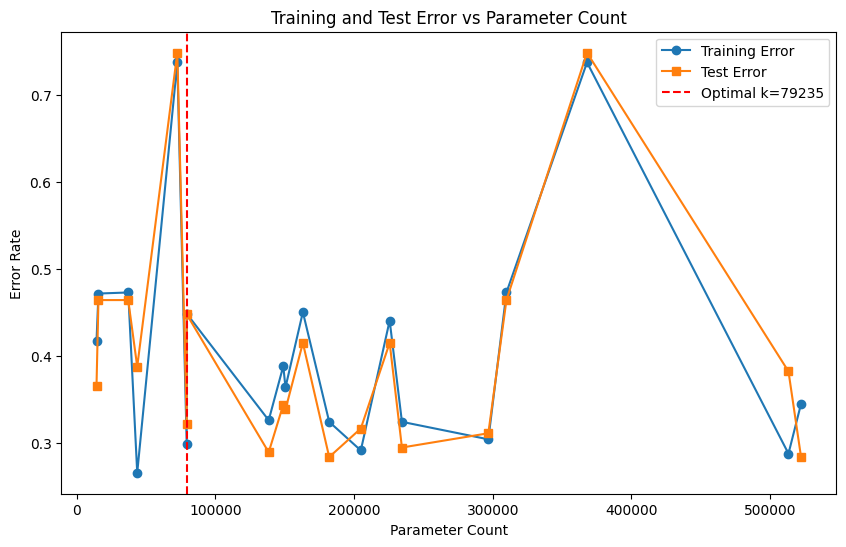

# CSE151A_WIN24_GROUP


# Introduction

### Topic: LeetCode

The dataset we have selected is derived from LeetCode, one of the largest online platforms for interview coding preparation with an extensive array of coding challenges categorized as easy, medium, and hard. However, the company has never explained what distinguishes these categories. The dataset we plan to analyze represents 1825 Leetcode problems, with 19 different features such as difficulty, acceptance rate, attempted frequency, and related topics for each individual question. The purpose of our project is to understand what factors are considered to be most important to Leetcode when scoring the difficulty of a problem.

🔗 [LeetCode Dataset](https://www.kaggle.com/datasets/gzipchrist/leetcode-problem-dataset/data )

### Steps

In order to undertake this task, we have followed a set of preliminary steps (data exploration and preprocessing) with the purpose of gaining some insight into what features are most responsible for determining difficulty ratings. After this initial step data analysis, we have developed 3 distinct classification models (k-nearest neighbors, decision trees and neural networks) with the purpose of categorizing the difficulty of a problem when given these attributes.

 ### Applications

 One possible application of our project would be to automatically label the difficulty of coding problems encountered outside of Leetcode, such as HackerRank or Codesignal.

 ### Code

 For the complete version, please check the [current notebook](./ipynb/LeetcodeDataExploration.ipynb).

# Method

## Data exploration

We have decided to perform our data exploration in 2 stages, one before and one after the data preprocessing. Stage 1 is the initial exploration of our data, looking into our attributes, their datatypes, and the distribution of our data. Stage 2 has been performed after the initial preprocessing of our data, looking further into the correlation between the different features and our target.

For a chronological approach, the steps have been: data exploration stage 1, data preprocessing stage 1, data exploration stage 2 and data preprocessing stage 2.

### Stage 1

#### Dataset info

The total number of observations that have been gathered for this dataset is 1825. We have considered that this is an appropriate number of observations for a thorough analysis and modeling but is manageble anough to avoid the need for subsampling.

The first step of our exploration has been observing our raw data. We have looked into the data types as well as the amount of null values. We have also taken a look at a small subset of the data in order to have a vague idea as to what to expect for each of the attributes.

**Datatypes:** 

| Column             | Non-Null Count | Dtype   |
|--------------------|----------------|---------|
| id                 | 1825           | int64   |
| title              | 1825           | object  |
| is_premium         | 1825           | int64   |
| difficulty         | 1825           | object  |
| solution_link      | 987            | object  |
| acceptance_rate    | 1825           | float64 |
| frequency          | 1825           | float64 |
| url                | 1825           | object  |
| discuss_count      | 1825           | int64   |
| accepted           | 1825           | object  |
| submissions        | 1825           | object  |
| companies          | 1749           | object  |
| related_topics     | 1571           | object  |
| likes              | 1825           | int64   |
| dislikes           | 1825           | int64   |
| rating             | 1825           | int64   |
| asked_by_faang     | 1825           | int64   |
| similar_questions  | 745            | object  |


<!-- **Dataset null data sum:**

| Column            | Null values |
|-------------------|----------------|
| is_premium       | 0              |
| difficulty       | 0              |
| acceptance_rate  | 0              |
| frequency        | 0              |
| discuss_count    | 0              |
| accepted         | 0              |
| submissions      | 0              |
| related_topics   | 254            |
| likes            | 0              |
| dislikes         | 0              |
| rating           | 0              |
| faang_count      | 76             |
| non_faang_count  | 76             | -->


**Data Example:**

  <div id="df-bb9ff9ee-06b9-4f4c-b98f-84fc4b73a93a" class="colab-df-container">
    <div>

<table border="1" class="dataframe">
  <thead>
    <tr style="text-align: right;">
      <th></th>
      <th>id</th>
      <th>title</th>
      <th>description</th>
      <th>is_premium</th>
      <th>difficulty</th>
      <th>solution_link</th>
      <th>acceptance_rate</th>
      <th>frequency</th>
      <th>url</th>
      <th>discuss_count</th>
      <th>accepted</th>
      <th>submissions</th>
      <th>companies</th>
      <th>related_topics</th>
      <th>likes</th>
      <th>dislikes</th>
      <th>rating</th>
      <th>asked_by_faang</th>
      <th>similar_questions</th>
    </tr>
  </thead>
  <tbody>
    <tr>
      <th>0</th>
      <td>1</td>
      <td>Two Sum</td>
      <td>Given an array of integers `nums` and an integ...</td>
      <td>0</td>
      <td>Easy</td>
      <td>/articles/two-sum</td>
      <td>46.7</td>
      <td>100.0</td>
      <td>https://leetcode.com/problems/two-sum</td>
      <td>999</td>
      <td>4.1M</td>
      <td>8.7M</td>
      <td>Amazon,Google,Apple,Adobe,Microsoft,Bloomberg,...</td>
      <td>Array,Hash Table</td>
      <td>20217</td>
      <td>712</td>
      <td>97</td>
      <td>1</td>
      <td>[3Sum, /problems/3sum/, Medium], [4Sum, /probl...</td>
    </tr>
    <tr>
      <th>1</th>
      <td>2</td>
      <td>Add Two Numbers</td>
      <td>You are given two non-empty linked lists repre...</td>
      <td>0</td>
      <td>Medium</td>
      <td>/articles/add-two-numbers</td>
      <td>35.7</td>
      <td>93.1</td>
      <td>https://leetcode.com/problems/add-two-numbers</td>
      <td>999</td>
      <td>1.9M</td>
      <td>5.2M</td>
      <td>Bloomberg,Microsoft,Amazon,Google,Facebook,App...</td>
      <td>Linked List,Math,Recursion</td>
      <td>11350</td>
      <td>2704</td>
      <td>81</td>
      <td>1</td>
      <td>[Multiply Strings, /problems/multiply-strings/...</td>
    </tr>
    <tr>
      <th>2</th>
      <td>3</td>
      <td>Longest Substring Without Repeating Characters</td>
      <td>Given a string `s`, find the length of the lon...</td>
      <td>0</td>
      <td>Medium</td>
      <td>/articles/longest-substring-without-repeating-...</td>
      <td>31.5</td>
      <td>90.9</td>
      <td>https://leetcode.com/problems/longest-substrin...</td>
      <td>999</td>
      <td>2.1M</td>
      <td>6.7M</td>
      <td>Amazon,Bloomberg,Microsoft,Facebook,Apple,Adob...</td>
      <td>Hash Table,Two Pointers,String,Sliding Window</td>
      <td>13810</td>
      <td>714</td>
      <td>95</td>
      <td>1</td>
      <td>[Longest Substring with At Most Two Distinct C...</td>
    </tr>
    <tr>
      <th>3</th>
      <td>4</td>
      <td>Median of Two Sorted Arrays</td>
      <td>Given two sorted arrays `nums1` and `nums2` of...</td>
      <td>0</td>
      <td>Hard</td>
      <td>/articles/median-of-two-sorted-arrays</td>
      <td>31.4</td>
      <td>86.2</td>
      <td>https://leetcode.com/problems/median-of-two-so...</td>
      <td>999</td>
      <td>904.7K</td>
      <td>2.9M</td>
      <td>Amazon,Goldman Sachs,Facebook,Microsoft,Apple,...</td>
      <td>Array,Binary Search,Divide and Conquer</td>
      <td>9665</td>
      <td>1486</td>
      <td>87</td>
      <td>1</td>
      <td>NaN</td>
    </tr>
    <tr>
      <th>4</th>
      <td>5</td>
      <td>Longest Palindromic Substring</td>
      <td>Given a string `s`, return the longest palindr...</td>
      <td>0</td>
      <td>Medium</td>
      <td>/articles/longest-palindromic-substring</td>
      <td>30.6</td>
      <td>84.7</td>
      <td>https://leetcode.com/problems/longest-palindro...</td>
      <td>999</td>
      <td>1.3M</td>
      <td>4.1M</td>
      <td>Amazon,Microsoft,Wayfair,Facebook,Adobe,eBay,G...</td>
      <td>String,Dynamic Programming</td>
      <td>10271</td>
      <td>670</td>
      <td>94</td>
      <td>1</td>
      <td>[Shortest Palindrome, /problems/shortest-palin...</td>
    </tr>
  </tbody>
</table>
</div>
    <div class="colab-df-buttons">

  <div class="colab-df-container">
    <button class="colab-df-convert" onclick="convertToInteractive('df-bb9ff9ee-06b9-4f4c-b98f-84fc4b73a93a')"
            title="Convert this dataframe to an interactive table."
            style="display:none;">

  <svg xmlns="http://www.w3.org/2000/svg" height="24px" viewBox="0 -960 960 960">
    <path d="M120-120v-720h720v720H120Zm60-500h600v-160H180v160Zm220 220h160v-160H400v160Zm0 220h160v-160H400v160ZM180-400h160v-160H180v160Zm440 0h160v-160H620v160ZM180-180h160v-160H180v160Zm440 0h160v-160H620v160Z"/>
  </svg>
    </button>

  
  </div>


<div id="df-fad44315-536b-4f99-8f7a-5b39ceb726d1">
  <button class="colab-df-quickchart" onclick="quickchart('df-fad44315-536b-4f99-8f7a-5b39ceb726d1')"
            title="Suggest charts"
            style="display:none;">

<svg xmlns="http://www.w3.org/2000/svg" height="24px"viewBox="0 0 24 24"
     width="24px">
    <g>
        <path d="M19 3H5c-1.1 0-2 .9-2 2v14c0 1.1.9 2 2 2h14c1.1 0 2-.9 2-2V5c0-1.1-.9-2-2-2zM9 17H7v-7h2v7zm4 0h-2V7h2v10zm4 0h-2v-4h2v4z"/>
    </g>
</svg>
  </button>

</div>
    </div>
  </div>

#### Attribute description

Each observation is detailed through 19 distinct features. However, for the scope of our analysis, we have opted to exclude 6 of these features as they do not contribute to our project's objectives.

Below we have provided a decription for each of the features included in the dataset.

| Column Name         | Data Type | # of Null | Description |
|---------------------|-----------|-----------|-------------|
| id                  | int64     | 0         | Unique problem id. |
| title               | String    | 0         | name of the problem. |
| description         | String    | 0         | problem description. |
| is_premium          | int64     | 0         | whether the question requires a premium account). This has been encoded as a number where the only possible values are 0 or 1, and 1 implies that the question does require a premium account. |
| difficulty          | String    | 0         | The level of difficulty of the entry (e.g., Easy, Medium, Hard). |
| solution_link       | String    | 838       | link to the solution for the problem. |
| acceptance_rate     | float64   | 0         | how often the answer submitted is correct). This is a float value indicating the percentage of acceptance, ranging from 13.9 to 95.6 in the case of our dataset but with a possible range of values between 0 and 100. |
| frequency           | float64   | 0         | how often the problem is attempted). This is also in the form of percentage. |
| url                 | String    | 0         | url to the problem. |
| discuss_count       | int64     | 0         | (how many comments are submitted by users). For this feature we have observed that there is a maximum count of 999, which means that there could be problems with that value that could go well over this limit or stay close to it. |
| accepted            | String    | 0         | how many times the answer was accepted). This has been encoded in the dataset as a string, where the value is encoded either as valueK, indicating that the value is in the thousands, or valueM, placing the value in the millions. However, for our project, we will convert this value to a number. |
| submissions         | String    | 0         | how many times the answer was submitted). This feature has the same characteristics as the previous feature, so we will perform the same modification. |
| companies           | String    | 76        | which companies were tagged as having asked this specific problem. |
| related_topics      | String    | 254       | (topics related to the current problem). This feature is given as a string of the different topics that the problem is associated with. However, as will be observed in the analysis, we have decided to use one-hot encoding in order to be able to work with this feature. It is also important to note that there is a 14% of null values, meaning that 14% of our observations don’t have any value for this feature. |
| likes               | int64     | 0         | how many likes the problem got). Integer value ranging from 2 to 20,200. |
| dislikes            | int64     | 0         | how many dislikes the problem got). Integer value ranging from 0 to 8900. |
| rating              | int64     | 0         | This feature is a combination of the previous 2 features. It is computed as likes/(likes+dislikes). Therefore, this is encoded in the form of percentage, ranging in the case of our dataset between 7 and 100. |
| asked_by_faang      | int64     | 0         | whether or not the question was asked by facebook, apple, amazon, google, or netflix. |
| similar_questions   | String    | 1080      | A list of similar entries, possibly including titles, links, and difficulty levels. |

####  Figures

For a more detailed insight into the data, please refer to the [current notebook](./ipynb/LeetcodeDataExploration.ipynb).

Below, we will provide the figures that we believe provide the best insights into out data.

<!-- Now that we have a better idea of the data we are working with, we are going to take a closer look into it:
- Analyze the distribution of topics and difficulty levels, and the relationship between the two.
- Explore the correlation between problem difficulty and other factors such as acceptence rate, frequency, submissions, related topics, and the like-to-dislike ratio. -->
<!-- 
  <div id="df-080b3694-28bd-4117-9216-3def1f142b76" class="colab-df-container">
    <div>

<table border="1" class="dataframe">
  <thead>
    <tr style="text-align: right;">
      <th></th>
      <th>id</th>
      <th>is_premium</th>
      <th>acceptance_rate</th>
      <th>frequency</th>
      <th>discuss_count</th>
      <th>likes</th>
      <th>dislikes</th>
      <th>rating</th>
      <th>asked_by_faang</th>
    </tr>
  </thead>
  <tbody>
    <tr>
      <th>count</th>
      <td>1825.000000</td>
      <td>1825.000000</td>
      <td>1825.000000</td>
      <td>1825.000000</td>
      <td>1825.000000</td>
      <td>1825.000000</td>
      <td>1825.000000</td>
      <td>1825.000000</td>
      <td>1825.000000</td>
    </tr>
    <tr>
      <th>mean</th>
      <td>913.000000</td>
      <td>0.218082</td>
      <td>53.139616</td>
      <td>21.113041</td>
      <td>421.435068</td>
      <td>1050.534795</td>
      <td>279.010959</td>
      <td>77.391233</td>
      <td>0.671233</td>
    </tr>
    <tr>
      <th>std</th>
      <td>526.976438</td>
      <td>0.413057</td>
      <td>14.778411</td>
      <td>22.364741</td>
      <td>330.583617</td>
      <td>1512.674013</td>
      <td>608.489206</td>
      <td>23.317515</td>
      <td>0.469894</td>
    </tr>
    <tr>
      <th>min</th>
      <td>1.000000</td>
      <td>0.000000</td>
      <td>13.900000</td>
      <td>0.000000</td>
      <td>9.000000</td>
      <td>2.000000</td>
      <td>0.000000</td>
      <td>7.000000</td>
      <td>0.000000</td>
    </tr>
    <tr>
      <th>25%</th>
      <td>457.000000</td>
      <td>0.000000</td>
      <td>42.400000</td>
      <td>3.100000</td>
      <td>150.000000</td>
      <td>217.000000</td>
      <td>32.000000</td>
      <td>67.000000</td>
      <td>0.000000</td>
    </tr>
    <tr>
      <th>50%</th>
      <td>913.000000</td>
      <td>0.000000</td>
      <td>51.600000</td>
      <td>13.500000</td>
      <td>292.000000</td>
      <td>516.000000</td>
      <td>92.000000</td>
      <td>88.000000</td>
      <td>1.000000</td>
    </tr>
    <tr>
      <th>75%</th>
      <td>1369.000000</td>
      <td>0.000000</td>
      <td>62.800000</td>
      <td>31.800000</td>
      <td>663.000000</td>
      <td>1200.000000</td>
      <td>239.000000</td>
      <td>95.000000</td>
      <td>1.000000</td>
    </tr>
    <tr>
      <th>max</th>
      <td>1825.000000</td>
      <td>1.000000</td>
      <td>95.600000</td>
      <td>100.000000</td>
      <td>999.000000</td>
      <td>20217.000000</td>
      <td>8900.000000</td>
      <td>100.000000</td>
      <td>1.000000</td>
    </tr>
  </tbody>
</table>
</div>
    <div class="colab-df-buttons">

  <div class="colab-df-container">
    <button class="colab-df-convert" onclick="convertToInteractive('df-080b3694-28bd-4117-9216-3def1f142b76')"
            title="Convert this dataframe to an interactive table."
            style="display:none;">

  <svg xmlns="http://www.w3.org/2000/svg" height="24px" viewBox="0 -960 960 960">;
    <path d="M120-120v-720h720v720H120Zm60-500h600v-160H180v160Zm220 220h160v-160H400v160Zm0 220h160v-160H400v160ZM180-400h160v-160H180v160Zm440 0h160v-160H620v160ZM180-180h160v-160H180v160Zm440 0h160v-160H620v160Z"/>
  </svg>
    </button>

  </div>


<div id="df-66014bcc-8d87-46cc-bb7e-82a77c38bf10">
  <button class="colab-df-quickchart" onclick="quickchart('df-66014bcc-8d87-46cc-bb7e-82a77c38bf10')"
            title="Suggest charts"
            style="display:none;">

<svg xmlns="http://www.w3.org/2000/svg" height="24px"viewBox="0 0 24 24"
     width="24px">
    <g>
        <path d="M19 3H5c-1.1 0-2 .9-2 2v14c0 1.1.9 2 2 2h14c1.1 0 2-.9 2-2V5c0-1.1-.9-2-2-2zM9 17H7v-7h2v7zm4 0h-2V7h2v10zm4 0h-2v-4h2v4z"/>
    </g>
</svg>
  </button>

</div>
    </div>
  </div> -->


*Figure 1. Correlation plot between the different features.*


*Figure 2. Visualization of the number of problems associated with each unique topic*
    


*Figure 3. Distribution of problems across different difficulty levels (Easy, Medium, Hard)*
    


*Figure 4. Distribution of topics by difficulty level*

### Stage 2

#### Figures

**Pairplot**

After the initial preprocessing we decided to visualize the pairwise relationships between variables to identify potential patterns and correlations.


*Figure 5. Pairplot analysis of encoded data*
    
Key observations from our pair plot analysis:
- There appears to be a significant correlation between discussion, acceptance rate, and difficulty.
- Likes and dislikes are inversely correlated.
- The count of non-FAANG companies and problem frequency seem to have a positive correlation.
However, the pair plot does not provide provide substantial information relevant to our goal. Therefore, we will proceed to examine the data using a heatmap/correlation matrix to gain more insights.

**Correlation matrix**

Transitioning to the correlation matrix analysis, our aim is to gain deeper insights into the relationships between variables. We begin by normalizing our data, for which we have chosen min-max normalization since not all our data is normally distributed.

  <!-- <div id="df-a2b7bcfe-8318-4a2c-80a8-f71441b9651b" class="colab-df-container">
    <div>

<table border="1" class="dataframe">
  <thead>
    <tr style="text-align: right;">
      <th></th>
      <th>is_premium</th>
      <th>difficulty</th>
      <th>acceptance_rate</th>
      <th>frequency</th>
      <th>discuss_count</th>
      <th>accepted</th>
      <th>submissions</th>
      <th>likes</th>
      <th>dislikes</th>
      <th>rating</th>
      <th>...</th>
      <th>Sliding Window</th>
      <th>Sort</th>
      <th>Stack</th>
      <th>String</th>
      <th>Suffix Array</th>
      <th>Topological Sort</th>
      <th>Tree</th>
      <th>Trie</th>
      <th>Two Pointers</th>
      <th>Union Find</th>
    </tr>
  </thead>
  <tbody>
    <tr>
      <th>0</th>
      <td>0.0</td>
      <td>0.0</td>
      <td>0.401469</td>
      <td>1.000</td>
      <td>1.000000</td>
      <td>4100000.0</td>
      <td>8700000.0</td>
      <td>1.000000</td>
      <td>0.080000</td>
      <td>0.967742</td>
      <td>...</td>
      <td>0.0</td>
      <td>0.0</td>
      <td>0.0</td>
      <td>0.0</td>
      <td>0.0</td>
      <td>0.0</td>
      <td>0.0</td>
      <td>0.0</td>
      <td>0.0</td>
      <td>0.0</td>
    </tr>
    <tr>
      <th>1</th>
      <td>0.0</td>
      <td>0.5</td>
      <td>0.266830</td>
      <td>0.931</td>
      <td>1.000000</td>
      <td>1900000.0</td>
      <td>5200000.0</td>
      <td>0.561365</td>
      <td>0.303820</td>
      <td>0.795699</td>
      <td>...</td>
      <td>0.0</td>
      <td>0.0</td>
      <td>0.0</td>
      <td>0.0</td>
      <td>0.0</td>
      <td>0.0</td>
      <td>0.0</td>
      <td>0.0</td>
      <td>0.0</td>
      <td>0.0</td>
    </tr>
    <tr>
      <th>2</th>
      <td>0.0</td>
      <td>0.5</td>
      <td>0.215422</td>
      <td>0.909</td>
      <td>1.000000</td>
      <td>2100000.0</td>
      <td>6700000.0</td>
      <td>0.683057</td>
      <td>0.080225</td>
      <td>0.946237</td>
      <td>...</td>
      <td>1.0</td>
      <td>0.0</td>
      <td>0.0</td>
      <td>1.0</td>
      <td>0.0</td>
      <td>0.0</td>
      <td>0.0</td>
      <td>0.0</td>
      <td>1.0</td>
      <td>0.0</td>
    </tr>
    <tr>
      <th>3</th>
      <td>0.0</td>
      <td>1.0</td>
      <td>0.214198</td>
      <td>0.862</td>
      <td>1.000000</td>
      <td>904700.0</td>
      <td>2900000.0</td>
      <td>0.478011</td>
      <td>0.166966</td>
      <td>0.860215</td>
      <td>...</td>
      <td>0.0</td>
      <td>0.0</td>
      <td>0.0</td>
      <td>0.0</td>
      <td>0.0</td>
      <td>0.0</td>
      <td>0.0</td>
      <td>0.0</td>
      <td>0.0</td>
      <td>0.0</td>
    </tr>
    <tr>
      <th>4</th>
      <td>0.0</td>
      <td>0.5</td>
      <td>0.204406</td>
      <td>0.847</td>
      <td>1.000000</td>
      <td>1300000.0</td>
      <td>4100000.0</td>
      <td>0.507989</td>
      <td>0.075281</td>
      <td>0.935484</td>
      <td>...</td>
      <td>0.0</td>
      <td>0.0</td>
      <td>0.0</td>
      <td>1.0</td>
      <td>0.0</td>
      <td>0.0</td>
      <td>0.0</td>
      <td>0.0</td>
      <td>0.0</td>
      <td>0.0</td>
    </tr>
    <tr>
      <th>...</th>
      <td>...</td>
      <td>...</td>
      <td>...</td>
      <td>...</td>
      <td>...</td>
      <td>...</td>
      <td>...</td>
      <td>...</td>
      <td>...</td>
      <td>...</td>
      <td>...</td>
      <td>...</td>
      <td>...</td>
      <td>...</td>
      <td>...</td>
      <td>...</td>
      <td>...</td>
      <td>...</td>
      <td>...</td>
      <td>...</td>
      <td>...</td>
    </tr>
    <tr>
      <th>1820</th>
      <td>1.0</td>
      <td>0.0</td>
      <td>0.917993</td>
      <td>0.000</td>
      <td>0.006061</td>
      <td>305</td>
      <td>343</td>
      <td>0.000000</td>
      <td>0.000225</td>
      <td>0.462366</td>
      <td>...</td>
      <td>0.0</td>
      <td>0.0</td>
      <td>0.0</td>
      <td>0.0</td>
      <td>0.0</td>
      <td>0.0</td>
      <td>0.0</td>
      <td>0.0</td>
      <td>0.0</td>
      <td>0.0</td>
    </tr>
    <tr>
      <th>1821</th>
      <td>0.0</td>
      <td>0.0</td>
      <td>0.659731</td>
      <td>0.000</td>
      <td>0.095960</td>
      <td>7900.0</td>
      <td>11700.0</td>
      <td>0.001731</td>
      <td>0.000449</td>
      <td>0.892473</td>
      <td>...</td>
      <td>0.0</td>
      <td>0.0</td>
      <td>0.0</td>
      <td>0.0</td>
      <td>0.0</td>
      <td>0.0</td>
      <td>0.0</td>
      <td>0.0</td>
      <td>0.0</td>
      <td>0.0</td>
    </tr>
    <tr>
      <th>1822</th>
      <td>0.0</td>
      <td>0.5</td>
      <td>0.708690</td>
      <td>0.000</td>
      <td>0.127273</td>
      <td>6800.0</td>
      <td>9500.0</td>
      <td>0.003908</td>
      <td>0.000449</td>
      <td>0.946237</td>
      <td>...</td>
      <td>0.0</td>
      <td>0.0</td>
      <td>0.0</td>
      <td>0.0</td>
      <td>0.0</td>
      <td>0.0</td>
      <td>0.0</td>
      <td>0.0</td>
      <td>0.0</td>
      <td>0.0</td>
    </tr>
    <tr>
      <th>1823</th>
      <td>0.0</td>
      <td>0.5</td>
      <td>0.407589</td>
      <td>0.000</td>
      <td>0.126263</td>
      <td>5000.0</td>
      <td>10700.0</td>
      <td>0.007173</td>
      <td>0.000899</td>
      <td>0.946237</td>
      <td>...</td>
      <td>0.0</td>
      <td>0.0</td>
      <td>0.0</td>
      <td>0.0</td>
      <td>0.0</td>
      <td>0.0</td>
      <td>0.0</td>
      <td>0.0</td>
      <td>0.0</td>
      <td>0.0</td>
    </tr>
    <tr>
      <th>1824</th>
      <td>0.0</td>
      <td>1.0</td>
      <td>0.173807</td>
      <td>0.000</td>
      <td>0.039394</td>
      <td>2100.0</td>
      <td>7400.0</td>
      <td>0.002473</td>
      <td>0.004831</td>
      <td>0.516129</td>
      <td>...</td>
      <td>0.0</td>
      <td>0.0</td>
      <td>0.0</td>
      <td>0.0</td>
      <td>0.0</td>
      <td>0.0</td>
      <td>0.0</td>
      <td>0.0</td>
      <td>0.0</td>
      <td>0.0</td>
    </tr>
  </tbody>
</table>
<p>1825 rows × 55 columns</p>
</div>
    <div class="colab-df-buttons">

  <div class="colab-df-container">
    <button class="colab-df-convert" onclick="convertToInteractive('df-a2b7bcfe-8318-4a2c-80a8-f71441b9651b')"
            title="Convert this dataframe to an interactive table."
            style="display:none;">

  <svg xmlns="http://www.w3.org/2000/svg" height="24px" viewBox="0 -960 960 960">
    <path d="M120-120v-720h720v720H120Zm60-500h600v-160H180v160Zm220 220h160v-160H400v160Zm0 220h160v-160H400v160ZM180-400h160v-160H180v160Zm440 0h160v-160H620v160ZM180-180h160v-160H180v160Zm440 0h160v-160H620v160Z"/>
  </svg>
    </button>

  </div>


<div id="df-434c40dc-40a9-44a4-bd25-2cf9613cdf54">
  <button class="colab-df-quickchart" onclick="quickchart('df-434c40dc-40a9-44a4-bd25-2cf9613cdf54')"
            title="Suggest charts"
            style="display:none;">

<svg xmlns="http://www.w3.org/2000/svg" height="24px"viewBox="0 0 24 24"
     width="24px">
    <g>
        <path d="M19 3H5c-1.1 0-2 .9-2 2v14c0 1.1.9 2 2 2h14c1.1 0 2-.9 2-2V5c0-1.1-.9-2-2-2zM9 17H7v-7h2v7zm4 0h-2V7h2v10zm4 0h-2v-4h2v4z"/>
    </g>
</svg>
  </button>

</div>
    </div>
  </div> -->

With the data normalization complete, we can now examine our correlation matrix.


*Figure 6. Complete correlation matrix of all attributes*
    

This correlation matrix offers insights into the relationships between variables. Notable observations include:
- Several "Tree" related topics have a positive correlation with eachother.
- Discussion is negatively correlated with rating (significantly more so than submissions), implying that the harder a problem is, the less discussion there will be.
- The most negatively correlated topic with rating is "Math"

However, given the extensive information presented in this correlation matrix, we will narrow our focus on the parameter of interest: problem difficulty.


    


*Figure 7. Correlation between all attributes and problem difficulty*


To clarify the complex data, we break down the analysis into related topics and the other remaining features.
Looking at the related topics we can conclude some interesting properties:
- "Dynamic programming" is the most corrolated topic in determining problem difficulty.
- "Array" topics are the most negatively correlated topic.
- Most topic labels are associated with increased difficulty.


    


*Figure 8. Correlation between related topics and problem difficulty*
    


Looking at the other features we can conclude some other interesting properties:
- "Acceptance rate" is the most correlated feature determining difficulty (which seems self evident)
- "Discuss count" is the second most correlated feature.
- "Dislikes" seems to be a better predictor of problem difficulty than likes (which is interesting since leetcode actually hid the dislike counter)


*Figure 9. Correlation between all features (except the related topics) and problem difficulty*
    

We can now clearly decide which features are relevant to problem difficulty and which are not. In the next stage of our preprocessing we will drop all features with a correlation coefficient below 0.05, leaving us with a set of 24 features (excluding 'difficulty' itself).

    


*Figure 10. Correlation between the features we have kept and problem difficulty*

## Preprocessing

### Stage 1

#### Steps

**1. Dropping Unnecessary Data**

We have identified certain attributes that don't contribute to predicting 'difficulty'. These columns are:

- "id": Unique identifiers for problems, irrelevant to difficulty prediction.
- "title": Does not provide predictive value for difficulty.
- "description": Unrelated to the predictive task at hand.
- "solution_link" and "url": Links that offer no predictive insight.
- "similar_questions": Does not directly contribute to predicting difficulty.
- "asked_by_faang": Rather than a binary value of whether a FAANG company asked the question, a count of how many FAANG companies asked it might be more informative.

**2. Data encoding**

Certain columns require encoding to numerical attributes:

- "difficulty": Our target variable will be encoded from categorical ("Easy", "Medium", "Hard") to a numerical format.
- "submissions" and "accepted": These string-formatted numerical values will be converted to integers.
- "companies": To capture the potential correlation between the problem's difficulty and the company's profile, we'll convert this into two numeric attributes: "faang_count" for the count of FAANG companies and "non_faang_count" for others.
- "related_topics": Given the potential link between certain topics and problem difficulty, this attribute will be standardized and one-hot encoded to represent the various topics.

The changes performed can be appreciated in the following table:

  <div id="df-53f34cb7-d84a-46c5-a557-5b8ce8fcea36" class="colab-df-container">
    <div>

<table border="1" class="dataframe">
  <thead>
    <tr style="text-align: right;">
      <th></th>
      <th>is_premium</th>
      <th>difficulty</th>
      <th>acceptance_rate</th>
      <th>frequency</th>
      <th>discuss_count</th>
      <th>accepted</th>
      <th>submissions</th>
      <th>likes</th>
      <th>dislikes</th>
      <th>rating</th>
      <th>...</th>
      <th>Sliding Window</th>
      <th>Sort</th>
      <th>Stack</th>
      <th>String</th>
      <th>Suffix Array</th>
      <th>Topological Sort</th>
      <th>Tree</th>
      <th>Trie</th>
      <th>Two Pointers</th>
      <th>Union Find</th>
    </tr>
  </thead>
  <tbody>
    <tr>
      <th>0</th>
      <td>0</td>
      <td>0</td>
      <td>46.7</td>
      <td>100.0</td>
      <td>999</td>
      <td>4100000.0</td>
      <td>8700000.0</td>
      <td>20217</td>
      <td>712</td>
      <td>97</td>
      <td>...</td>
      <td>0</td>
      <td>0</td>
      <td>0</td>
      <td>0</td>
      <td>0</td>
      <td>0</td>
      <td>0</td>
      <td>0</td>
      <td>0</td>
      <td>0</td>
    </tr>
    <tr>
      <th>1</th>
      <td>0</td>
      <td>1</td>
      <td>35.7</td>
      <td>93.1</td>
      <td>999</td>
      <td>1900000.0</td>
      <td>5200000.0</td>
      <td>11350</td>
      <td>2704</td>
      <td>81</td>
      <td>...</td>
      <td>0</td>
      <td>0</td>
      <td>0</td>
      <td>0</td>
      <td>0</td>
      <td>0</td>
      <td>0</td>
      <td>0</td>
      <td>0</td>
      <td>0</td>
    </tr>
    <tr>
      <th>2</th>
      <td>0</td>
      <td>1</td>
      <td>31.5</td>
      <td>90.9</td>
      <td>999</td>
      <td>2100000.0</td>
      <td>6700000.0</td>
      <td>13810</td>
      <td>714</td>
      <td>95</td>
      <td>...</td>
      <td>1</td>
      <td>0</td>
      <td>0</td>
      <td>1</td>
      <td>0</td>
      <td>0</td>
      <td>0</td>
      <td>0</td>
      <td>1</td>
      <td>0</td>
    </tr>
    <tr>
      <th>3</th>
      <td>0</td>
      <td>2</td>
      <td>31.4</td>
      <td>86.2</td>
      <td>999</td>
      <td>904700.0</td>
      <td>2900000.0</td>
      <td>9665</td>
      <td>1486</td>
      <td>87</td>
      <td>...</td>
      <td>0</td>
      <td>0</td>
      <td>0</td>
      <td>0</td>
      <td>0</td>
      <td>0</td>
      <td>0</td>
      <td>0</td>
      <td>0</td>
      <td>0</td>
    </tr>
    <tr>
      <th>4</th>
      <td>0</td>
      <td>1</td>
      <td>30.6</td>
      <td>84.7</td>
      <td>999</td>
      <td>1300000.0</td>
      <td>4100000.0</td>
      <td>10271</td>
      <td>670</td>
      <td>94</td>
      <td>...</td>
      <td>0</td>
      <td>0</td>
      <td>0</td>
      <td>1</td>
      <td>0</td>
      <td>0</td>
      <td>0</td>
      <td>0</td>
      <td>0</td>
      <td>0</td>
    </tr>
    <tr>
      <th>...</th>
      <td>...</td>
      <td>...</td>
      <td>...</td>
      <td>...</td>
      <td>...</td>
      <td>...</td>
      <td>...</td>
      <td>...</td>
      <td>...</td>
      <td>...</td>
      <td>...</td>
      <td>...</td>
      <td>...</td>
      <td>...</td>
      <td>...</td>
      <td>...</td>
      <td>...</td>
      <td>...</td>
      <td>...</td>
      <td>...</td>
      <td>...</td>
    </tr>
    <tr>
      <th>1820</th>
      <td>1</td>
      <td>0</td>
      <td>88.9</td>
      <td>0.0</td>
      <td>15</td>
      <td>305</td>
      <td>343</td>
      <td>2</td>
      <td>2</td>
      <td>50</td>
      <td>...</td>
      <td>0</td>
      <td>0</td>
      <td>0</td>
      <td>0</td>
      <td>0</td>
      <td>0</td>
      <td>0</td>
      <td>0</td>
      <td>0</td>
      <td>0</td>
    </tr>
    <tr>
      <th>1821</th>
      <td>0</td>
      <td>0</td>
      <td>67.8</td>
      <td>0.0</td>
      <td>104</td>
      <td>7900.0</td>
      <td>11700.0</td>
      <td>37</td>
      <td>4</td>
      <td>90</td>
      <td>...</td>
      <td>0</td>
      <td>0</td>
      <td>0</td>
      <td>0</td>
      <td>0</td>
      <td>0</td>
      <td>0</td>
      <td>0</td>
      <td>0</td>
      <td>0</td>
    </tr>
    <tr>
      <th>1822</th>
      <td>0</td>
      <td>1</td>
      <td>71.8</td>
      <td>0.0</td>
      <td>135</td>
      <td>6800.0</td>
      <td>9500.0</td>
      <td>81</td>
      <td>4</td>
      <td>95</td>
      <td>...</td>
      <td>0</td>
      <td>0</td>
      <td>0</td>
      <td>0</td>
      <td>0</td>
      <td>0</td>
      <td>0</td>
      <td>0</td>
      <td>0</td>
      <td>0</td>
    </tr>
    <tr>
      <th>1823</th>
      <td>0</td>
      <td>1</td>
      <td>47.2</td>
      <td>0.0</td>
      <td>134</td>
      <td>5000.0</td>
      <td>10700.0</td>
      <td>147</td>
      <td>8</td>
      <td>95</td>
      <td>...</td>
      <td>0</td>
      <td>0</td>
      <td>0</td>
      <td>0</td>
      <td>0</td>
      <td>0</td>
      <td>0</td>
      <td>0</td>
      <td>0</td>
      <td>0</td>
    </tr>
    <tr>
      <th>1824</th>
      <td>0</td>
      <td>2</td>
      <td>28.1</td>
      <td>0.0</td>
      <td>48</td>
      <td>2100.0</td>
      <td>7400.0</td>
      <td>52</td>
      <td>43</td>
      <td>55</td>
      <td>...</td>
      <td>0</td>
      <td>0</td>
      <td>0</td>
      <td>0</td>
      <td>0</td>
      <td>0</td>
      <td>0</td>
      <td>0</td>
      <td>0</td>
      <td>0</td>
    </tr>
  </tbody>
</table>
<p>1825 rows × 55 columns</p>
</div>
    <div class="colab-df-buttons">

  <div class="colab-df-container">
    <button class="colab-df-convert" onclick="convertToInteractive('df-53f34cb7-d84a-46c5-a557-5b8ce8fcea36')"
            title="Convert this dataframe to an interactive table."
            style="display:none;">

  <svg xmlns="http://www.w3.org/2000/svg" height="24px" viewBox="0 -960 960 960">
    <path d="M120-120v-720h720v720H120Zm60-500h600v-160H180v160Zm220 220h160v-160H400v160Zm0 220h160v-160H400v160ZM180-400h160v-160H180v160Zm440 0h160v-160H620v160ZM180-180h160v-160H180v160Zm440 0h160v-160H620v160Z"/>
  </svg>
    </button>

  
  </div>


<div id="df-f8066434-6038-4cb7-89a5-bd32a6e0f277">
  <button class="colab-df-quickchart" onclick="quickchart('df-f8066434-6038-4cb7-89a5-bd32a6e0f277')"
            title="Suggest charts"
            style="display:none;">

<svg xmlns="http://www.w3.org/2000/svg" height="24px"viewBox="0 0 24 24"
     width="24px">
    <g>
        <path d="M19 3H5c-1.1 0-2 .9-2 2v14c0 1.1.9 2 2 2h14c1.1 0 2-.9 2-2V5c0-1.1-.9-2-2-2zM9 17H7v-7h2v7zm4 0h-2V7h2v10zm4 0h-2v-4h2v4z"/>
    </g>
</svg>
  </button>

</div>
    </div>
  </div>

**3. Handling Missing Data**
After the initial data cleaning:
- No attributes currently exhibit missing values, indicating a clean dataset ready for further processing.
- For optimal model performance, normalization will be applied to the remaining attributes to ensute uniformity in data scale and distribution.


<!-- We performed several preprocessing steps we discussed above, including:

- Encoding 'difficulty' as 0 (Easy), 1 (Medium), 2 (Hard).
- Dropping 'id', 'title', 'description', 'solution_link', 'url', 'asked_by_faang' columns.
- Encoding 'related_topics' using one-hot encoding. Although it might not be relevant, it's interesting to explore.
- Converting 'companies' into FAANG count/total count.

This part mainly consists of coding. For the detailed code, please check the [notebook](./ipynb/LeetcodeDataExploration.ipynb). -->

<!-- # Data Visualization and Analysis
- Analyze the distribution of topics and difficulty levels, and the relationship between the two.
- Explore the correlation between problem difficulty and other factors such as acceptence rate, frequency, submissions, related topics, and the like-to-dislike ratio.
- Visualize the data to explore patterns and uncover insights.


  <div id="df-9b4b5ca5-0a1c-4e9d-a2d8-15b03a84f734" class="colab-df-container">
    <div>

<table border="1" class="dataframe">
  <thead>
    <tr style="text-align: right;">
      <th></th>
      <th>is_premium</th>
      <th>difficulty</th>
      <th>acceptance_rate</th>
      <th>frequency</th>
      <th>discuss_count</th>
      <th>likes</th>
      <th>dislikes</th>
      <th>rating</th>
      <th>faang_count</th>
      <th>non_faang_count</th>
      <th>...</th>
      <th>Sliding Window</th>
      <th>Sort</th>
      <th>Stack</th>
      <th>String</th>
      <th>Suffix Array</th>
      <th>Topological Sort</th>
      <th>Tree</th>
      <th>Trie</th>
      <th>Two Pointers</th>
      <th>Union Find</th>
    </tr>
  </thead>
  <tbody>
    <tr>
      <th>count</th>
      <td>1825.000000</td>
      <td>1825.000000</td>
      <td>1825.000000</td>
      <td>1825.000000</td>
      <td>1825.000000</td>
      <td>1825.000000</td>
      <td>1825.000000</td>
      <td>1825.000000</td>
      <td>1749.000000</td>
      <td>1749.000000</td>
      <td>...</td>
      <td>1825.000000</td>
      <td>1825.000000</td>
      <td>1825.000000</td>
      <td>1825.000000</td>
      <td>1825.000000</td>
      <td>1825.000000</td>
      <td>1825.000000</td>
      <td>1825.000000</td>
      <td>1825.000000</td>
      <td>1825.000000</td>
    </tr>
    <tr>
      <th>mean</th>
      <td>0.218082</td>
      <td>0.949589</td>
      <td>53.139616</td>
      <td>21.113041</td>
      <td>421.435068</td>
      <td>1050.534795</td>
      <td>279.010959</td>
      <td>77.391233</td>
      <td>1.068039</td>
      <td>1.250429</td>
      <td>...</td>
      <td>0.014795</td>
      <td>0.041644</td>
      <td>0.035068</td>
      <td>0.121096</td>
      <td>0.002192</td>
      <td>0.003288</td>
      <td>0.085479</td>
      <td>0.011507</td>
      <td>0.040548</td>
      <td>0.020274</td>
    </tr>
    <tr>
      <th>std</th>
      <td>0.413057</td>
      <td>0.685598</td>
      <td>14.778411</td>
      <td>22.364741</td>
      <td>330.583617</td>
      <td>1512.674013</td>
      <td>608.489206</td>
      <td>23.317515</td>
      <td>1.011067</td>
      <td>2.060625</td>
      <td>...</td>
      <td>0.120763</td>
      <td>0.199829</td>
      <td>0.184003</td>
      <td>0.326328</td>
      <td>0.046778</td>
      <td>0.057260</td>
      <td>0.279670</td>
      <td>0.106680</td>
      <td>0.197295</td>
      <td>0.140975</td>
    </tr>
    <tr>
      <th>min</th>
      <td>0.000000</td>
      <td>0.000000</td>
      <td>13.900000</td>
      <td>0.000000</td>
      <td>9.000000</td>
      <td>2.000000</td>
      <td>0.000000</td>
      <td>7.000000</td>
      <td>0.000000</td>
      <td>0.000000</td>
      <td>...</td>
      <td>0.000000</td>
      <td>0.000000</td>
      <td>0.000000</td>
      <td>0.000000</td>
      <td>0.000000</td>
      <td>0.000000</td>
      <td>0.000000</td>
      <td>0.000000</td>
      <td>0.000000</td>
      <td>0.000000</td>
    </tr>
    <tr>
      <th>25%</th>
      <td>0.000000</td>
      <td>0.000000</td>
      <td>42.400000</td>
      <td>3.100000</td>
      <td>150.000000</td>
      <td>217.000000</td>
      <td>32.000000</td>
      <td>67.000000</td>
      <td>0.000000</td>
      <td>0.000000</td>
      <td>...</td>
      <td>0.000000</td>
      <td>0.000000</td>
      <td>0.000000</td>
      <td>0.000000</td>
      <td>0.000000</td>
      <td>0.000000</td>
      <td>0.000000</td>
      <td>0.000000</td>
      <td>0.000000</td>
      <td>0.000000</td>
    </tr>
    <tr>
      <th>50%</th>
      <td>0.000000</td>
      <td>1.000000</td>
      <td>51.600000</td>
      <td>13.500000</td>
      <td>292.000000</td>
      <td>516.000000</td>
      <td>92.000000</td>
      <td>88.000000</td>
      <td>1.000000</td>
      <td>1.000000</td>
      <td>...</td>
      <td>0.000000</td>
      <td>0.000000</td>
      <td>0.000000</td>
      <td>0.000000</td>
      <td>0.000000</td>
      <td>0.000000</td>
      <td>0.000000</td>
      <td>0.000000</td>
      <td>0.000000</td>
      <td>0.000000</td>
    </tr>
    <tr>
      <th>75%</th>
      <td>0.000000</td>
      <td>1.000000</td>
      <td>62.800000</td>
      <td>31.800000</td>
      <td>663.000000</td>
      <td>1200.000000</td>
      <td>239.000000</td>
      <td>95.000000</td>
      <td>1.000000</td>
      <td>1.000000</td>
      <td>...</td>
      <td>0.000000</td>
      <td>0.000000</td>
      <td>0.000000</td>
      <td>0.000000</td>
      <td>0.000000</td>
      <td>0.000000</td>
      <td>0.000000</td>
      <td>0.000000</td>
      <td>0.000000</td>
      <td>0.000000</td>
    </tr>
    <tr>
      <th>max</th>
      <td>1.000000</td>
      <td>2.000000</td>
      <td>95.600000</td>
      <td>100.000000</td>
      <td>999.000000</td>
      <td>20217.000000</td>
      <td>8900.000000</td>
      <td>100.000000</td>
      <td>4.000000</td>
      <td>16.000000</td>
      <td>...</td>
      <td>1.000000</td>
      <td>1.000000</td>
      <td>1.000000</td>
      <td>1.000000</td>
      <td>1.000000</td>
      <td>1.000000</td>
      <td>1.000000</td>
      <td>1.000000</td>
      <td>1.000000</td>
      <td>1.000000</td>
    </tr>
  </tbody>
</table>
<p>8 rows × 53 columns</p>
</div>
    <div class="colab-df-buttons">

  <div class="colab-df-container">
    <button class="colab-df-convert" onclick="convertToInteractive('df-9b4b5ca5-0a1c-4e9d-a2d8-15b03a84f734')"
            title="Convert this dataframe to an interactive table."
            style="display:none;">

  <svg xmlns="http://www.w3.org/2000/svg" height="24px" viewBox="0 -960 960 960">
    <path d="M120-120v-720h720v720H120Zm60-500h600v-160H180v160Zm220 220h160v-160H400v160Zm0 220h160v-160H400v160ZM180-400h160v-160H180v160Zm440 0h160v-160H620v160ZM180-180h160v-160H180v160Zm440 0h160v-160H620v160Z"/>
  </svg>
    </button>


  
  </div>


<div id="df-ac2df204-1a6d-43f4-b3cb-797392f12822">
  <button class="colab-df-quickchart" onclick="quickchart('df-ac2df204-1a6d-43f4-b3cb-797392f12822')"
            title="Suggest charts"
            style="display:none;">

<svg xmlns="http://www.w3.org/2000/svg" height="24px"viewBox="0 0 24 24"
     width="24px">
    <g>
        <path d="M19 3H5c-1.1 0-2 .9-2 2v14c0 1.1.9 2 2 2h14c1.1 0 2-.9 2-2V5c0-1.1-.9-2-2-2zM9 17H7v-7h2v7zm4 0h-2V7h2v10zm4 0h-2v-4h2v4z"/>
    </g>
</svg>
  </button>

</div>
    </div>
  </div> -->


### Stage 2

Following our comprehensive data exploration in stage 2, we have now identified a select group of features to keep. Although a significant portion of our data underwent preprocessing during the initial importing and cleaning phase, now we just need to make refinements based on our findings from the data exploration. That is the reason why we will drop all features with a correlation coefficient below 0.05, leaving us with a set of 24 features (excluding 'difficulty' itself).

A sample of the final dataframe can be observed below.

#### Sample output of our final dataframe

<div id="df-76fac49e-535d-4278-b823-bf57a1b57685">
  <button class="colab-df-quickchart" onclick="quickchart('df-76fac49e-535d-4278-b823-bf57a1b57685')"
            title="Suggest charts"
            style="display:none;">

<svg xmlns="http://www.w3.org/2000/svg" height="24px"viewBox="0 0 24 24"
     width="24px">
    <g>
        <path d="M19 3H5c-1.1 0-2 .9-2 2v14c0 1.1.9 2 2 2h14c1.1 0 2-.9 2-2V5c0-1.1-.9-2-2-2zM9 17H7v-7h2v7zm4 0h-2V7h2v10zm4 0h-2v-4h2v4z"/>
    </g>
</svg>
  </button>

</div>
    </div>
  </div>


  <div id="df-9b565fdc-fb99-414d-af92-79629f89c11e" class="colab-df-container">
    <div>

<table border="1" class="dataframe">
  <thead>
    <tr style="text-align: right;">
      <th></th>
      <th>acceptance_rate</th>
      <th>discuss_count</th>
      <th>Array</th>
      <th>dislikes</th>
      <th>Hash Table</th>
      <th>String</th>
      <th>Sliding Window</th>
      <th>Trie</th>
      <th>Depth-first Search</th>
      <th>Binary Search</th>
      <th>...</th>
      <th>Breadth-first Search</th>
      <th>Ordered Map</th>
      <th>Heap</th>
      <th>Union Find</th>
      <th>Backtracking</th>
      <th>frequency</th>
      <th>Segment Tree</th>
      <th>rating</th>
      <th>Dynamic Programming</th>
      <th>difficulty</th>
    </tr>
  </thead>
  <tbody>
    <tr>
      <th>0</th>
      <td>46.7</td>
      <td>999</td>
      <td>1</td>
      <td>712</td>
      <td>1</td>
      <td>0</td>
      <td>0</td>
      <td>0</td>
      <td>0</td>
      <td>0</td>
      <td>...</td>
      <td>0</td>
      <td>0</td>
      <td>0</td>
      <td>0</td>
      <td>0</td>
      <td>100.0</td>
      <td>0</td>
      <td>97</td>
      <td>0</td>
      <td>0</td>
    </tr>
    <tr>
      <th>1</th>
      <td>35.7</td>
      <td>999</td>
      <td>0</td>
      <td>2704</td>
      <td>0</td>
      <td>0</td>
      <td>0</td>
      <td>0</td>
      <td>0</td>
      <td>0</td>
      <td>...</td>
      <td>0</td>
      <td>0</td>
      <td>0</td>
      <td>0</td>
      <td>0</td>
      <td>93.1</td>
      <td>0</td>
      <td>81</td>
      <td>0</td>
      <td>1</td>
    </tr>
    <tr>
      <th>2</th>
      <td>31.5</td>
      <td>999</td>
      <td>0</td>
      <td>714</td>
      <td>1</td>
      <td>1</td>
      <td>1</td>
      <td>0</td>
      <td>0</td>
      <td>0</td>
      <td>...</td>
      <td>0</td>
      <td>0</td>
      <td>0</td>
      <td>0</td>
      <td>0</td>
      <td>90.9</td>
      <td>0</td>
      <td>95</td>
      <td>0</td>
      <td>1</td>
    </tr>
    <tr>
      <th>3</th>
      <td>31.4</td>
      <td>999</td>
      <td>1</td>
      <td>1486</td>
      <td>0</td>
      <td>0</td>
      <td>0</td>
      <td>0</td>
      <td>0</td>
      <td>1</td>
      <td>...</td>
      <td>0</td>
      <td>0</td>
      <td>0</td>
      <td>0</td>
      <td>0</td>
      <td>86.2</td>
      <td>0</td>
      <td>87</td>
      <td>0</td>
      <td>2</td>
    </tr>
    <tr>
      <th>4</th>
      <td>30.6</td>
      <td>999</td>
      <td>0</td>
      <td>670</td>
      <td>0</td>
      <td>1</td>
      <td>0</td>
      <td>0</td>
      <td>0</td>
      <td>0</td>
      <td>...</td>
      <td>0</td>
      <td>0</td>
      <td>0</td>
      <td>0</td>
      <td>0</td>
      <td>84.7</td>
      <td>0</td>
      <td>94</td>
      <td>1</td>
      <td>1</td>
    </tr>
    <tr>
      <th>...</th>
      <td>...</td>
      <td>...</td>
      <td>...</td>
      <td>...</td>
      <td>...</td>
      <td>...</td>
      <td>...</td>
      <td>...</td>
      <td>...</td>
      <td>...</td>
      <td>...</td>
      <td>...</td>
      <td>...</td>
      <td>...</td>
      <td>...</td>
      <td>...</td>
      <td>...</td>
      <td>...</td>
      <td>...</td>
      <td>...</td>
      <td>...</td>
    </tr>
    <tr>
      <th>1820</th>
      <td>88.9</td>
      <td>15</td>
      <td>0</td>
      <td>2</td>
      <td>0</td>
      <td>0</td>
      <td>0</td>
      <td>0</td>
      <td>0</td>
      <td>0</td>
      <td>...</td>
      <td>0</td>
      <td>0</td>
      <td>0</td>
      <td>0</td>
      <td>0</td>
      <td>0.0</td>
      <td>0</td>
      <td>50</td>
      <td>0</td>
      <td>0</td>
    </tr>
    <tr>
      <th>1821</th>
      <td>67.8</td>
      <td>104</td>
      <td>0</td>
      <td>4</td>
      <td>0</td>
      <td>0</td>
      <td>0</td>
      <td>0</td>
      <td>0</td>
      <td>0</td>
      <td>...</td>
      <td>0</td>
      <td>0</td>
      <td>0</td>
      <td>0</td>
      <td>0</td>
      <td>0.0</td>
      <td>0</td>
      <td>90</td>
      <td>0</td>
      <td>0</td>
    </tr>
    <tr>
      <th>1822</th>
      <td>71.8</td>
      <td>135</td>
      <td>1</td>
      <td>4</td>
      <td>0</td>
      <td>0</td>
      <td>0</td>
      <td>0</td>
      <td>0</td>
      <td>0</td>
      <td>...</td>
      <td>0</td>
      <td>0</td>
      <td>0</td>
      <td>0</td>
      <td>0</td>
      <td>0.0</td>
      <td>0</td>
      <td>95</td>
      <td>0</td>
      <td>1</td>
    </tr>
    <tr>
      <th>1823</th>
      <td>47.2</td>
      <td>134</td>
      <td>0</td>
      <td>8</td>
      <td>0</td>
      <td>0</td>
      <td>0</td>
      <td>0</td>
      <td>0</td>
      <td>0</td>
      <td>...</td>
      <td>1</td>
      <td>0</td>
      <td>0</td>
      <td>0</td>
      <td>0</td>
      <td>0.0</td>
      <td>0</td>
      <td>95</td>
      <td>1</td>
      <td>1</td>
    </tr>
    <tr>
      <th>1824</th>
      <td>28.1</td>
      <td>48</td>
      <td>0</td>
      <td>43</td>
      <td>0</td>
      <td>0</td>
      <td>0</td>
      <td>0</td>
      <td>0</td>
      <td>0</td>
      <td>...</td>
      <td>0</td>
      <td>0</td>
      <td>1</td>
      <td>0</td>
      <td>0</td>
      <td>0.0</td>
      <td>0</td>
      <td>55</td>
      <td>0</td>
      <td>2</td>
    </tr>
  </tbody>
</table>
<p>1825 rows × 23 columns</p>
</div>
    <div class="colab-df-buttons">

  <div class="colab-df-container">
    <button class="colab-df-convert" onclick="convertToInteractive('df-9b565fdc-fb99-414d-af92-79629f89c11e')"
            title="Convert this dataframe to an interactive table."
            style="display:none;">

  <svg xmlns="http://www.w3.org/2000/svg" height="24px" viewBox="0 -960 960 960">
    <path d="M120-120v-720h720v720H120Zm60-500h600v-160H180v160Zm220 220h160v-160H400v160Zm0 220h160v-160H400v160ZM180-400h160v-160H180v160Zm440 0h160v-160H620v160ZM180-180h160v-160H180v160Zm440 0h160v-160H620v160Z"/>
  </svg>
    </button>

  
  </div>


<div id="df-7239ee62-0a9b-4381-b977-590787bf6576">
  <button class="colab-df-quickchart" onclick="quickchart('df-7239ee62-0a9b-4381-b977-590787bf6576')"
            title="Suggest charts"
            style="display:none;">
  </button>
</div>
</div>
</div>

## Model 1 - K-Nearest Neighbors (KNN)

For the complete version, please check the [current notebook](./ipynb/LeetcodeDataExploration.ipynb).

We chose the K-Nearest Neighbors (KNN) algorithm for its simplicity and effectiveness, particularly in multi-label classification tasks. KNN operates on the principle that similar data points are often in close proximity and classifies a new data point based on the majority vote of its 'k' nearest neighbors. Its ability to handle multi-label classification makes it well-suited for predicting the difficulty levels of LeetCode problems (Easy, Medium, Hard).

### Hyperparameter tuning

In the case of K-nearest neighbors, the hyperparameter we can tune is the 'k' value to determine the optimal number of neighbors for classification. The way we have approached this has been by building different models with different k values in a range from 1 to 40 and calculating the argmin for its error.

Our result was k=12.

## Model 2 - Decision Trees

We chose the Decision Tree algorithm for its easy interpretation, and its ability to visualize which attributes are most important, which isn't always clear with other algorithms. This is beneficial because we can see the hierarchical relationship between the features, thus being able to determine which features are most strongly predictive, and which are not. Also, its ability to handle various data types such as discrete or continuous values through the use of thresholds makes it suitable for a multi-label classification, or in our case, predicting the difficulty levels of LeetCode problems (Easy, Medium, Hard).

### Hyperparameter tuning

For decision trees, we decided to tune the model on the ccp_alpha parameter. This parameter represents the degree of pruning after the decision tree hsa been built and is used to control the trade-off between tree complexity and its ability to minimize ipurity. The goal is to get a decision tree that has a better performance on unseen data.

The way we have implemented this had been by obtaining the accuracy score of the model depending on the value for ccp_alpha and doing argmax to get the value for alpha.

The best validation accuracy was achieved for alpha=0.0016001376425733224


## Model 3 - Neural networks

We have observed that k-nearest neighbors and decision trees both have similar performance. We hope that a neural network will be able to infer more complex patterns that may not be captured by these more simplistic models.

### Hyperparameter tuning

In the case of neural networks there is a wide range of hyperparameters that can be tuned. In order to fins the best neural networks, the parameters that we have chosen to tune are:
- Number of layers
- Activation function for all hidden layers
- Learning rate
- Optimizer
  - We haven't learned many optimizers beyond SGD but we will include Adam since it is based on SGD

We have chosen not to tune:
- Hidden layers individually (at least for now)
  - While by no means authoritative, [this stack overflow post](https://stackoverflow.com/questions/37947558/neural-network-composed-of-multiple-activation-functions) seems to reasonably explain that changing the individual layers activation functions is likely to be less worthwhile than simply changing the number of layers or neurons
- Output layer
  - Softmax is generally considered to be the best output activation function for multiclassification problems
- Loss function
  - We don't want to use a regression loss function as our problem is a classification problem
  - Since we have multiple classes we should use categorical cross entropy and not binary crossentropy.
- Epochs
  - We chose not to tune epochs as the [keras docs](https://keras.io/guides/keras_tuner/getting_started/#tune-model-training) say "It is generally not needed to tune the number of epochs because a built-in callback is passed to model.fit() to save the model at its best epoch evaluated by the validation_data."

Our search space ends up being as follows:
```
Search space summary
Default search space size: 6
hidden_layers (Int)
{'default': None, 'conditions': [], 'min_value': 2, 'max_value': 6, 'step': 1, 'sampling': 'linear'}
units_0 (Int)
{'default': None, 'conditions': [], 'min_value': 64, 'max_value': 512, 'step': 48, 'sampling': 'linear'}
activation (Choice)
{'default': 'relu', 'conditions': [], 'values': ['relu', 'tanh'], 'ordered': False}
units_1 (Int)
{'default': None, 'conditions': [], 'min_value': 64, 'max_value': 512, 'step': 48, 'sampling': 'linear'}
learning_rate (Float)
{'default': 0.0001, 'conditions': [], 'min_value': 0.0001, 'max_value': 1.0, 'step': None, 'sampling': 'log'}
optimizer (Choice)
{'default': 'adam', 'conditions': [], 'values': ['adam', 'SGD'], 'ordered': False}
```

After the training, our best model has a loss of 0.7388 and an accuracy of 0.6776. The model is as follows:

Model: Sequential

| Layer (type)     | Output Shape | Param # |
|------------------|--------------|---------|
| dense (Dense)    | (None, 352)  | 8096    |
| dense_1 (Dense)  | (None, 160)  | 56480   |
| dense_2 (Dense)  | (None, 64)   | 10304   |
| dense_3 (Dense)  | (None, 64)   | 4160    |
| dense_4 (Dense)  | (None, 3)    | 195     |

Total params: 79235
Trainable params: 79235
Non-trainable params: 0


# Result

## Model 1 Results / Figures

### Evaluation On Test Set (KNN)

After tuning our model to the best 'k' value, we continue by assessing its performance on the unseen test data to see how well it generalizes.

    Confusion Matrix:
    [[[118  17]
      [ 32  16]]
    
     [[ 39  49]
      [ 21  74]]
    
     [[134   9]
      [ 22  18]]]
    
    Classification Report:
                  precision    recall  f1-score   support
    
               0       0.48      0.33      0.40        48
               1       0.60      0.78      0.68        95
               2       0.67      0.45      0.54        40
    
        accuracy                           0.59       183
       macro avg       0.58      0.52      0.54       183
    weighted avg       0.59      0.59      0.57       183
    
    

### Evaluation On Training Set (KNN)

To understand our model's learning, we also evaluate its performance on the training set to see how well it has captured the underlying patterns of the data.

    Confusion Matrix:
    [[[1087  126]
      [ 210  219]]
    
     [[ 393  381]
      [ 163  705]]
    
     [[1238   59]
      [ 193  152]]]
    
    Classification Report:
                  precision    recall  f1-score   support
    
               0       0.63      0.51      0.57       429
               1       0.65      0.81      0.72       868
               2       0.72      0.44      0.55       345
    
        accuracy                           0.66      1642
       macro avg       0.67      0.59      0.61      1642
    weighted avg       0.66      0.66      0.64      1642
    
    

### Comparing Training and Testing Error

By compare the error/accuracy and precision, recall in training and test data, we can see that:
- The model performs not too good in both trainingand test data, we only got accuracy = 0.66/0.59.
- Overall, the model performs better in training data.
- The model performs better in class '2', which is medium in "difficulty". This make sense because the observation of medium problems is the most.
- The model performs stable in precision (around 0.60 in three classes), but performs unstable in recall (high in medium problems, low in other problems.) We believe the reason caused this difference is also the overvation number of different problems.

Next we would show the fitting graph of training and test error under different K values.


### Fitting Graph and Cross Validation Result
The fitting graph below shows the relationship between the choice of 'k' in KNN and the corresponding **training**, **testing**, and **cross-validation errors**.


*Figure 12. Training, testing and cross valodation error based on the value of k for KNN*
    
#### **Observations from the Graph**

- **Overfitting at Low k-values:** When 'k' is small (especially at k=1), the model achieves perfect accuracy on the training data, indicative of overfitting. As 'k' increases, the training error rises, and the test error generally decreases which shows a reduction in overfitting.

- **Underfitting at High k-values:** Larger 'k' values tend to generalize better to unseen data, reducing test errors but excessively large 'k' can lead to underfitting.

- **Cross-Validation:** The cross-validation error doesn't always grow according to 'k'. This behavior shows the importance of cross-validation in identifying a 'k' that ensures a model that is balanced between known data and unseen data. This pattern shows the delicate balance between avoiding overfitting with lower 'k' values and the risk of underfitting with higher 'k' values, despite the smaller errors.

- **Odd vs. Even k-values:** Odd values of 'k' generally outperform even values, likely due to the nature of KNNs where an even 'k' can lead to equal votes among competing classes.

**Reference used (KNN Introduction):** https://www.codecademy.com/learn/introduction-to-supervised-learning-skill-path/modules/k-nearest-neighbors-skill-path/cheatsheet

#### **Optimal 'k' Selection**

We have chosen a 'k' of 12 since it shows the most balanced performance between overfitting and underfitting, as evidenced by its superior cross-validation score.


## Model 2 Results / Figures

### Hyperparameter tuning observations


*Figure 13. Training and testing error based on the value for the effective alpha*
    
Below, you will be able to find the best model.


*Figure 14. Best model for decision trees*

**Observations**
When accuracy score = 1, it is overfitting

- **Overfitting at low alpha values:** When ccp alpha is small, indicating less pruning on the decision tree, the training model achieves perfect accuracy, which indicates overfitting.

- **Cost Complexity Pruning:** On the fitting graph, we found out that the cost complexity pruning alpha value that gives us the highest accuracy in the testing dataset is 0.0016001376425733224.

- **Model Comparison:** When compared to the previous models fitting graph it behaves similarly with earlier values of alpha/k overfitting and has a higher error at later values.

### Decision Tree visualization


    

    
*Figure 15. Visualizaiton of the decision tree model*

**Decision Tree Observation**

We observe that the most useful features for classification are the ones being compared in the top layers of the tree. In the top 3 layers, the only features used are discuss_count, acceptance_rate, and rating. In the lower layers, frequency, acceptance_rate, and many question topics (Hash Map, Union Find, etc) are used.

Looking at the tree as a whole, we find a lot of nodes of class 1, perhaps due to the nature of our encoding putting class 1 between the other classes causing many predictions of class 1. This aligns with about half of the samples being class 1 as well as class 1 having relatively fewer false negatives (precision < recall).

The first decision separates more than half of the class 2 observations from the set along with around a fourth of the class 1 observations and very few class 0 observations. This suggests that the classes do somewhat fall on a spectrum with respect to the selected features (it is easier to separate class 0 and 2 rather than 0 and 1 or 1 and 2). This is supported by the fact that there is only one instance of two sibling nodes being class 0 and 2; every other pair is 0/1 or 1/2.


### Evaluation on Training and Test


    Train accuracy: 0.7521315468940317
    Test accuracy: 0.6065573770491803
                  precision    recall  f1-score   support
    
               0       0.53      0.33      0.41        48
               1       0.62      0.72      0.66        95
               2       0.63      0.68      0.65        40
    
        accuracy                           0.61       183
       macro avg       0.59      0.57      0.57       183
    weighted avg       0.60      0.61      0.59       183
    


### Comparing Training and Testing Error

Now we conduct a comparative analysis of the model's performance across the training and the testing sets to understand how well the model can generalize beyond the data it was trained on.

- **Performance Overview:** The accuracy scores indicate that the model's performance is moderate, with a training accuracy of 0.75 and testing accuracy of 0.61. This again, has room for improvement in the model's ability to predict unseen data accurately. However, it had slightly better results than the previous model. The model performs better on the training set, as expected.

- **Class-wise Performance:** The model shows better performance for the 'medium' and 'hard' difficulty level than the 'easy' difficulty level. This could be because of having low prevalence of 'easy' difficulty class compared to 'medium' and 'hard' in the dataset.

- **Precision and Recall:** The model’s precision across the 3 classes is relatively stable at around .60. The recall however is not as stable with recall being lower for the easier questions and higher for the medium and harder questions. The features don’t capture the difference between easy and medium questions very well so the model will frequently classify it as a medium question.


## Model 3 Results / Figures

### Evaluation On Test Set (Neural Networks)

After obtaining out best model, we continue by assessing its performance on the unseen test data to see how well it generalizes.

              precision    recall  f1-score   support

           0       0.61      0.72      0.66        46
           1       0.71      0.71      0.71        98
           2       0.68      0.54      0.60        39

    accuracy                           0.68       183
   macro avg       0.67      0.66      0.66       183
weighted avg       0.68      0.68      0.68       183


### Evalutaion On Training Set (Neural Networks)

To understand our model's learning, we also evaluate its performance on the training set to see how well it has captured the underlying patterns of the data.

              precision    recall  f1-score   support

           0       0.65      0.66      0.66       431
           1       0.70      0.77      0.74       865
           2       0.78      0.56      0.65       346

    accuracy                           0.70      1642
   macro avg       0.71      0.67      0.68      1642
weighted avg       0.71      0.70      0.70      1642


### Comparing Training and Testing Error

We can now compare the Training and Testing Performance of our Neural Network and compare them to previous models

- **Training vs Testing:** The training accuracy was 70% and the testing accuracy was 68%. This implies that our model is slightly overfit as the training accuracy is higher than the testing accuracy. The precision and recall of the testing set is also lower than the training set.
- **Neural Network vs KNN:** When comparing training accuracy our neural network performs about 4% better than our KNN model. When comparing testing accuracy our neural network performs about 9% better. While not a huge difference it is a small improvment.
- **Neural Network vs Decision Tree:** When comparing training accuracy our neural network performs about 3% worse than our decision tree model. However, when comparing testing accuracy our neural network performs about 7% better. This shows how the decision tree learning model tends to overfit data

In general the hypertuned neural network seems to more accurately predict the difficulty of leetcode problems. However, there is a tradeoff. The neural network is much less transparent of a model than a decision tree learning model.

### Fitting Graph and Cross Validation Result



*Figure 16. Training and testing error based on the parameter count*

Our fitting graph is unfortunately very disorganized. This is because parameter count is not a great measure of model complexity. However, it gives us some insight into our model, such as the fact that it is slightly overfit.

# Discussion

### Discussion of Model #1: K-Nearest Neighbours

Despite our efforts in fine-tuning 'k', the model's performance through iterative cross-validation on the dataset — marked by accuracies of 0.59 and 0.66 — hasn't met our expectations.
This might be due to the fact that there is a relatively weak correlation between our features and the target variable "difficulty". The exploratory analysis, particularly the heatmap, showed that even the most correlated feature, "acceptance_rate", only has a correlation coefficient of -0.39. This is likely a significant contributor to the model's underwhelming performance.

**Strategies for Improvement**

Given the model's current limitations, we propose some approaches to improve its accuracy:
Extended 'k' Range: Broadening the range of 'k' values beyond the initial 1 to 40, we may find a more effective 'k' that could improve the model's performance. However, we need to keep in mind that it's crucial to balance the risk of overfitting with smaller 'k' values against underfitting with larger 'k' values.
Data Preprocessing Refinement: Revisiting our aproach to preprocessing, which is currently centered around MinMax Scaling, could be beneficial. Exploring alternative scaling and standardization techniques could reveal new patterns and correlations that might help the model's performance.
As we progress to subsequent models, we hope that we can achieve a better performance.


### Discussion of Model #2: Decision Tree

To conclude our second model, our decision tree performed mostly the same as the first model, and while having high recall on easy problems is still difficult, the recall is more stable for medium and difficult problems. 

**Strategies for Improvement**

Some strategies that we have not implemented but would improve the performance of the decision tree are bagging and boosting. This model revealed the most important features, and getting more accurate data on discussion_count can be useful along with possible feature expansion

### Discussion of Model #3: Neural Network

Our Neural Network model outperformed our KNN and Decision Tree models, but barely. With accuracies of 68% for testing data and 70% for training data, our model really only has 7% improvment over the previous ones.

We also need to acknowledge that Neural Networks are much more opaque than Decision Trees or KNN models. If somebody wants to understand why a problem is labeled easy, medium, or hard our Neural Network is unlikely to provide great insight.

**Strategies for Improvement**
1. _More rigourous hypertuning:_ For the sake of training time (and not losing our minds) we limited the parameters we were hypertuning. In theory there could be a model with more layers, more neurons, and different activation functions that may perform significantly better. Furthermore, we chose to use RandomizedSearch tuner for the sake of time, but GridSearch may give better results.
2. _Better data/pre-processing:_ As the saying goes, garbage in -> garbage out. While our models perform decently we are unlikely to get much better performance without more and better data. An important aspect of a leetcode problem is the problem description. However, for simplicity sake we chose to drop it. If we were to process this data we would likely improve our model's accuracy significantly.

# Conclusion

In this study, we explored three different machine learning models — K-Nearest Neighbors (KNN), Decision Tree, and Neural Network — to predict the difficulty level of LeetCode problems.

Having analyzed each of the different models, a conclusion that we are not excited to arrive to is that our dataset is not ideal for analysis. We have not been able to obtain a high accuracy in neither of the models, with the maximum accuracy having been obtained with the neural network, with an accuracy of 68% for testing data and 70% for training data.

We believe that a reason behind this could be the imbalanced distribution of the data, with the majority of problems falling into the medium difficulty category. This imbalance might have led to skewed model predictions and hindered their ability to accurately classify instances across all difficulty levels.

Looking ahead, we recognize the need for improvements to enhance the accuracy of our predictive models. Implementing the strategies outlined in the discussion section, such as refining data preprocessing techniques and expanding our hyperparameter tuning, holds promise for improving model performance. Additionally, acquiring a more comprehensive dataset with a balanced distribution of problem difficulty could yield more accurate and reliable predictions.

In summary, while our initial findings may not be as promising as hoped, we remain optimistic about the potential for future improvements.

# Collaboration

🔗 [Current Notebook](./ipynb/LeetcodeDataExploration.ipynb)
